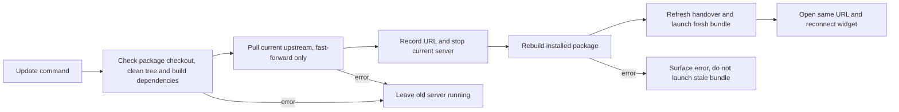
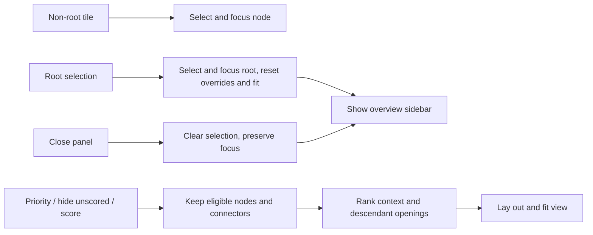
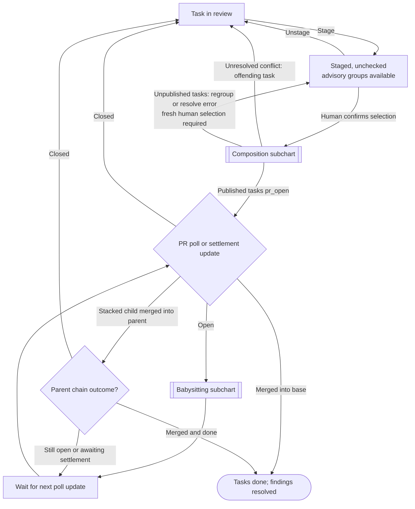
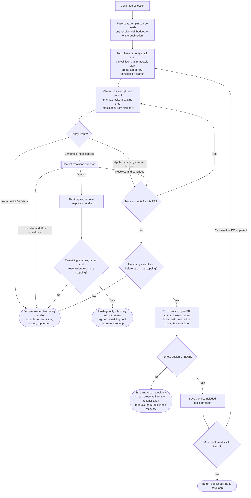
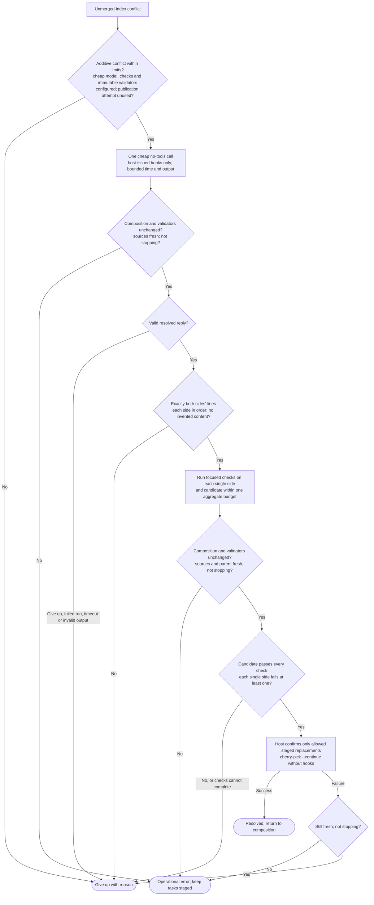
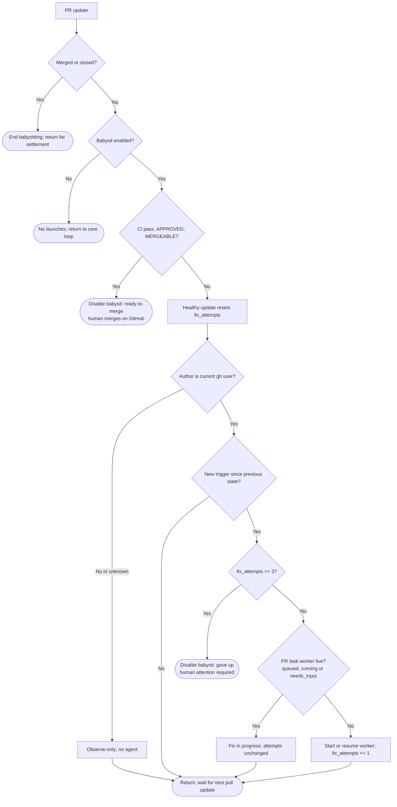

# techtree — design

A pi package that shows a repository as an RPG-style tech tree: every directory is a node, scored for quality, with live agent work and PRs overlaid. From the tree you can start improvement tasks and babysit PRs.

Open source, with no dependency on any specific pi host. It works in plain pi, in the pi TUI, and in any host that can open a URL.

## Decisions

| Topic | Decision |
|---|---|
| Surface | A pi extension serves a localhost web app; `/techtree` starts it and prints the URL. |
| Agents | Headless pi child processes (`pi --mode rpc`), one per task, each in its own git worktree. |
| PRs | `gh` CLI polling. No GitHub App, no webhooks. |
| Tree | The directory tree is the core. Plugins can name and annotate nodes; for example, a Cargo crate root becomes a "crate" node. |
| Scores | Each metric is turned into a percentile against the repo's other nodes of the same kind, and a weighted composite of those gives a 0–100 quality score. Weights live in config. |
| Progress | Planned delta = the sum of the estimated impacts of the task's findings. Fill comes from checklist completion and the current phase. |
| Autonomy | New change tasks commit and stop for review by default. Opening a task PR is opt-in; staging and smart grouping never publish without confirmation. Nothing ever auto-merges. |
| LLM scans | On demand per subtree, cached by file content hash. |
| State | User cache: `~/.cache/techtree/<repo-id>/` (SQLite via `node:sqlite`, plus per-task logs). Optional repo config at `.techtree.yaml`. |
| Concurrency | 3 workers by default (configurable); further tasks queue. |
| Stack | TypeScript. Node server: `node:http`, `node:sqlite`, no framework. Front end: Preact with hand-rolled SVG, built with esbuild. |

## Architecture

```
pi extension (techtree)
 ├─ /techtree command → start server, notify URL, open it in the default browser
 ├─ tools: techtree_status, techtree_findings, techtree_report (worker progress)
 └─ server (node:http, localhost, random port, token in URL)
     ├─ REST + SSE API  ←→  web UI (Preact/SVG)
     ├─ scorer pipeline  → metric plugins → sqlite
     ├─ task runner      → pi --mode rpc children in worktrees
     └─ PR poller        → gh pr list/view/checks
```

There is one server per repo, shared by every pi session in that repo through a lockfile (`server.json`: pid, port, token, url, version, build) in the cache dir. The server runs as a detached Node process (`techtree serve <repo>`) so tasks outlive the pi session that started it; `/techtree` starts it when the lockfile is missing or stale and reuses it otherwise.

### Server lifecycle

- **`techtree serve [repo] [--port N]`** (default `.`, random port) starts the server for the repo with the real backend and serves the built UI from `dist/web`, read from disk on every request, so `npm run build` and a page reload is the UI dev loop. When a live server already exists (see below) it prints that server's URL and exits instead. Otherwise it claims the repo with an exclusive SQLite lock on `<cacheDir>/server.lock` (released by the OS when the process dies, so a crash leaves no stale claim); a process that loses the claim waits up to 30 s for the winner to become live, prints its URL and exits, so concurrent launches yield one server. The owner listens, writes `<cacheDir>/server.json` atomically (temp file + rename), prints the URL, and stays in the foreground. On SIGINT/SIGTERM or idle exit it removes `server.json` (only if it still names its own pid), detaches from task workers, aborts running scans and waits for their pi children to exit, then releases the claim and exits.
- **Idle exit:** the server exits after 2 hours (`TECHTREE_IDLE_MS` overrides) with no API request, no SSE client, no task with a live worker or waiting in the queue (`queued`, `running`, `needs_input`) and no scoring or scan in progress.
- **`techtree stop [repo]`** sends SIGTERM to the pid in `server.json` when that server is live and waits up to 15 s for it to exit (then SIGKILL), so a following start never races the old server's lockfile; it removes a stale `server.json`.
- **Build id:** `npm run build` writes `dist/build-id` (a fresh random id) after `dist/cli.js` and `dist/web/`. The server records the id it started with in `server.json` (`build`). A build is *complete* when `dist/build-id`, `dist/cli.js` and `dist/web/app.js` all exist.
- **Auto-update:** the server watches `dist/` (`fs.watch` plus a 5 s poll). When `dist/build-id` differs from its own and the build is complete, it waits until no scoring run or LLM scan is in progress (at most 10 minutes, then proceeds), logs the handover to `server.log`, writes the handover file (below), shuts down as on SIGTERM, and spawns its replacement detached, so open pages and URLs keep working. Tasks resume as on any restart.
- **Restart** (same port and token): write the handover file, stop the live server as `techtree stop` does, then spawn `serve`. Used by `/techtree restart` and by Launch on a build mismatch.
- **`/techtree update`** updates the installed techtree package, not the repository being scored. Require `PACKAGE_ROOT` to be the root of a Git checkout/worktree with a clean working tree and installed build dependencies; reject non-checkout installs and local edits without pulling or stopping the server. Run `git pull --ff-only` on the checkout's current branch and configured upstream, never switch branches, reset, stash, force-push or install dependencies. A failed pull leaves the existing server running. After a successful pull (including already up to date), stop the current repo's server, rebuild the package with `node build.mjs` even when bundles already exist, then launch the new bundle on the original port/token and behave like `/techtree`. Stop before rebuilding so that this server's build watcher cannot race an explicit restart; refresh the handover after the build so a build longer than its TTL keeps the URL. Git operations and build have bounded timeouts and surface errors. A failed build does not launch stale/partial bundles: the server remains stopped, and the user can repair the build and restart. Other repo servers retain their existing build-watch behavior. `/techtree restart`, `/techtree`, and build-mismatch restarts do not pull or force a rebuild.
- **Handover file** `<cacheDir>/handover.json` (`{ port, token }`, mode 0600): written before a restart or auto-update stops the old server. Whichever `serve` process then wins the ownership claim (the replacement, or a concurrent launch that saw no live server meanwhile) listens on that port with that token (an explicit `--port` still wins for the port), then deletes the file. A file older than 60 s is ignored, so an aborted restart never pins a later start.
- **Live server:** `server.json` exists, its pid is alive, and `GET /api/health` on its port answers 200 within 2 s. Anything else is stale.
- **Launch** (`/techtree` and the extension tools): reuse a live server, restarting it (see Restart) when its `build` differs from the current complete `dist/build-id` (covers servers that missed the watch; no restart when there is no `dist/build-id`); otherwise spawn `node <package>/dist/cli.js serve <repo>` detached, with stdout and stderr appended to `<cacheDir>/server.log` (mode 0600, also enforced on an existing log, because it holds the token-bearing URL), and wait up to 30 s for a live server. If `dist/cli.js` or `dist/web` is missing, the launcher builds the package first (`node build.mjs`) and fails with an error naming the missing `esbuild` dev dependency when it is not installed.



### Backend (`src/backend/`)

`RepoBackend` implements `Backend` with the real pieces:

- **Scores:** the latest `ScoreResult` is kept in memory and in the `cache` table (kind `backend`, key `result`), so a restarted server serves it at once. On start, and on `POST /api/score`, it rescores with `score()` (default plugins plus `llm-scan`) when there is no stored result or HEAD moved (start) or always (`POST /api/score`); one run at a time, with a request arriving during a run queuing one more run. Each run saves a snapshot, records findings (full run) and emits `scores`. `getState` and the other score-based reads wait for the first result when none exists yet, and fail with 503 when no run is in progress (e.g. the first run failed).
- **Node ids** are checked as own keys of the tree, so a restored result never accepts ids like `toString`, and per-node accumulators have no prototype.
- **Node:** history from the snapshots; the node's own findings with their impacts, ranked by node impact; PRs and tasks anchored at the node; suggestions anchored at the node; `ownCtas`/`childCtas` from all tasks, PRs and suggestions.
- **Claimed findings.** A suggestion with a finding carried by a task of the project in `queued`, `running`, `needs_input`, `review`, `staged` or `pr_open` is not offered (node suggestions, CTAs, overview); it comes back if the task fails or is discarded.
- **Busy paths** for suggestion conflict: files changed in the worktree of every task with a live or queued worker (`git diff --name-only -z <baseRef>` there, committed and uncommitted; NUL-delimited so non-ASCII names stay exact) plus the files of every open PR. The worktree part is cached for 15 s per set of live worktrees (each `git` call is a blocking process launch, which costs a quarter second or more on some machines), so reads stay fast; a task starting or ending changes the set and recomputes it.
- **Overview:** attention tasks, flagged PRs, the first 8 suggestions (in their diversified order), and `scanCoverage`.
- **Tasks** go through the `TaskRunner`. A started task's `plannedFrom` is the node's quality (0 when null) and `plannedTo` = `plannedFrom` + the what-if impact of all its findings at the node. Without a `title`, a single-finding task takes the finding's title. Without a `prompt`, the prompt lists each finding's location, title and detail. Unknown finding ids are a 400; runner errors map to 404 (unknown task), 400 (invalid report) or 409 (wrong state).
- **Scan:** `POST /api/scan` runs `scanNode` in the background (409 while that node is already scanning), emitting `scan` events with status `running` (message `<done>/<total> batches`), then `done` (or `failed` with the error), then rescores.
- **PRs** come from a `PrSource` (`list()`, `setBabysit(number, on)`, `onChange(listener)`); the default source has no PRs and `setBabysit` is a 404.

### pi extension (`extensions/index.ts`)

It is `index.ts` so that both `-e <package>/extensions` (a directory loads its `index.ts`) and the package manifest's `./extensions` discovery find it. pi loads the TypeScript directly through jiti; it imports modules from `src/`, and only the server it launches runs from `dist/`. Its factory starts nothing.

- **In worker children** (`TECHTREE_TASK` set) it registers only `techtree_report` and never starts a server.
- **`/techtree`** launches or reuses the server and shows the URL: a `warning` notify (delivered by every UI host, including RPC hosts that drop background `info` notifies), and on stdout in print mode, where notifies have no channel. Outside print mode it also opens the URL in the OS default browser (detached, errors ignored: `open <url>` on macOS, `cmd /c start "" <url>` on Windows, else `xdg-open <url>`) unless config `openBrowser` is false. It then starts the status widget. Subcommands (offered as argument completions):
  - `/techtree url`: show the URL without opening the browser.
  - `/techtree stop`: stop this repo's server (as `techtree stop`) and notify the result.
  - `/techtree restart`: restart the server on the same port and token (see "Server lifecycle"), then behave like `/techtree`.
  - `/techtree update`: fast-forward pull and rebuild the installed package, restart this repo's server on the same URL, then behave like `/techtree` (see "Server lifecycle").
  - anything else is an error naming the subcommands.
- **Status widget** (`setWidget` key `techtree`): one line, `techtree: <n> running · <m> need attention · <url>`, fed by one `GET /api/state` and then the `/api/events` stream (refetching state on reconnect). It stops on `session_shutdown`.
- **Tools:** `techtree_status` (`{ project? }`: root quality, running tasks, attention tasks and flagged PRs, URL) and `techtree_findings` (`{ path?, limit?, project? }`: top findings by impact for the deepest node containing `path`, a repo-relative or absolute file or directory defaulting to the working directory; limit 10). `project` defaults to `quality`. Both launch the server when needed.

## Projects

A *project* is one use of the tech tree on a repo: quality, performance, a feature. New databases start with **Quality** (id `quality`), an ordinary project seeded with the current metric plugins. Its scorer can be edited, replaced, or refined like any other project's without rebuilding techtree. Users add projects (e.g. "Faster startup", goal: "cut cold start below 1 s") and switch between them.

```ts
interface ScorerSpec {
  plugins?: string[];   // selected metric plugin ids: generic, git, rust, slop, llm-scan
  rubric?: string;      // LLM-judged rubric: what the scan looks for
  command?: string[];   // argv of an external scoring command, run in the repo root
  plan?: boolean;       // work items reported by Plan tasks
}
interface Project { id: string; name: string; goal?: string; scorer: ScorerSpec; createdAt: string }
```

- **Shared vs per project.** The tree (paths, `loc`, kinds, structure) is shared. Scores, findings, suggestions, calls to action, snapshots and tasks belong to one project (`Task.project`, a `project` column on `snapshots`, `findings` and `tasks`).
- **Scorers.** A project *has a scorer* when its `plugins` is non-empty, its `rubric` is non-blank, its `command` is non-empty or `plan` is true (`isScored`). Every project runs its own selected plugins and scorer parts; none aliases Quality's result. Settings and accepted proposals replace the entire scorer (omitted parts are removed). For example, `{rubric: "Find missing error handling"}` replaces Quality's plugins with that rubric; `{plugins: ["generic"], rubric: "Find missing error handling"}` combines generic metrics with that rubric. Unknown plugin ids or invalid scorer shapes are rejected (400). A project without a scorer has no scores, findings or suggestions but keeps the shared neutral metrics and tasks. Scanning requires a rubric or explicitly selected `llm-scan`; a rubric overrides `llm-scan` focus and uses its own cache and metrics, resetting coverage when edited.
  `slop` requires `rust`, which supplies its test-count denominator; selecting `slop` alone is rejected rather than reporting a misleading zero test-smell rate. Creating a project from the empty UI must load its state even when its id equals the previous selection (for example, delete and recreate `quality`).
- **Storage.** The per-repo SQLite db has a `projects` table (`id`, `data` JSON `Project`). A transactional, versioned migration seeds Quality once and removes its legacy `builtin` flag without changing its scorer, name, goal, id, creation time or history. Deleted projects are not reseeded. Older project columns and task JSON still default to `quality`. Scoring caches are versioned and tied to scorer/config identity; outdated runs cannot publish after an edit or deletion.
- **Ids.** A new project's id is its name lowercased, with runs of other characters than `a-z0-9` turned into `-` and trimmed (`project` when empty), suffixed `-2`, `-3`, … when taken; `all` is reserved for the cross-project overview.
- **PRs** belong to the project of their task (`taskId`), else to Quality; `pr` events and listed PRs carry that as `project`.
- **Worker prompts** of a project with a goal start with `Project: <name>` and `Goal: <goal>` lines before the task prompt.
- **Delete** removes a project with its tasks (discarded like "Discard": worktree, branch, log, session), findings, snapshots, dismissals and project caches. A project with a task that is `queued`, `running`, `needs_input`, or `pr_open` with a PR not yet seen merged or closed cannot be deleted (409: cancel it or close its PR first); retired PR tasks are discarded with the rest. Explicit or default requests for missing `quality` return 404; internal rescoring and the cross-project overview work with no projects. The UI selects another existing project after deletion, or offers project creation when none remain.
- **CLI.** `techtree score [repo] [--project <id>]` runs that project's selected plugins, rubric cache, command and plan scorer and saves its snapshot (default `quality`). A project without a scorer saves nothing; an unknown project is an error. Rubric scans themselves remain on-demand in the server.
- **Cross-project overview** (`GET /api/overview?project=all`): `attentionTasks` and `flaggedPrs` of every project first (each labelled by its `project`), then each project's own `suggestions` interleaved round-robin in project order and cut to 8. Coverage is Quality's if it exists, otherwise zero; `scorerErrors` are omitted.

### Project scorers

Every project's scores come from its selected plugin, rubric, command and plan parts over a shared tree. A project-independent base pass collects neutral sizes and git activity and annotates node kinds; it does not run Rust/Slop analysis or save project snapshots or findings. Each project includes those neutral metrics so tiles keep their size and `minLoc` applies. Plugin metrics retain `config.weights` (unconfigured plugin metrics weigh zero); rubric, command and plan metrics default to weight 1. Results are kept in memory and in the `cache` table, saved as one snapshot per scored project per run. Plugin finding ids are namespaced per project, except Quality's existing ids which remain unchanged for historical tasks/dismissals. Rubric, command and plan findings already include their project identity.

- **Rubric.** The LLM scan (see "LLM scan") with the rubric added to the prompt: `/skill:techtree-scan Rubric: <rubric>`, a line asking to report only what the rubric describes instead of the skill's focus areas (same output format), then the files. Its cache kind is `rubric:<project>:<sha256(rubric) first 12 hex>`, so editing the rubric starts coverage over. Metrics: `issues` = Σ severity weight of the scanned own files' findings (`lower_better`, `sum`, `normalizeBy: rubric_loc`), `rubric_loc` = their lines (`neutral`, `sum`). Findings have `source: "rubric"` and `metricEffects.issues` = −weight. `POST /api/scan?project=<id>` scans a subtree with the rubric; the overview's coverage is the rubric scan's.
- **Command.** `command` runs with cwd = repo root (never read from the repo: the project lives in techtree's cache, so it is the user's own config), in its own process group with a timeout of `plugins.command.timeoutMs` (default 600000; the whole group gets SIGTERM, then SIGKILL after 1 s, when the run fails at the latest, so subprocesses a wrapper started cannot hold it open), on every rescore. Its stdout is JSON:

  ```json
  { "metrics": [{ "key": "p99_ms", "label": "p99 latency", "direction": "lower_better", "unit": "ms", "aggregate": "max" }],
    "values": { "crates/rpc/src/server.rs": { "p99_ms": 42 }, "crates/db": { "p99_ms": 7 } },
    "findings": [{ "file": "crates/rpc/src/server.rs", "line": 88, "title": "Allocates per request", "detail": "…", "severity": "medium", "effort": "small" }] }
  ```

  A metric needs a non-empty `key` and `label` and a valid `direction`; `aggregate` is `sum` (default), `max` or `mean_by_loc`; `normalizeBy` is not supported. A `values` path is a node id (directory) or a file; a file's values count for its directory (or the deepest existing ancestor). Several values for the same node and metric are combined with the metric's aggregate (`mean_by_loc`: plain mean). Unknown paths, keys and non-finite numbers are skipped. A finding names a `node` or a `file` (whose directory is its node), and needs `title` and a valid `severity`; `detail` defaults to `""`, `effort` to `small`; `source: "command"`. Its `metricEffects` (expected change per metric key if fixed) are the finding's own `metricEffects` when given (known keys, finite numbers); otherwise each `lower_better` metric valued at the finding's `file` (else its `node`) path is split evenly among that path's findings: fixing all of them is expected to bring the value to 0. A finding with no effects has zero impact and ranks last. A run that cannot start, exits nonzero, times out or prints invalid JSON gives no metrics and no findings and its error (with the last stderr line) is shown in the project overview (`ApiOverview.scorerErrors`).
- **Plan.** Work items reported by Plan tasks (below), stored in cache kind `plan`, key `<project>`, as `{ id, node, title, detail, effort, severity }` (id = hash of project, node and title; a re-reported item replaces the old one). An item is *resolved* once a `change` task of the project that carries its id reaches `pr_open` or `done`. Metrics: `plan_items` (own items, `neutral`, `sum`) and `progress` = resolved items (`higher_better`, `sum`, `normalizeBy: plan_items`); nodes without items in their subtree are unscored. Unresolved items are findings with `source: "plan"` and `metricEffects.progress = +1`, so they become suggestions and calls to action on their nodes, and starting a task from them works like any finding. A `change` task of a plan project reaching `pr_open` or `done` triggers a rescore.

**Task kinds.** `Task.kind` is `change` (default; everything under "Agents"), `scorer` or `plan`. Only `change` tasks make branches and PRs: scorer and plan tasks run in a throwaway worktree detached at `baseRef` (no branch; discarding removes it), never open PRs, and finish when their checklist is done (`scorer` → `review`, `plan` → `done`). They are anchored at the root, need no findings and get their prompt from the backend (a given `prompt` is added as the user's instruction); `manualReview` is ignored. Plan tasks run with `--tools read,grep,find,ls,techtree_report`.

- **Plan** ("Plan the work"; starting one turns the project's `plan` on): the prompt gives the goal and asks the agent to read the repo and report work items with `techtree_report({ items: [{ node, title, detail, effort, severity? }] })`, `node` a directory of the tree (`""` = root), `severity` default `medium`. A report whose items are malformed or name unknown nodes is rejected with 400 naming them. Accepted items are stored (see Plan above) and the project is rescored.
- **Scorer** ("Draft scorer" when the project has none, "Refine scorer" otherwise): the prompt gives the goal, the complete current `ScorerSpec`, available plugin ids, current scores and findings, and the scripts directory `<cache>/projects/<project>/` where the agent may write command scripts. `techtree_report({scorer: {plugins?, rubric?, command?, plan?}})` proposes a complete replacement (same validation as settings; at least one non-empty part). The task card shows all parts, including plugin removals, as a diff. **Accept scorer** saves a `review` scorer task's proposal, marks it `done`, and rescores (409 otherwise). Replying resumes the agent to iterate.

## Data model (contract for all subtasks)

`src/types.ts` is the authoritative copy of these contracts. Beyond the summary below it adds: `TreeNode.parent`; `Tree` (`repoRoot` + `nodes` by id); `CollectCtx` (repo root, tree, config, a `Cache` keyed by kind and key, logger, abort signal); `Finding.tags` (used by the complexity heuristic); `Task.project` (see "Projects"), `Task.stagedAt`, `bundle`, `outcome`, `summary`, `proposedDismiss` (see "Staging and combined PRs" and "Dismissed findings"), `Task.prompt`, `question`, `error`, `pid`, `logPath`, timestamps; `PrState.title`, `author`, `taskId`, and the optional poller fields `mergeable`, `branch`, `head`, `reviewCount`, `babysitStatus` (see "PRs"); the scoring output (`MetricScore`, `NodeScore`, `Impact`, `ScoreResult`, `Suggestion`); `Config` (including the optional `terminal` template); `ChatEntry` (a chat transcript turn); and the HTTP API payloads below.

```ts
type NodeId = string;              // repo-relative dir path, "" = root
interface TreeNode { id: NodeId; name: string; kind: string /* "dir" | "crate" | ... */; children: NodeId[]; files: string[] }

interface MetricDef {
  key: string;                     // "loc", "test_count", "lint_warnings", ...
  label: string;
  unit?: string;
  direction: "higher_better" | "lower_better" | "neutral";   // neutral = weight-only (e.g. loc)
  aggregate: "sum" | "max" | "mean_by_loc";                   // how parents combine children
  normalizeBy?: string;            // e.g. lint_warnings per "loc" before percentile
}
interface MetricPlugin {
  id: string;
  metrics: MetricDef[];
  annotate?(tree: Tree): void;     // rename/kind nodes (cargo: crate names)
  collect(ctx: CollectCtx): Promise<Record<NodeId, Record<string, number>>>;  // leaf/own values
  findings?(ctx: CollectCtx): Promise<Finding[]>;
}
interface Finding {
  id: string;                      // stable hash of (source, file, rule, snippet)
  node: NodeId; file?: string; line?: number;
  source: string;                  // "clippy", "llm-scan", "test-gap", ...
  title: string; detail: string;
  severity: "low" | "medium" | "high";
  effort: "trivial" | "small" | "medium" | "large";
  metricEffects: Record<string, number>;   // e.g. { lint_warnings: -1 } if fixed
  confidence?: number;             // 0..1, default 1: how likely the finding is a real problem
}
interface Task {
  id: string; node: NodeId; title: string; findingIds: string[];
  state: "queued" | "running" | "needs_input" | "review" | "staged" | "pr_open" | "done" | "failed";
  manualReview: boolean; worktree?: string; branch?: string; pr?: number;
  plannedFrom: number; plannedTo: number;   // composite scores
  checklist: { text: string; done: boolean }[]; phase: "plan" | "explore" | "edit" | "test" | "pr";
}
interface PrState { number: number; url: string; node: NodeId; files: string[]; ci: "pass" | "fail" | "pending";
  review: string; updatedAt: string; babysit: boolean; stale: boolean; stuck: boolean }
```

## Scoring

1. **Collect.** Each plugin returns its own values per node. The core aggregates them up the tree using each metric's `aggregate`.
2. **Normalize.** Metrics with `normalizeBy` are divided first, so lint warnings are counted per kLOC. Each node then gets a percentile among peers of the same `kind` with at least `minLoc` lines; smaller nodes are unscored (null percentiles and quality) and render neutral, because a parent's score says nothing about a small folder. `lower_better` metrics are flipped.
3. **Composite.** quality = Σ wᵢ·pctᵢ / Σ wᵢ over the metrics present. The weights come from `.techtree.yaml`, with defaults provided.
4. **History.** Every scoring run writes a snapshot (commit sha, timestamp), giving sparklines and before/after comparisons for merged tasks.

The v1 plugins are listed below.

| Plugin | Metrics | Findings |
|---|---|---|
| `generic` | `loc`, `files`, `max_file_loc`, `todo_density` | very large files, TODO/FIXME clusters |
| `git` | `churn_90d`, `authors_90d`, `last_touched_days`, `open_pr_overlap` | — |
| `rust` | crate annotation, `fn_count`, `complexity` (approx.), `unwrap_density`, `test_count`, `test_ratio`, `ignored_tests`, `lint_warnings` (clippy JSON), `test_time` (nextest JUnit, if present) | clippy diagnostics, untested public fns, unwrap/expect in non-test code |
| `slop` | `dup_lines`, `comment_noise`, `test_smells` | duplicated blocks, noise comments, test smells (see "Slop detectors") |
| `llm-scan` (on demand) | `review_debt` (severity-weighted, per kLOC of scanned code), `scanned_loc` | each scanned issue, with severity, effort and a suggested fix |

### v1 plugin metrics

Own values are per node: a directory's own files only; the core aggregates up. Density and ratio metrics hold a raw count and name their denominator in `normalizeBy`, so findings can state their effect as a count and parents aggregate correctly by summing.

| Metric | Own value | Direction | Aggregate | normalizeBy |
|---|---|---|---|---|
| `loc` | non-blank lines | neutral | sum | |
| `files` | counted files | neutral | sum | |
| `max_file_loc` | largest file's `loc` | lower_better | max | |
| `todo_density` | lines with `TODO`/`FIXME`/`XXX`/`HACK` | lower_better | sum | `loc` |
| `churn_90d` | lines added + deleted in the last 90 days | neutral | sum | |
| `authors_90d` | distinct author emails in the last 90 days | neutral | max | |
| `last_touched_days` | days since the newest commit touching an own file | neutral | max (stalest part) | |
| `open_pr_overlap` | open PRs changing an own file | neutral | max | |
| `fn_count` | `fn` items in non-test Rust code | neutral | sum | |
| `pub_fn_count` | `pub fn` items in non-test Rust code | neutral | sum | |
| `complexity` | branch points (`if`, `match`, `while`, `for … in`, `loop`, `&&`, `\|\|`) in non-test code | lower_better | sum | `fn_count` |
| `unwrap_density` | `.unwrap()` / `.expect(` in non-test code, excluding binary entry points (`main.rs`, files under `src/bin/`) and build scripts (`build.rs`), and calls in `const`/`static` item initializers (evaluated at compile time, so they cannot panic at runtime) | lower_better | sum | `loc` |
| `test_count` | test fns (`#[test]`, `#[<path>::test]`, `#[rstest]`) | neutral | sum | |
| `test_ratio` | test fns (same count as `test_count`) | higher_better | sum | `pub_fn_count` |
| `ignored_tests` | `#[ignore]` attributes | lower_better | sum | |
| `fan_in` | workspace crates depending on this crate (crate nodes only) | neutral | max | |
| `lint_warnings` | clippy/rustc lint diagnostics in own files (linted crates only) | lower_better | sum | `loc` |
| `test_time` | seconds from nextest JUnit XML (crate nodes only) | neutral | sum | |
| `dup_lines` | significant lines of own code files inside a duplicated block (every copy counts) | lower_better | sum | `loc` |
| `comment_noise` | noise comment lines in own code files | lower_better | sum | `loc` |
| `test_smells` | test smells in own Rust files (one per assertion-free, near-duplicate or overlong test, one per trivial assert) | lower_better | sum | `test_count` |

Git metrics are neutral: churn, authorship and recency describe how hot a node is (used by the complexity heuristic and as weights), not its quality. `open_pr_overlap` feeds conflict, not quality. Only history of files in the tree counts: excluded paths and files that no longer exist (deleted or moved away) are ignored, because they are not any node's own files.

Rules shared by the plugins:

- **Skipped files** (`generic`): binary files (NUL byte in the first 8 KB), files over 2 MB, lockfiles, minified `*.min.*` files, files under `vendor/` or `third_party/`, and files whose first lines say `@generated` or `DO NOT EDIT`.
- **Test code** (Rust; shared by every Rust metric and finding, including the slop detectors) is detected lexically:
  - *test files*: files with a `tests`, `test_utils`, `testing`, `test_helpers`, `fixtures`, `mock` or `mocks` directory in their path; files named `tests.rs`, `test_utils.rs`, `testing.rs`, `test_helpers.rs`, `fixtures.rs`, `mock.rs`, `mocks.rs`, `test_*.rs`, `*_test.rs` or `*_tests.rs`; files an out-of-line test-only module (`#[cfg(test)] mod name;`, see below) points at; files with a file-level inner `#![cfg(test)]`; and every file of a *test-support crate*, whose package name or directory path has a segment (split at `/`, `-`, `_`) `test`, `tests`, `testing`, `testsuite`, `harness`, `e2e`, `fixtures`, `mock`, `mocks`, the pair `test utils`/`test helpers`, or starts with `load test…` (e.g. `base-test-utils`, `actions/harness`, `crates/infra/challenger-e2e`, `base-load-tester`);
  - *test regions* in other files: the item or statement (module, fn, impl, struct, use, `let` …) after a `#[cfg(P)]` whose predicate is test-only, up to its `;` or the `}` closing its first block, continuing past that block while the code goes on with `.`, `?`, `;`, `else` or `as` (so `let x = Fixture { … }.build().unwrap();` is covered whole); the block enclosing a nested inner `#![cfg(P)]`; and the bodies of test fns (`#[test]`, `#[<path>::test]`, `#[rstest]`). A predicate is test-only when it is `test`; `feature = "test-utils"` (also `test_utils`, `testing`, `test-helpers`, `test-support`); `all(…)` with a test-only member (e.g. `all(test, unix)`); or `any(…)` whose members are all test-only (e.g. `any(test, feature = "test-utils")`). `not(…)` and anything else are not. Comments inside a predicate are ignored.
- **Non-test Rust code** is everything else outside `benches/` and `examples/` directories. Comments and string literals are ignored. The detection is lexical and approximate.
- **Crates** (`rust.annotate`): a directory whose `Cargo.toml` has a `[package]` section becomes kind `crate`, named after the package. `fan_in` counts dependents across all workspace `Cargo.toml` dependency tables. Renames via `package = "…"` are honoured, including aliases a member inherits with `workspace = true` from the root `[workspace.dependencies]`.
- **Clippy** runs only when `plugins.rust.clippy` is true or `TECHTREE_CLIPPY=1`. One `cargo clippy --message-format=json -p … <clippyArgs>` covers every crate whose key (hash of its files, the root `Cargo.toml`, `Cargo.lock`, `rust-toolchain[.toml]` and `clippyArgs`) is not cached. The child inherits the parent environment (e.g. `CARGO_TARGET_DIR`). A crate counts as linted when one of its targets other than the build script was checked (or reported lints) and it had no non-lint compile error. A crate that fails to build, including through a failing build script, gets no `lint_warnings`, is not cached, and is logged. Each diagnostic is counted once per primary source span, so repeated emissions (e.g. lib and test targets under `--all-targets`) collapse while separate occurrences on one line stay separate. `plugins.rust.exclude` lists crate names to skip.
- **test_time** sums `testsuite` times per package from `<target>/nextest/*/*.xml`, where `<target>` is `CARGO_TARGET_DIR` or `<repo>/target`.
- **open_pr_overlap** uses `gh pr list --state open --json number,files` when a remote points at GitHub, cached for 10 minutes; any failure yields 0.

Findings (ids hash source, file, rule and a snippet, never a line number):

| Source | Rule | Granularity | metricEffects |
|---|---|---|---|
| `large-file` | `large-file` | file with ≥ 1000 loc; ≥ 2000 medium/large, ≥ 4000 high/large | `max_file_loc` down to max(1000, next largest file) |
| `todo` | `todo-cluster` | file with ≥ 3 TODO lines | `todo_density: -n` |
| `clippy` | lint code | one per diagnostic; trivial when machine-applicable, else small | `lint_warnings: -1` |
| `test-gap` | `untested-pub-fn` | file whose `pub fn` names never appear in the crate's test code, only in crates with `fan_in` > 0; confidence 0.3 | `test_count: +n`, `test_ratio: +n` |
| `unwrap` | `unwrap-expect` | file with unwrap/expect counted by `unwrap_density`; confidence = mean weight of its calls | `unwrap_density: -n` |
| `duplication` | `duplicate-block` | one per duplicated block; confidence 0.9 | `dup_lines: -n` (the anchored copy) |
| `comment-noise` | `noise-comments` | file with noise comment lines; confidence = mean weight of its lines | `comment_noise: -n` |
| `test-smell` | `assert-free`, `duplicate-tests`, `trivial-assert`, `long-test` | one per file and rule (one per group for duplicates) | `test_smells: -n` |

Clippy findings are tagged `concurrency` (lock, mutex, atomic, `Arc`, `Send`/`Sync`, await), `security` (unsafe, transmute, raw pointers, uninit) or `api` (`must_use`, docs, `new_without_default`, self conventions); untested public fns are tagged `api`.

**Confidence.** `test-gap` is a name-matching heuristic, so it is low-confidence and only reported for crates other crates depend on; uncovered fns of leaf crates still lower `test_ratio` but produce no finding. An `unwrap` finding's confidence is the mean weight of its calls: bare `.unwrap()` 1; `.expect(` 0.6 (the message documents an invariant); `.lock()`, `.read()` or `.write()` followed by `.unwrap()`/`.expect(` 0.2 (lock poisoning is idiomatically fatal); `.unwrap()`/`.expect(` directly on a string literal's `.parse()` (`"…".parse().unwrap()`, with or without a turbofish) 0.2 (a constant that cannot fail).

**Impact estimation (what-if).** Fixing finding *f* applies `metricEffects` to its node's raw values, then recomputes aggregation, percentiles and composite for that node and its ancestors, holding everyone else fixed. impact(f) = Δquality at the node, and the root delta is shown alongside. A task's planned delta applies all its findings together.

### Slop detectors

The `slop` plugin finds duplicated code, comment noise and weak tests. It is lexical, deterministic and reads each file once (under 2 s on a 500 kLOC Rust workspace); its work is linear in the number of lines, even for highly repetitive input. *Code files* are files with the extensions `rs`, `ts`, `tsx`, `js`, `jsx`, `mjs`, `cjs`, `go`, `java`, `kt`, `swift`, `c`, `h`, `cc`, `cpp`, `hpp`, `cs`, `scala` and `sol` that `readSource` accepts. Every code file is lexed like Rust (`//` and nested `/* */` comments, `"…"` and raw strings, char literals), which is approximate for the other C-family languages. *Doc comments* (`///`, `//!`, `/** */`, `/*! */`) are never noise. *Test code* in Rust files is the Rust test code defined under "Rules shared by the plugins"; in other files it is a whole file whose path has a `tests`, `test`, `__tests__`, `test_utils`, `testing`, `fixtures`, `mock` or `mocks` directory, or whose name ends in `.test.*`, `_test.*`, `.spec.*` (also plural). Test-support crates keep their duplication and test-smell findings, under the test-code thresholds.

**Duplication.** Each line is normalized: comments removed (literals kept, so blocks of different data never match), all whitespace removed. *Significant* lines are the normalized lines that contain a letter or digit and are not imports (`[pub] use …`, `[pub] mod x;`, `import …`, `extern crate …`, `package …`) or attributes (`#[…]`, `#![…]`). A *window* is 10 consecutive significant lines of one file; it can match only when it has at least 5 distinct lines and 250 normalized characters, so repetitive code and runs of short lines (getters, literal lists, closing brackets) never count. Two windows match when their normalized text is equal, except windows of the same file that start fewer than 10 significant lines apart. A *block* is a maximal run of consecutive windows in one file, each matching the window at the same offset in one other location, the *partner*. Files are processed in path order and windows in order; every occurrence of a block's windows is marked, and marked windows start no new block, so each duplicated region is reported once. A block gives one finding anchored at its first line, listing every other location of its first window (at most 5 shown): title `Deduplicate N-line block in F (also in G[, +k more])`, N = significant lines in the block, effort `small` below 30 lines, `medium` below 100, else `large`; severity `medium` with ≥ 30 lines or ≥ 3 copies, else `low`; id snippet = the block's normalized text. Blocks starting in test code are reported only with ≥ 20 lines, because repeated test setup is common and cheap. `dup_lines` counts the significant lines covered by any matching window, test code included.

**Comment noise.** Only comments on a line of their own count. Consecutive comment lines form a *run*. Each line is classified, first match wins:

- *kept*: a run before the first code line that mentions a license, copyright or SPDX; a line containing `SAFETY:`, `TODO`, `FIXME`, `XXX` or `HACK` (counted by `todo_density`), or a tool directive (`eslint`, `@ts-`, `prettier`, `rustfmt`, `clippy::`, `noqa`, `nolint`).
- *divider* (weight 0.9): four or more of the same character from `-=*#~_/+` with at most 40 other characters, e.g. `// ---- Scoring output ----`, plus a label line between two divider lines; never in a run with a `|` (an ASCII table).
- *commented-out code* (weight 0.8): a code-like line in a run that has a code-like line ending in `;`, `{` or `}`. A line is code-like when it ends with `;`, `{`, `}`, `)` or `,`, contains an identifier directly followed by `(`, an assignment `=`, `::`, `->` or `=>` (or is only brackets and separators), and is not prose: no backtick and no three plain words in a row other than Rust keywords. E.g. `// let x = foo(1);` but not `// rejects the high-s form (EIP-2);`.
- *stale note* (weight 0.7): a run of one line, of at most 3 words, starting with `removed`, `old`, `unused`, `deprecated`, `dead code` or `no longer used` (case-insensitive), e.g. `// removed`.
- *restating* (weight 0.6): a run of one line directly above a code line, with 2–6 words, without `?` or an intent word (`because`, `why`, `note`, `so`, `otherwise`, `ensure`, `since`, `unless`, `must`, `never`, `always`, `only`, `not`, `until`, `workaround`), whose content words (lowercase, stopwords removed, a trailing `s` dropped from words over 3 letters) number at least 2 and all occur among the next line's identifier parts (identifiers split at `_` and case changes), allowing `new` for create/construct/build/init/initialize, `get` for fetch/read/retrieve, `set` for update/assign, `len` for length/count, `err` for error, `iter` for iterate/loop/each. E.g. `// create the client` above `let client = Client::new(cfg);`.

One finding per file with noise: `Remove N noise comment lines in F`, listing each line and its kind (at most 20); effort `trivial` up to 5 lines, `small` up to 30, else `medium`; severity `low`.

**Test smells** (Rust files; tests are the fns marked by the `test_count` attributes):

- `assert-free` (weight 0.7): the test has no expectation: its body contains none of `assert` or `expect` (any case, anywhere: macros, helpers, builders such as `with_expected_err`), `panic!`, `unreachable!`, `todo!`, `.unwrap…(` (including `unwrap_err`), `.times(`, or a call of a fn whose name starts with `check`, `verify`, `ensure` or `validate`; it does not return `Result` while using `?`; it is not `#[should_panic]` (in any position of its attribute group); it does not mention a fn or macro of the same file that has an expectation (directly or through another one it mentions, e.g. `cases.for_each(run_case)`); and it invokes no macro other than `println!`, `print!`, `eprintln!`, `eprint!`, `dbg!`, `format!`, `vec!`, `matches!`, `write!`, `writeln!` (other macros may assert).
- `duplicate-tests` (weight 0.8): two or more tests in a file, not parameterized with `#[case…]`, whose bodies are equal after normalization (comments and literal contents blanked, numbers replaced by `0`, whitespace removed) and at least 40 characters long; they could be one table-driven test.
- `trivial-assert` (weight 0.9): `assert!(true)`, `assert!(!false)`, or `assert_eq!`/`assert_ne!` whose two operands are both literals, or identical, literal contents included, and free of calls (`assert_eq!(x, x)`, not the determinism check `assert_eq!(f(), f())` nor `assert_eq!(m["a"], m["b"])`).
- `long-test` (weight 0.5): a test body over 120 non-blank lines and 40 statements (`;`), so long data tables of a table-driven test do not count.

Each rule gives one finding per file (per group for duplicates) with n = affected tests (trivial asserts: occurrences): titles `N tests in F assert nothing`, `Merge N near-duplicate tests in F`, `Remove N trivial asserts in F`, `Split N overlong tests in F`; effort `trivial` for trivial asserts, `small` for up to 3 tests, else `medium`; severity `low`; id snippet = the rule (the first test's name for duplicates). `test_smells` sums n over a file's findings.

### LLM scan

`scanNode(node, ctx, opts)` in `src/plugins/llm-scan.ts` reviews the files of a subtree (the node and all descendants) with the `techtree-scan` skill.

1. **Select.** Subtree files sorted by path, skipping binary files (containing a NUL byte) and files larger than `batchBytes`; files not yet scanned at their current contents (no `file:<path>` entry with a matching `sha`) come first, and at most `maxFiles` are kept. A large subtree or the whole repo is therefore covered over repeated scans, each advancing coverage instead of rescanning the same files.
2. **Batch.** Files are chunked in order into batches of at most `batchFiles` files and `batchBytes` UTF-8 bytes. Batch key = sha256 of (SKILL.md contents, each path and its contents).
3. **Run.** A cached batch costs nothing. Otherwise pi runs once per batch, at most `concurrency` at a time, with cwd = repo root: `<piCommand> -p --no-session --tools read,grep,find,ls --skill <package>/skills/techtree-scan`, with `/skill:techtree-scan <files with numbered lines>` on stdin. Prompts to pi always go on stdin, never as an argument: a multi-KB argument can get pi killed at launch. A run that exits nonzero, times out (`timeoutMs`, whatever its exit code), or prints no JSON array fails that batch; failures are reported and not cached, and never throw. A timed-out or aborted child gets SIGTERM, then SIGKILL after 1 s; the batch settles only once the child has exited. Aborting the signal stops running children, skips pending batches, and rejects with the abort reason.
4. **Parse.** The final text must contain a JSON array (bare, in a ```json fence, or between the first `[` and last `]`). Items need a non-empty `title`, a `detail` string, a `file` from the batch, a valid `severity` and `effort`; optional `line` (positive integer), `tags` (strings), `suggestedFix` (string, appended to the detail) and `metricEffects` (finite numbers). Malformed items, and items repeating an earlier item's `file` and `title` (the finding identity), are dropped and the rest kept.
5. **Store** in `ctx.cache` kind `llm-scan`: `batch:<key>` → the batch's findings, and `file:<path>` → `{ sha, loc, findings }` for every file in the batch (an empty list means scanned and clean).
6. **Progress.** `opts.onProgress` receives `{ done, total, cached, failed, findings }` after each batch.

Options come from `config.plugins["llm-scan"]`, overridable per call: `concurrency` (2), `maxFiles` (200), `batchFiles` (20), `batchBytes` (60000), `timeoutMs` (600000).

**Scoring reads only the cache, never pi.** A file counts as scanned when its `file:<path>` entry's `sha` matches the file's current contents. For each node with scanned own files: `review_debt` = Σ severity weight of their findings (low 1, medium 3, high 9; `aggregate: sum`, `normalizeBy: scanned_loc`, `lower_better`), and `scanned_loc` = their summed line count (`neutral`, `sum`). Nodes with no scanned files get neither metric. Each cached finding becomes a `Finding` with `source: "llm-scan"`, `node` = the file's directory, id = hash of (source, file, title), and `metricEffects.review_debt` = −weight (overriding any model-supplied value). `scanCoverage(ctx)` returns the overview `coverage`: nodes with any scanned own file, total nodes, scanned and total lines.

**Priority** of a suggested task = impact.node × confidence × size ÷ effort cost × (1 − conflict), where confidence is the mean of its findings' confidence (1 when unset), size = √(loc of the node where the impact is measured ÷ root loc) (1 without `loc`), and conflict ∈ [0,1] is the overlap of its files and directories with running tasks' worktree diffs and open-PR file lists. The size factor damps the bias toward tiny nodes, where one fix moves a percentile a lot but the repo barely changes.

### Scoring rules (`src/core/`)

The precise rules the scorer implements:

- **Tree.** Files come from `git ls-files -co --exclude-standard` (tracked plus untracked, not ignored). A `config.ignore` entry is a path glob (`*` matches within a segment, `**` across segments). An entry without `/` matches any path segment (`target` drops `target/…` and `crates/a/target/…`); an entry with `/` matches a leading part of the path. Every directory with a file somewhere below it is a node: id = its repo-relative path, root id `""`, name = basename (repo dir name for the root), kind `dir` until a plugin's `annotate` changes it.
- **Aggregation.** A node has a metric if it or a descendant has an own value for it. `sum` adds own and children's values; `max` takes the largest; `mean_by_loc` is Σ value·loc ÷ Σ loc over the own value (weighted by own `loc`) and the children's aggregated values (weighted by their aggregated `loc`), falling back to the plain mean when Σ loc = 0. When several plugins define the same key, the first definition wins.
- **Normalize.** `normalizeBy: "loc"` gives a value per 1000 lines (per kLOC); any other `normalizeBy` metric is a plain ratio. A zero or missing divisor gives 0.
- **Peers.** A node is ranked when its aggregated `loc` ≥ `minLoc` (every node is ranked if no plugin defines `loc`). Its peers for a metric are the other ranked nodes of the same `kind` that have the metric.
- **Percentile** (interpolated mid-rank). For value *v* and peers *P* (*m* = |P|, the node itself excluded): if *m* = 0, 50; if some peers equal *v*, 100·(#{p < v} + #{p = v}/2) ÷ *m*; below every peer 0; above every peer 100; otherwise linear interpolation between the percentiles of the nearest peer values below and above. Ties get identical scores, and a small change in value gives a small change in percentile, which keeps what-if impacts non-zero. `lower_better` metrics use 100 − pct; `neutral` metrics get `pct: null`. A node that is not ranked gets `pct: null` for every metric and a null quality.
- **Composite.** quality = Σ wᵢ·pctᵢ ÷ Σ wᵢ over the node's metrics with a non-null pct and weight > 0; null if there are none.
- **What-if.** Effects are added to the node's own values (clamped at 0). Only the changed nodes and their ancestors are re-aggregated and re-scored, against the unchanged peer distributions. A node ranked before and after moves its pct by percentile(*S*, new) − percentile(*S*, old), clamped to 0..100, where *S* is the unchanged distribution including its own old value; otherwise it is ranked (or inherits) as above. Including the old value keeps a fix visible for the worst node of a kind, whose plain percentile stays 0 until it passes the next-worst peer. A Δ involving a null quality is 0, and the node Δ for an unscored focus is reported at its nearest scored ancestor, so fixes in small folders still rank. A multi-finding impact sums the effects per node and reports the Δ at the deepest common ancestor of the findings' nodes (or a given node).
- **Effort cost.** trivial 1, small 2, medium 5, large 13; priority uses the node impact (see **Priority** above for the full formula).
- **Conflict.** A suggestion's paths are its findings' files (its node's dir when none have a file). Two paths overlap when one equals or contains the other (the root contains everything). conflict = fraction of the suggestion's paths overlapping any busy path.
- **Suggestions.** One per finding, except that `trivial` findings from the same source in the same file form one suggestion, anchored at the deepest common ancestor of their nodes (its impact is measured there). A suggestion carries its findings' `source`. Suggestions are sorted by priority, highest first, then *diversified*: taken in blocks of 8 positions, each block admits at most 2 suggestions per source, filling the block greedily with the highest-priority admissible suggestion and only then with any remaining one when no admissible one is left.
- **Hot node.** A node is hot when its aggregated `churn_90d` or `fan_in` is > 0 and fewer than ⌈n/10⌉ of the n nodes of its kind with that metric have a strictly larger value.
- **Pipeline.** `score()` builds the tree, runs every plugin's `annotate` in order, then every `collect` and `findings` in parallel. A failing hook is logged and skipped: a failed `collect` drops that plugin's metrics, a failed `findings` drops its findings. Findings on unknown nodes are dropped, duplicate ids keep the first.
- **Persistence.** Each run inserts a snapshot with its node scores. Findings are upserted by id (`first_seen` kept, `last_seen` updated, `resolved_at` cleared); after a full run, unresolved findings not in it get `resolved_at` (by membership, not timestamp).
- **Report.** `formatReport` lists, per non-neutral metric, the 10 best and 10 worst ranked (non-inherited) nodes independently (they overlap when fewer than 20 nodes are ranked), then the top 20 findings by priority (conflict 0), diversified by source like suggestions. Control characters in repository text (paths, names, titles, labels) are printed as `\xNN`.

## UI

- **Tree:** top to bottom, root to deepest directory, as a tidy tree with collapse/expand and zoom/pan. It should look and feel like a game tech tree and feel alive, not like a plain graph:
  - **Layout.** Depth picks the row: a node's children sit one row below it, side by side in sort order, and the parent is centred over them. Each node occupies a slot as wide as its tile with its badges or its label, whichever is wider; a subtree gets a contiguous horizontal band at least as wide as its children's bands and its own slot, so nothing overlaps. The label sits centred under the tile: the expand handle (on nodes with children), the name cut to 14 characters with an ellipsis (the full path shows on hover), and the number of hidden children. Edges leave the parent below its label, run down to a horizontal bus shared by its children, and drop into each child's top edge.
  - **Focus.** The tree renders around a focus node within a visible-node budget (default 70), so it stays narrow and deep. Initially the focus is the root. Selecting a node makes it the focus. The context around it is kept small — the ancestor path to the root, plus at most a few siblings of the focus and of each ancestor (uncles), nearest first, with the rest folded into a "+N more" stub that selects the parent when clicked. Sibling context is picked from the current sort order, nearest to the path node first, preferring siblings whose subtree holds an attention item (see motion below); folding a single sibling is pointless, so it is shown instead.
  - **Descendants** of the focus are chosen best-first by *subtree value* (below): every immediate child of the focus is always shown (when it has more than 40, the 40 of highest subtree value, plus a "+N more" stub); then, repeatedly, the visible unopened descendant of highest subtree value opens to show its 2 children of highest subtree value, plus a "+N more" stub when it has others. Opening stops at the first node whose reveal (children plus stub) would exceed the budget; the ancestor path with its context and the focus's children are always shown, so only openings are limited by it. Folding a single child is pointless, so a node with 3 children (or a focus with 41) shows them all. The result is the full child row plus a few long chains drilling into the most valuable spots. Ties in subtree value fall back to the current sort order, and shown children are always drawn in sort order. A "+N more" stub inside the focus subtree expands its node (like the expand handle) instead of selecting it.
  - **Subtree value** = the largest node value in the subtree, where node value = 1,000,000 if the node needs attention (see motion below) + 100,000 if it has a running task + (100 − quality) × √own loc (0 when unscored) + 10 × own findings. Own loc is the node's `loc` minus its children's (its own files' lines). Attention and running work always win, then the worst concentration of code: using own rather than aggregated loc makes the chain drill down to the directory that holds the bad code instead of stopping at its biggest ancestor. Example: a review task in `crates/a/src/deep` puts a chain from the root through `crates`, `crates/a`, `crates/a/src` to `crates/a/src/deep`.
  - Manual expand/collapse still works within the focused view: expanding a node shows all its children (on an ancestor, it unfolds the "+N more" stub; collapsing it folds them again), collapsing a node hides its children (except on the ancestor path), and manual choices are reset when the focus changes. Manual expansions come first within the budget: the path to a manually expanded node stays open whatever the subtree values (its children are shown besides the most valuable ones, even past the budget), and to make room, automatic openings are undone, most recent first, except those leading to a manually expanded node (only manual expansions and the focus's children alone can exceed the budget). Closing the panel keeps the focus. Fit frames every tile with its badges and label. Changing focus re-fits the view to the focus subtree (with its context) and animates nodes to their new places. The page URL carries the focus as `?focus=<node>`, so a focused view can be shared or reloaded.
  - **Graph controls.** The repo root is a selectable node: selecting it sets focus to the root, resets manual overrides, rebuilds and fits the root-focused view, clears the URL's `focus` parameter, and keeps the root's selection ring. Its sidebar is special: show the same overview as when nothing is selected, never a root node panel. This applies to root selections from the tree, stubs, inbox and outbox. Close still clears selection and shows the overview without changing the current focus. The toolbar defaults to **Prioritize active**; **Prioritize inactive** reverses the work preference for both sibling context and best-first descendant openings, without changing drawing sort order or hiding work. Active means queued/running/needs_input/review/staged/pr_open tasks or an open PR in the subtree. Attention and running work break ties only in active mode; inactive mode uses score/findings value within each activity group.
  - **Hide unscored** defaults off and uses the selected score (null means gray). It removes unscored branches before budgeting, so they do not consume slots or produce '+N more' stubs. Root, focus and ancestor connectors to scored nodes remain even if gray. Manual expansion does not bypass this filter. Switching score or either control re-fits the view; no data or tasks are changed. For example, an unscored parent of a scored leaf stays as a connector, while an entirely unscored sibling branch disappears.
  - Each node is a pixel-art square tile on a dark board: a 16×16-pixel sprite (crisp edges, no anti-aliasing, chunky frame; crates get a gold frame and tab) whose side scales with √weight between 24 and 64 world units, snapped to multiples of 8. The weight metric is selectable (loc, test_count, test_time, …). Edges are orthogonal elbows whose width scales with √weight.
  - Tile fill comes from the selected score on a diverging ramp so the worst nodes stand out. The ramp is normalized to the repo's range: t = (score − min) ÷ (max − min) over every node's score for the selected key (0.5 when all are equal). Hue runs red (t = 0) → orange → amber → green → teal (t = 1), with saturation highest at the bad end; unscored nodes are gray. Bad scores stand out through colour alone (saturation and hue), not motion.
  - The tile surfaces more at a glance: a 4×2 grid of stat pips, one per weighted metric (non-neutral, weight > 0, heaviest first, at most 8), each coloured by the node's percentile on the same ramp over a fixed 0..100 range and left dark when the node lacks the metric; plus corner badges for open PRs (top right, red when CI fails), tasks needing input (top left), actioned tasks (bottom left, blue) and suggested tasks (bottom right, muted). Actioned counts queued/running/needs_input/review/staged/pr_open tasks anchored at this node; suggested counts all currently offered suggestions anchored here, excluding claimed/dismissed findings. Counts are not subtree totals or finding counts. Zero badges are omitted; display caps at 9+ with exact counts in hover titles. Task events refresh suggestion counts so claiming or releasing findings is reflected.
  - A bar along the tile's bottom shows quality as an XP bar, or the research bar of the node's first running task.
  - Motion means work or attention, never score. Status rings are distinct: question = yellow pulsing glow, ready for review = green pulsing glow, in progress = cyan marching dashes, queued = purple static dotted outline; flagged PRs retain yellow attention glow. When statuses overlap, question > flagged PR attention > review > running > queued. Each status propagates along every ancestor edge to the root, including from hidden descendants, but not onto ancestor tiles. Shared edges use the same precedence; effect paths render over ordinary edges so sibling buses cannot cover the highlight. Selected-node marching edges and score-change flashes also reach ancestor edges. Nodes slide when layout changes, and after a rescore every node whose selected score changed by at least 0.5 flashes and floats its signed delta. All motion respects `prefers-reduced-motion`.
  - Siblings are sorted by a selectable key (default: alphabetical).
- **Overlays:** running tasks appear as a research bar under the node. The bar is solid up to `plannedFrom`, then shows a loading stripe up to `plannedTo` filled to checklist completion, then empty. Its color follows the score ramp. Open PRs appear as a count bubble on the top-right corner of their anchor node. The anchor is the deepest node that contains at least 60% of the PR's changed lines.


- **Node panel** (on click): first "This node": the node's own calls to action with their actions (answer a question, review the diff and Open PR, babysit toggle, Start a suggested task); then "From children": the top calls to action from its descendants, each labelled with its path relative to the node and selecting that node on click; then composite score and per-metric breakdown with percentiles and sparklines, findings ranked by impact, open PRs with a babysit toggle, and tasks with their checklist and action bar (see "Task actions"). Suggested tasks appear only as calls to action. Starting a task asks for the manual-review checkbox (pre-ticked by the heuristic), lets you edit the prompt, and lets you pick the model from the models pi reports (`GET /api/models`), prepopulated with `config.defaultModel` or, when unset, the last model used in this repo, else pi's own default. Start stays disabled until that list has loaded, so a task never silently skips the default; if loading fails, the dialog says so and starts with pi's default. When it was opened without the suggestion's findings (overview, grouping), it loads them (`GET /api/findings?ids=<id,…>&project=`) and fills the default prompt from them.
- **Grouping suggestions.** Suggested-task rows (the node's own calls to action, "From children" suggestions and the overview's top suggestions) have a checkbox. Checked suggestions (of one project; others are disabled meanwhile) show a bar under the panel: "N selected · Start together · Clear". Start together (from 2) opens the start dialog for one task carrying every checked finding: anchored at the deepest common ancestor of their nodes, titled after the first suggestion "(+N more)", with the largest effort, summed impact and priority, the highest conflict, manual review if any needs it, and source kept only when all agree. Starting clears the selection.
- **Projects.** The header has a project switcher: "All projects" (first), every project and "New project…" (name and goal). A gear opens any project's settings: rename, goal, selected plugin checkboxes, rubric, command, plan, and delete. Quality uses the same settings and "Refine scorer" action as every project. Selection is kept as `?project=<id>` (`all` for all projects; absent = all projects). When a selected project is deleted or missing, the UI selects the first remaining project; with none it offers creation. "All projects" closes the node panel and shows the labelled cross-project overview.
  The settings dialog refetches the project when opened, so saving never restores a scorer replaced since. Project lists are also refetched on score events and reconnects. Scorer tasks open a dialog for optional instructions. Projects without a scorer show "Draft scorer" and "Plan the work" (also listed in the cross-project overview); scored projects show "Refine scorer" and, with `plan`, "Plan the work". Overviews show scorer errors and scan coverage only for scannable projects. Node details refetch on project changes without showing the previous project's data meanwhile. Task/PR events update their own project's view; cross-project attention and the outbox follow all projects.
- **Refining text.** The goal and rubric fields of the project dialogs have a "Refine with agent" button (disabled while the field is empty). It sends the text, with the project name and (for a rubric) its goal, to `POST /api/refine`, which runs `<piCommand> -p --no-session --tools read,grep,find,ls [--model <refineModel or defaultModel>]` with the prompt on stdin in the repo root (read-only: the agent may look at the code for context), timeout 5 minutes. The prompt says what the text is for (a goal is shown to every worker and drives scorer drafting and planning; a rubric tells an LLM scan of each file what to flag), asks to keep the user's intent and constraints without inventing requirements, and to reply with the refined text only. The reply replaces the field's text; "Undo" restores the previous text; nothing is saved until the dialog is saved. Empty text or an unknown kind is 400; a failed run is 502 with its error.
- **Project colours.** Each project has a colour: its position in the project list picks from a fixed palette of 8 (Quality first), cycling past 8. Project tags in the cross-project overview use it as their background, and the project switcher shows the selected project's colour as its left border.
- **Layout: inbox, tree, outbox.** The **inbox** (node panel or overview: what to work on) is on the left, the tree in the middle, and the **outbox** (open PRs: what to get merged, see "Outbox") on the right.
- **Panel width.** Both side panels are resizable. The inbox is 440 px wide by default, with its handle on its right edge; the outbox is 380 px by default, with its handle on its left edge. Dragging a handle away from its panel widens it, between 320 px and 75% of the window; the tree takes the remaining width and re-fits when the drag ends. The widths are kept in `localStorage` (`techtree.panelWidth` for the inbox, `techtree.outboxWidth` for the outbox); double-clicking a handle resets that panel to its default.
- **New task here** in the node panel opens the start dialog without findings, for a free-form prompt (Start stays disabled while the prompt is empty); it works in every project.
- **Overview** (no selection): calls to action:
  1. tasks in `needs_input` or `review`
  2. the top suggested tasks by priority, favouring low conflict and diversified by source
  3. a scan-coverage summary, with a **Scan repo** button (scannable projects only) that scans the repo root like the node panel's Scan subtree
  4. the **Staged** section (`ApiOverview.stagedTasks`, scoped like `attentionTasks`; see "Staging and combined PRs")
  5. **In progress**: queued and running tasks of every kind (`ApiOverview.activeTasks`, scoped like `attentionTasks`), each with its node and checklist progress; selecting one opens its node, where the task card has the log, diff and chat. Scorer and plan tasks belong to the repo root, so without this they'd only be visible on the root node.

  PRs are not listed here: they live in the outbox. (`ApiOverview.flaggedPrs` stays in the API for the `techtree_status` tool.)
- **Outbox** (right panel): every open PR of every project (`GET /api/prs`), kept live through `pr`, `pr_removed`, `task` and `task_removed` events (a `pr` event naming a task the outbox does not know refetches it). Nothing here merges: the PR number links to GitHub. Each row shows the project's colour tag, `#n` (link), the title, compact badges (CI pass / fail / pending, the review decision, conflict), a babysit toggle (`POST /api/prs/:number/babysit`), a one-line status and the PR's age (since `updatedAt`). Clicking a row selects its node, switching to its project, so the inbox shows that node; an expand control shows the PR's linked task (`taskId`, usually its babysit task) with the task action bar (log, diff, chat). Rows sit in one keyed list under their section headings, so a row moving between sections (e.g. its task starts asking) keeps its expanded task and any unsent chat draft. Rows fall into three sections, in order, by the first rule that matches (`outboxEntry` in `src/web/outbox.ts`):
  1. **Needs you** (highlighted; the count shows in the panel header), with the reason as the status: `ready to merge — merge on GitHub` (CI pass + `APPROVED` + `MERGEABLE`); babysit off and `babysitStatus` starts with `gave up` (that status); babysit on and `babysitStatus` starts with `observe-only` (that status: not your PR, no agent runs); babysit off and changes requested / merge conflict / CI failing (`<those> · babysit off`); the linked task is `needs_input` (`agent asks: <question>`) or `review` (`fix ready for review`); `stuck` (`no progress in 24h`); `stale` (`no update in 3 days`).
  2. **Babysitting**: babysit on and none of the above; status = `babysitStatus`, else `waiting for CI or review`.
3. **Waiting**: everything else; status `checks pending · waiting for review` while CI is pending and review is `REVIEW_REQUIRED`, `checks pending` for other pending CI, else `waiting for review`. Pending rollups can be cancelled checks or review status contexts; do not claim that CI is actively running.
- **Auto-babysit** (outbox header toggle, persisted per repo in the `cache` table, kind `settings`, key `autoBabysit`; `GET /api/prs` reports it, `POST /api/prs/auto-babysit` sets it). Switching it on turns babysit on for every open PR of the current gh user (as a per-PR switch-on would); while it is on, each PR of the current user seen for the first time starts babysat. Per-PR toggles keep working: auto only applies to PRs it has not seen yet, so a PR switched off stays off. Switching it off changes no PR.

**Task actions.** Every task row (in "This node" and under "Tasks") has one action bar; each action shows only in the states listed:

| Action | Shown when | Does |
|---|---|---|
| Open PR | `review`, `change` tasks | `POST /api/tasks/:id/open-pr` |
| Accept scorer | `review`, `scorer` tasks with a proposal | `POST /api/tasks/:id/accept-scorer`; the proposal diff shows above the bar |
| Stage | `review`, `change` tasks | `POST /api/tasks/:id/stage` (see "Staging and combined PRs") |
| Unstage | `staged` | `POST /api/tasks/:id/unstage` |
| Dismiss findings | the task has findings | `POST /api/findings/dismiss` with the task's findings (see "Dismissed findings"); when the agent proposed a dismissal, the row shows its reason and the button confirms that proposal |
| Cancel | `queued`, `running`, `needs_input`, `review` | `POST /api/tasks/:id/cancel` (a babysit or fix run returns to `pr_open`, see "Agents") |
| Discard | every state except `pr_open` | asks for confirmation, then `POST /api/tasks/:id/discard` |
| Log | always | toggles the log pane: the last 200 lines of `GET /api/tasks/:id/log`, followed live through `log` events |
| Diff | the task has a worktree | toggles the diff pane (`GET /api/tasks/:id/diff`); open by default in `review` |
| Chat | the task has a worktree | toggles the chat pane (below) |
| Open in terminal: shell / agent | the task has a worktree | `POST /api/tasks/:id/open-terminal`; agent is disabled, with the reason as its tooltip, while the task is `queued`, `running` or `needs_input` |

The task's PR shows as a `PR #N` link to the PR's URL when the poller knows the PR, else as plain text.

**Chat pane.** The task's transcript (`GET /api/tasks/:id/chat`, then live `chat` events): user messages, assistant messages and one-line tool calls, each with its time, in order. Below it a textarea and Send post `POST /api/tasks/:id/message`. Send is disabled with the reason shown when the server would refuse the message: the task is `queued` ("waiting for a worker slot"), `running` without a worker yet ("starting"), or `done` without the `no_change` outcome ("the task is done"). Assistant markdown is shown as plain text.

**Links.** URLs (`http://`, `https://`) in task questions and errors, log and chat lines, finding titles and details, call-to-action reasons and suggestion titles are clickable links opening in a new tab (`rel="noreferrer"`). Trailing punctuation (`.,;:!?'"`, and a closing `)`/`]` without its opener in the URL) stays outside the link; trimming is linear in the URL's length. Text is rendered as text nodes, never as HTML.

**Calls to action** (`Cta`, used by the node panel and overview), ranked highest first:
1. tasks in `needs_input`, then `review`;
2. PRs that are failing, then stuck, then stale;
3. suggestions in their diversified order (see "Suggestions").
A node's `ownCtas` are those anchored at the node; `childCtas` are the top 10 anchored strictly below it, with their suggestions diversified again among themselves.

**Complexity heuristic** (`Suggestion.manualReview`; informational only, the start dialog's **Open PR automatically** default does not follow it, see "Staging and combined PRs"): set it if any of these hold:
- the effort is `medium` or larger,
- there is more than one finding,
- the node is "hot" (top-decile churn or fan-in among nodes of its kind),
- a finding is tagged `concurrency`, `security` or `api`.

## Agents

- **Start** (`change` tasks; see "Task kinds" for `scorer` and `plan`): the runner creates a worktree at `~/code/worktrees/<repo>/techtree-<task>` (`worktreeTemplate`: `{home}`, `{repo}` = repo dir name, `{task}` = task id) on a new branch `techtree/<task>` from `baseRef`, with `git worktree add` run asynchronously while the task holds a worker slot (so `POST /api/tasks` returns the queued task at once and the server never blocks on a large checkout); the main checkout's working tree is never touched. It spawns `piCommand --mode rpc --session-dir <cache>/sessions/<task> --session-id <task> -e <package>/extensions --skill <package>/skills/techtree-worker --skill <package>/skills/techtree-babysit` there, with `TECHTREE_URL`, `TECHTREE_TOKEN` and `TECHTREE_TASK` in the environment, and adds `--model <model>` when the task has one (on every spawn, including resumes, recovery and Open PR), and sends the task prompt as `/skill:techtree-worker <prompt>` plus the finish rule for the task's `manualReview` setting.
- **Queue:** at most `workers` tasks have a live child (`running` or `needs_input`); further tasks stay `queued` and start in creation order as slots free up. Resuming a task that has a worktree but no child ("Open PR", an answer after restart, recovery) also goes through the queue: the task becomes `queued` and respawns on its pi session with the resume prompt when a slot frees.
- **Worker protocol:** the skill requires a checklist up front through the `techtree_report` tool (`{plan}`), then `{phase}` and `{done:i}` updates. When stuck, the worker calls `{needs_input: question}`, which pauses the task. `techtree_report` POSTs the payload to `$TECHTREE_URL/api/tasks/$TECHTREE_TASK/report?token=$TECHTREE_TOKEN`; one payload may carry several fields. Reports for tasks without a live worker, unknown phases, or out-of-range `done` indexes are rejected.
- **RPC events:** every event worth reading (assistant messages, tool calls, retries, dialogs, errors, stderr, state changes) becomes a timestamped line in `<cache>/tasks/<task>.log` and a `log` server event; every task change is persisted to SQLite and emitted as a `task` event.
  - An extension dialog (`select`, `confirm`, `input`, `editor`) moves the task to `needs_input` with the dialog text as the question. The answer is sent back as the dialog response: `confirm` is true when the answer starts with y/yes/ok/true/allow, other dialogs get the text as their value. If pi resolves the dialog itself (its `timeout` elapses, or the agent settles while the dialog is open), the dialog is dropped and the task returns to `running`.
  - An answer to a reported `needs_input` question is sent as a follow-up prompt. Either way the task returns to `running`.
  - When the agent settles (`agent_settled`) while `running` and the task is not finished, the runner nudges once; if it settles unfinished again, the task moves to `needs_input`. Any report or answer re-arms the nudge.
  - If pi rejects a prompt (`response` with `success: false`), the task becomes `failed` with pi's error, because no run will follow.
  - Records from a child that is no longer the task's current worker (after cancel, replacement or shutdown) are ignored.
  - If the child exits while the task is `queued`, `running` or `needs_input`, the task becomes `failed` with the exit code and log path.
- **Finish:** a task is finished when its checklist is non-empty and fully ticked and, in the PR stage, `gh pr view <branch> --json number` finds the PR (run asynchronously, with a 60 s timeout); when that lookup fails (e.g. GitHub rate limits), the last `…/pull/<n>` URL in the worker's final message is used instead. The PR stage is every task without `manualReview`, a `manualReview` task after "Open PR", and every task that already has a PR. A PR lookup still in flight is ignored when another prompt has been sent to the worker meanwhile (a chat message, an answer) or the checklist is no longer complete; the next settle decides.
  - **No net change.** When the checklist is done and the task has no PR (`pr` unset), the runner checks `git diff --name-only <baseRef>...HEAD` in the worktree first (asynchronously; a check whose worker was replaced meanwhile is ignored, and a failing check fails the task with `diff check failed: …`). When it is empty (no commits, or commits that cancel out such as a commit and its revert), the task ends as `done` with `outcome: "no_change"` and `summary` = the worker's last assistant message, and the child is ended, whatever `manualReview` says. The worker can also end that way explicitly with `techtree_report({ outcome: "no_change", summary })` (summary defaults to its last message), e.g. when the right answer is that nothing should change. The task card shows the summary prominently. A new finish clears `outcome` and `summary`.
  - With `manualReview`, the worker commits and stops; the runner moves the task to `review` and ends the child. The diff is `git diff <baseRef>...HEAD` in the worktree, where `baseRef` is resolved in the main checkout. The UI shows it with an "Open PR" button.
  - "Open PR" (`review` → `queued` → `running`, phase `pr`) resumes the same pi session with an instruction to push to the upstream remote and open the PR with `gh`, following the repo's PR template.
  - Otherwise the worker opens the PR itself in one go. Once the PR number is found the task records it, moves to `pr_open` and the child is ended. Nothing ever merges.
- **Stopping a worker** (cancel, discard, failure, finish): the child gets SIGTERM (on finish, its stdin is closed instead) and SIGKILL if it is still alive 1 s later (5 s on finish). Until it has exited, its session counts as busy: a queued resume of the task waits, and agent mode in "Open in terminal" is refused with 409.
- **Pruning:** when a worker run ends in `review`, `pr_open`, `done` or `failed` (not `needs_input`), the runner deletes `config.pruneOnIdle` paths inside the task's worktree in the background (absolute paths and paths with `..` are ignored), e.g. `target` so idle Rust worktrees don't keep tens of GB of build output.
- **Cancel:** stops the child (if any) and marks the task `failed` with error `cancelled`. The worktree is kept. A task that already has a PR (a babysit or fix run, `pr` set) returns to `pr_open` instead, so the PR stays tracked and babysit can resume it later; nothing happens to the PR itself.
- **Message** (`POST /api/tasks/:id/message`, the chat pane) routes by state:
  - `running` with a live worker: sent as a `prompt` with `streamingBehavior: "steer"`, delivered to pi after the current tool calls (or starting a run when pi is idle); it re-arms the nudge.
  - `needs_input`: an answer (see above).
  - `review`, `failed` or `pr_open` with a worktree and a pi session: resumed through the queue on its session with the message as the prompt (like "Open PR"); a `failed` task's error is cleared. The finish rules apply as usual, so a `review` task returns to `review` and a `pr_open` task to `pr_open` (its PR number is kept) once its checklist is done again.
  - `done` with `outcome: "no_change"` and a worktree and session: resumed the same way; its `outcome` and `summary` are cleared, and the finish rules decide again (`review` once it has a net diff, `no_change` again otherwise).
  - anything else (`queued`, `running` before its worker has spawned, other `done` tasks, `staged`, no worktree or no session): rejected with 409.
- **Chat transcript:** besides the log, the runner appends one JSON line `{ role, text, at }` (`ChatEntry`) per conversation turn to `<cache>/tasks/<task>.chat.jsonl` and emits it as a `chat` event (`{ type: "chat", taskId, entry }`): `user` for every prompt it sends (the initial prompt, answers, messages, nudges and resume prompts, as sent) and every dialog answer, `assistant` for each assistant message with text, `tool` for each tool call (`<tool> <args>`, args truncated to 200 characters). `GET /api/tasks/:id/chat` returns the file's entries in order (empty for tasks started before this existed; 404 for unknown tasks). The chat pane merges the snapshot with `chat` events that arrived while it loaded, so none is lost. Discard deletes the file.
- **Open in terminal** (`POST /api/tasks/:id/open-terminal`, body `{ mode: "shell" | "agent" }`): opens a real terminal window in the task's worktree, detached from the server. `shell` opens a shell there; `agent` runs interactive pi on the task's session: `piCommand --session-dir <cache>/sessions/<task> --session-id <task>` plus `--model <model>` when the task has one, refused with 409 while the task is `queued`, `running` or `needs_input` (cancel first, because two pi processes would write the same session). Both need an existing worktree (409 otherwise). The window comes from `config.terminal`, an argv template in which `{cwd}` is replaced by the worktree path and `{command}` by the command as one shell-quoted string (literally, in one pass, so `$` sequences and placeholder text inside the values stay as they are) (empty in shell mode; argv elements left empty are dropped). Without `terminal`: on macOS `osascript` tells Terminal.app to `do script "cd '<cwd>' && <command>"` and activates it; on Linux `x-terminal-emulator -e sh -c "cd '<cwd>' && <command>; exec \"${SHELL:-/bin/sh}\""`; elsewhere 501. Every path and argv word is single-quoted for the shell (and the macOS script escaped for AppleScript), so no text reaches a shell unquoted. A terminal program that cannot be started is a 501 naming it.
- **Discard:** for junk work that should never become a PR. Allowed in every state except `pr_open` (close the PR on GitHub first). Stops the child (if any), force-removes the worktree, deletes the local `techtree/<task>` branch (never a remote branch), deletes the task row, its log and its session, and emits `task_removed`. Its findings become suggestions again.
- **Babysit tasks:** a task started with `pr: <number>` (runner-only `StartTask` field) adopts that existing PR instead of opening one: its worktree is created detached at `baseRef` and then switched with `gh pr checkout <number> --branch techtree/<task>`, run asynchronously with a 5-minute timeout while the task holds a worker slot (a task cancelled meanwhile never spawns a worker), its prompt is sent as given (the caller includes `/skill:techtree-babysit`), and its PR lookup uses the PR number. `resumeTask(task, prompt)` queues a `pr_open` task that has a worktree to respawn on its session with `prompt`. Babysit itself is described under "PRs".
- **Recovery:** task state lives in SQLite. RPC runs over the child's stdio, so a new server cannot reattach to an old child; and when the server dies, the child's stdin closes and pi shuts down. On start, for each task persisted as `running`, `needs_input`, or `queued` with a worktree, the runner stops any process still alive at the recorded pid.
  - If the task's pi session file exists, `running` tasks are queued to respawn on that session (`--session-id`) with a short "continue" prompt. `needs_input` tasks keep their question and are queued to respawn on that session when answered; an answer to a lost dialog is sent as a prompt. An answer or "Open PR" still waiting in the queue during a restart is lost: the task resumes with the "continue" prompt, or the PR instruction if it is in the PR stage.
  - Without a session file the task is marked `failed`, with the log path in `error`.
  - Queue pumping waits until the recovery sweep has finished; then `queued` tasks start as slots allow. `review`, `pr_open`, `done` and `failed` tasks are left untouched.

## PRs

`src/prs/` polls `gh`, anchors PRs on the tree, flags them, and babysits them. Nothing here ever merges.

**Poller** (`PrPoller`). One poll runs, in the repo root, through the `gh` argv prefix (default `["gh"]`):
1. `gh api user --jq .login`: the current user, re-checked every poll so an account switch takes effect at once;
2. `gh pr list --author @me --state open --limit 100 --json <fields>`;
3. `gh pr view <n> --json <fields>` for each PR recorded on a `pr_open` task that step 2 did not return and that is not retired (usually none). A PR whose `state` is not `OPEN` is dropped and retired.

A PR number is *retired* (cache kind `pr-retired`) once it is seen merged or closed, either in step 3 or by leaving the open list, so historical task PRs cost no gh calls.

`<fields>` = `number,url,title,author,files,statusCheckRollup,reviewDecision,reviews,updatedAt,mergeable,headRefName,headRefOid,state`. Polls never overlap (`poll()` while one is running returns the running one); the next poll is scheduled `intervalMs` (default 60 s) after the previous one ends, doubling after each consecutive failure up to `maxBackoffMs` (default 15 min). A failed step (missing `gh`, no auth, no user login, bad JSON, an entry without a numeric `number`, or anything failing while converting the entries) never throws: the poll keeps the previous PRs unchanged and `status` becomes `gh failed: <first stderr line or error>`; a failed user lookup also clears the user. A successful poll sets `status` to `ok`.

Each open PR becomes a `PrState`, persisted in the `prs` table (keeping `babysit`, `fix_attempts`, `last_progress_at` across polls) and emitted as a `pr` event when anything in it changed. Open PRs no longer returned (merged or closed) are deleted from the table, retired, and announced with a `pr_removed` event (`{ type: "pr_removed", number }`) so clients drop them.
- `ci` from `statusCheckRollup`: `fail` if any check run concluded `FAILURE`, `TIMED_OUT`, `ACTION_REQUIRED` or `STARTUP_FAILURE`, or any status context is `FAILURE`/`ERROR`; else `pending` if any check run is not `COMPLETED`, concluded `CANCELLED`, or any status context is `PENDING`/`EXPECTED`; else `pass` (also with no checks). Cancellation is unresolved, not a failed test or proof of success: it must neither trigger a CI-fix worker nor enable ready-to-merge. Example: Base #5530's cancelled zepter + successful checks + pending Heimdall review is `pending`, not `fail`. Genuine failures still win over cancellations or pending review.
- `review` = `reviewDecision` (`""` when null); `reviewCount` = submitted reviews by others that are not approvals; `mergeable` = gh's `MERGEABLE` / `CONFLICTING` / `UNKNOWN`; `branch` = head ref, `head` = head commit sha.
- `taskId` = the newest task whose `pr` is the PR's number or whose `branch` is its head ref.
- `node` = `anchorPr(files, tree)` on the latest tree (root when no tree is loaded).

**Anchoring** (`anchorPr`). Input: the PR's files with changed lines (additions + deletions). Each file's lines count toward the node of its directory, or the deepest existing ancestor when that directory is not a node (so files outside the tree count only toward the root). A node contains the lines of its subtree. The anchor is the deepest node containing at least 60% of all changed lines (the root always qualifies). When the PR changes no lines (renames, binaries), every file counts as one line; with no files the anchor is the root. Example: 70 lines in `crates/a/src`, 30 in `crates/b` → `crates/a/src`; 50 / 50 → `crates`.

**Flags** (injectable clock). *Progress* is a new head commit, a `ci` change, a `review` change or a `reviewCount` change; it sets `last_progress_at` to now. A PR first seen starts with `last_progress_at` = its `updatedAt`. `stale` = now − `updatedAt` ≥ 3 days; `stuck` = now − `last_progress_at` ≥ 24 h.

**Babysit** (`Babysitter`). `setBabysit(number, on)` toggles it per PR (async; unknown PR → error); switching on resets `fix_attempts` to 0, looks the current gh user up again, and immediately evaluates the PR's current state. Each poll update of a babysat PR follows the [babysitting subchart](#babysitting-subchart): retirement, disabled babysitting, ready-to-merge, observe-only, a new trigger, the attempt budget and an existing live worker, in that order.

The cycle's back edges wait for an external poll update; they are not immediate retries. A completed/failed worker does not itself launch the next attempt, and unchanged failing conditions are not a new trigger. Waiting, observe-only and fix-in-progress are nonterminal. Ready-to-merge, exhausted attempts, disabled babysitting and PR retirement end this babysitting cycle; only a healthy update (CI pass, no conflict, no changes requested) or explicit switch-on resets the attempt budget. Disabling babysitting prevents further launches but does not itself cancel a live worker.

- **Triggers** compare with the previous state (on switch-on: CI failing, changes requested or conflict as they are now): `ci` turns `fail`; `review` turns `CHANGES_REQUESTED`; `reviewCount` grows; `mergeable` turns `CONFLICTING`.
- **Failed attempts.** `fix_attempts` counts launches since the PR was last healthy (`ci` pass, no conflict, no changes requested); a healthy update resets it to 0, so only consecutive unsuccessful fixes use up the budget of 3.
- **Stopping.** At ready-to-merge, and when a babysat PR is merged or closed (it leaves the open list), the PR's task is cancelled if it is still `queued`, `running` or `needs_input`; a queued fix therefore never starts after closure. PRs that are not babysat leave their tasks alone.
- **Observe-only** is enforced in code: for a PR whose author is not the current gh user (or while the user is unknown), babysit never starts or resumes an agent, so it can neither push nor reply; it only sets `babysitStatus` and emits the `pr` event.
- Every outcome is written to `babysitStatus` (`ready to merge`, `observe-only: <triggers>` (or `observe-only: not your PR` on an update without triggers, so a babysat foreign PR always shows as observe-only), `gave up after 3 fix attempts`, `fix in progress: <triggers>`, `fix attempt <k>/3: <triggers>`). A merged or closed PR leaves the poll results, which ends its babysitting.
- The babysit prompt is `/skill:techtree-babysit` with the PR number, URL, title, head branch and triggers. Babysit tasks are titled `Babysit PR #<n>`, anchored at the PR's node, without manual review.
- **Auto-babysit** (`Babysitter.autoBabysit`, `setAutoBabysit(on)`; stored in cache kind `settings`, key `autoBabysit`): switching on looks the gh user up again and switches babysit on (as `setBabysit(n, true)`) for each open PR whose author is that user and that is not babysat; when the lookup fails, the switch-on fails (502) and the setting stays off, so it can simply be retried; while on, a poll update with no previous state (a PR seen for the first time) whose author is the current user switches babysit on before it is evaluated, with triggers as on switch-on. Switching off only clears the setting.

## Staging and combined PRs

To avoid many small PRs, reviewed tasks can be *staged* and several opened as one combined PR.

Staging moves a task `review` → `staged` (Unstage moves it back); opening a combined PR moves its tasks to `pr_open`; a merged bundle PR makes them `done` and a closed one returns them to `review`. The [core lifecycle](#core-lifecycle) shows these transitions and delegates detailed decisions to the subcharts below.

- **Stage** (`review` → `staged`, new `TaskState`) records `stagedAt`; **Unstage** returns the task to `review` and clears it. Staged tasks keep their worktree and branch, are not attention items, and can still be discarded.
- **UI.** New change tasks show an unchecked **Open PR automatically** option (`manualReview: true` by default, independent of suggestion heuristics). The overview has one **Staged** list per project, all **unchecked** by default, including tasks staged while the section is open. Smart grouping upgrades that same list: a fresh complete proposal sorts rows by group, and each group with more than one member gets a distinct numbered/color badge on its rows (with the rationale as a tooltip); solo changes have no badge. There are no separate group cards or duplicate task lists. Badges are advisory, not publication boundaries: select any rows across badges, or clear and rebuild the selection, then use the primary **Open combined PR** action above the list to publish exactly those changes against the base branch. Grouping never changes the selection or publishes automatically. Publication shows the opened PR link or the server's failure message beside the controls. Stale/incomplete suggestions fall back to the ordinary full list without badges; removed tasks lose their selection, and newly staged tasks remain unchecked.
- **Background opening.** The UI sends its checked selection to `POST /api/bundles/start`. After validation, source-head pinning, immediate reservation and durable job acceptance, the server returns **202** with `ApiComposition`; it does not wait for Git, the title model or GitHub. Accepted tasks leave the staged list (not their independent branches/worktrees), and the user can select other tasks or queue a disjoint PR. Publication remains serialized with synchronous/manual and smart publication through the repository gate.
  Jobs (`BundleJob`) have an id, project, task IDs/titles, timestamps and monotonically increasing revision, and transition `queued` → `running` → `opened` (with bundle/PR link) or `failed` (with the full diagnostic). They are persisted in cache kind `bundle-jobs`, per project, and included in `ApiComposition` and its existing events. Keep all active jobs and the newest 20 completed outcomes. The staged section shows this **PR opening activity** even when its pool is empty; reconnect/refetch restores activity. Late acceptance/fetch responses must not overwrite a newer job outcome.
  While queued/running, tasks remain reserved and are excluded from the staged pool and grouping input. A normal failure releases reservations and restores still-staged tasks to the list; the existing conflict fallback instead returns only the culprit to review, preserves other unpublished tasks and regroups. Success transitions the selected tasks to `pr_open`. Invalid/duplicate/mixed-project/reserved selections fail before acceptance and remain selectable; accepting a job clears only the submitted selection, not changes checked while the short acceptance request was in flight.
  Shutdown waits for accepted work through the gate; queued work checks shutdown/freshness before Git. A restart never automatically republishes jobs: a job whose bundle/task transition already committed is recovered as `opened`; an unfinished job becomes `interrupted`, restores unpublished staged tasks and warns that a remote PR may exist and must be checked before retrying. Durable recovery after an ambiguous manual push/create remains unimplemented (below), and background execution must not hide this warning.
- **Open combined PR** (`POST /api/bundles`), with the selected tasks taken in staging order:
  1. The base: `<b>` = `git rev-parse --abbrev-ref <baseRef>` in the main checkout. When that names a branch and the repo has a remote (`origin`, else the first one), `git fetch <remote> <b>` and start from `<remote>/<b>`; otherwise start from the local `baseRef`.
  2. A fresh worktree (`worktreeTemplate` with `{task}` = `bundle-<id>`) on a new branch `techtree/bundle-<id>` from that start.
  3. For each task, every non-merge commit in `$(git merge-base <baseRef> <head>)..<head>`, oldest first, is cherry-picked, where `<head>` is the task branch's commit pinned when the request arrived; commits that change nothing are skipped (and commits that become empty are dropped, `--empty=drop`). A replay with no net change against its start fails before pushing.
  4. A genuine unmerged-index conflict first goes to the bounded resolver (below). When it gives up: abort and remove the temporary bundle worktree/branch, automatically return only the offending task to `review`, clear its staging timestamp and persist the conflict paths and give-up reason in `Task.error`; its original branch/worktree are kept. Other tasks stay staged. The request fails with 409 and regrouping refreshes the remaining pool, but no modified publication is retried automatically. Non-conflict git failures, changed source heads and shutdown leave every task staged and fail with 502.
  5. Before pushing, prepare reviewer-facing metadata from the actual replay: each selected task's title, node, findings, reported summary and pinned commit subjects, plus the final composition's diff/stat against its immutable start. One no-tools call (`titleModel`, else `defaultModel`, else pi's default; 60 s, 32 KiB input, 16 KiB output, shutdown signal) proposes a conventional imperative title (≤72 characters), a short purpose/behavior summary and one concise change bullet per host-issued change id. Up to 20 changes are modeled; evidence is bounded, cuts are marked, and all repository/task text is untrusted data, not instructions. Do not mention the generator, task IDs, composition mechanics or boilerplate such as “Combined techtree changes” / “no findings”; a genuine component named techtree may still be described. Do not invent test results, issue links, benefits or implementation details. Strict JSON, nonempty bounded strings and exact change-id coverage are required; failed, oversized or malformed replies fall back to clean task-title bullets under `## Summary`, without raw commit subjects, “(+N more)” or tool branding. An explicit user title is preserved. Metadata does not modify repository files or source task titles.
  6. The body is `## Summary` (purpose and change bullets), then any automatic conflict-resolution audit, then the repository PR template verbatim (trimmed) when one exists (`.github/pull_request_template.md`, `.github/PULL_REQUEST_TEMPLATE.md`, `docs/pull_request_template.md`, `PULL_REQUEST_TEMPLATE.md`, `pull_request_template.md`, any case), so its sections and trailing metadata remain last. The shared body policy also applies to stacked publications; children retain `Stacked on #<parent PR>`, and their durable intent stores the generated title/body so recovery never regenerates them. Refresh source/parent/shutdown after metadata generation and immediately before push. `git push -u <remote> <bundle branch>`, then `gh pr create --head <bundle branch> --title <title> --body <body>` (plus `--base <b>` when the base is a branch). The PR number is read from the `…/pull/<n>` URL gh prints.
  7. The bundle is recorded in the `bundles` table: `Bundle { id, project, title, branch, worktree, taskIds, pr, url, createdAt }`. Every included task moves to `pr_open` with `pr` = the bundle's PR number and `bundle` = its id. Task worktrees and branches are kept.
- **Follow-up.** The bundle PR is polled like task PRs (its tasks are `pr_open` with its number), but it is never linked to those tasks (`PrState.taskId` skips tasks with a `bundle`), and a bundled `pr_open` task cannot be resumed by chat or `resumeTask` (409): each task's worktree holds only its own change. Babysit on a bundle PR therefore starts a new babysit task that checks the combined PR out. A bundle PR belongs to its bundle's project. After every successful poll, each bundle whose PR is retired (seen merged or closed, see "PRs") while one of its tasks is still `pr_open` is settled by `gh pr view <n> --json state`: `MERGED` → its tasks become `done` and their findings get `resolved_at`; `CLOSED` → its tasks return to `review` (`pr` and `bundle` cleared); a failed lookup (or `OPEN`) changes nothing and is retried after the next poll. Single-task "Open PR" is unchanged.

### Combined-PR creation and bounded conflict resolution

The core loop owns task states and PR settlement. Three subcharts expand its composition, conflict-resolution and babysitting steps without repeating the entire lifecycle. Manual combined PRs (`POST /api/bundles`) and confirmed stacked publications share the composition and resolver paths; a stacked item replays onto its parent's head and targets the parent's branch.

#### Core lifecycle

Read `[[…]]` nodes as calls to the named subchart. Subcharts return outcomes to this loop; back edges requiring a selection or poll update are not immediate automatic retries.



#### Composition subchart

Entry: a human-confirmed selection. A manual combined PR replays all selected tasks into one branch; the stacked API publishes one task per branch, then starts the next item from the newly published parent. Successfully opened items remain `pr_open` if a later item fails. Ambiguous remote outcomes require reconciliation before another confirmed attempt, not conflict unstaging.



#### Conflict-resolution subchart

Entry: a genuine cherry-pick conflict in an unpublished composition. `Resolved` resumes the same replay; `Give up` returns to composition cleanup and its final freshness gate before unstaging. Drift or shutdown returns an ordinary error, never a give-up. The detailed scope and validation contract follows these charts.



#### Babysitting subchart

Entry: a PR poll update (or explicit switch-on). Every waiting outcome returns to the core loop for the **next external poll**, not another immediate fix. Ready, disabled and exhausted-budget outcomes end babysitting but do not stop PR polling; only retirement ends this PR's polling lifecycle. Retirement and ready-to-merge cancel a live babysit worker; disabling alone does not.



#### Resolver contract

**Why this narrow resolver.** The user needs cheap resolution of the common case where two staged tasks add lines at the same spot (imports, list entries, tests, docs), not a general merge agent. The host therefore extracts the conflict hunks itself and the model only decides how the two sides' added lines interleave; replacements of host-issued hunk ids replace a free-form patch, so the model controls no paths, metadata or nonconflicting content. Anything else gives up, which is a valid outcome that costs at most one cheap call.

- **Scope, decided before any model call.** A genuine conflict (nonempty unmerged index after a failed cherry-pick) is eligible only when all of these hold; otherwise the resolver gives up with that reason and makes no model call:
  - `conflictChecks` (user config only, see "Configuration") is a non-empty list of non-empty argv arrays; `conflictValidators` (user config only) is a valid declaration pinned at the composition's start (below); a cheap model (`groupModel`, else `titleModel`; never `defaultModel` or pi's default) is configured; the publication's single attempt is unused; the platform has process groups (not Windows).
  - At most **3** unmerged paths. Each has exactly index stages 1, 2 and 3 with one regular-file mode (`100644` or `100755`), and stage 1 is the commit's parent's blob at that path, stage 2 the bundle `HEAD`'s, stage 3 the commit's. This excludes rename/delete, modify/delete, add/add, rename detection, symlinks, submodules and mode changes.
  - No blob contains a NUL byte or a line that starts like a conflict marker (`<<<<<<<`, `|||||||`, `=======`, `>>>>>>>`), and each is empty or ends with a newline. The path is not a lockfile or dependency manifest (`package-lock.json`, `npm-shrinkwrap.json`, `yarn.lock`, `pnpm-lock.yaml`, `bun.lockb`, `package.json`, `Cargo.lock`, `Cargo.toml`, `go.mod`, `go.sum`, `Gemfile`, `Gemfile.lock`, `poetry.lock`, `Pipfile.lock`, `pyproject.toml`, `uv.lock`, `composer.json`, `composer.lock`, `flake.lock`, `requirements*.txt`, any directory). No `filter`, `merge`, `working-tree-encoding` or `conflict-marker-size` attribute applies. The worktree path is a regular file whose real directory is inside the bundle worktree.
  - Hunks come from `git merge-file -p --diff3` over the three stage blobs. Taking every hunk's ours side (respectively theirs side) of that output must give the same text as taking the ours (theirs) side of every marker region in the file Git left in the worktree, so the reconstruction matches the replay's nonconflicting content exactly.
  - Every hunk is **purely additive**: its base lines occur in order inside its ours lines and inside its theirs lines, each at exactly one alignment (leftmost and rightmost match agree). A rewritten or deleted base line, or an ambiguous alignment, gives up.
  - Every declared validator is unchanged since the composition's start: the index holds exactly the pinned entries (stage 0, same modes and blobs, no added or removed files under a declared directory), tracked files there match the index, each pinned file is a regular file reached through real directories (no symlink alias anywhere on its path), and there are no other files there. A conflict in a validator, or an earlier selected change or a nonconflicting part of this commit that edits, adds or deletes one, gives up, so validator edits are never resolved.
  - As a supplementary guard, no check argument, read as a path relative to the bundle worktree, names a conflicted file or a directory containing one (`.` names everything). Neither this guard nor the declaration proves completeness; the operator attests it.
  - At most **200** conflicting lines in total (base + ours + theirs over all hunks), and a prompt of at most **32 KiB**. Evidence is never truncated.
- **One cheap call.** The prompt (on stdin) holds the task title, the commit subject and, for each hunk, its host id (`h1`, `h2`, …), path, up to 3 nonconflicting lines before and after it, and its base, ours and theirs lines, as JSON data that the prompt says are never instructions. `<piCommand> -p --no-session --no-tools --model <m>` runs in the repo root, timeout **60 s**, output cap **64 KiB**, in its own process group, which is killed and awaited on timeout, cap or shutdown. The reply is exactly one JSON object (a ```` ```json ```` fence is allowed): `{"outcome":"resolved","hunks":[{"id":"h1","lines":["…"]}],"reason":"…"}` or `{"outcome":"give_up","reason":"…"}`, with no other keys (also none besides `id` and `lines` in a hunk), a `reason` of at most 300 characters, every hunk id exactly once and lines without newline characters. No repair prompt, retry or escalation. A failed run, timeout or invalid reply is a give-up.
- **Exact provenance.** A replacement is accepted only when its lines, as a multiset, equal the hunk's ours lines plus theirs lines minus base lines, and it contains the ours lines in order and the theirs lines in order. So every line comes from one side; nothing is dropped, invented or revived from deleted base text; the model only chooses the interleaving. This is a structural confinement, not proof the result is right: two adjacent additions can still conflict in meaning (two `return`s, duplicate keys, order-sensitive entries).
- **Declared validators.** `conflictValidators` lists repo-relative literal paths of regular tracked files or directories (no globs, `.`/`..` segments, absolute paths, symlinks anywhere on the path or inside a directory, or submodules). Before any selected task is replayed, the host pins each path's entries (for a directory, its full file inventory) with modes and blobs from the composition's immutable start commit: the fetched base for a manual combined PR, the base or verified parent head for a stacked item. A missing or unsupported path makes the declaration unusable and every conflict gives up without a model call. The host enforces only that this declared closure stays immutable through the replay, the model call, the checks and continuation. The operator attests that the closure is complete: the test files, imported helpers, assertion code, discovery configuration and launcher scripts every configured check depends on. Installed runtimes and toolchains outside the repository are the existing trusted environment. Arbitrary imported dependencies cannot be inferred from argv; a check that discovers tests dynamically needs its whole discovery root declared as a directory, otherwise the operator must not configure it.
- **Behavioral evidence.** The host writes and stages, in turn, three versions of the conflicted files: ours side only, theirs side only, and the candidate. For each it runs every check, as argv without a shell, in the bundle worktree, in its own process group (killed after each check so no descendant outlives it), with combined output capped at 64 KiB, all within one **60 s** budget. The candidate must make every check exit 0, and each single-side version must make at least one check exit nonzero; an always-passing check therefore cannot authorize a resolution. A timeout, cap, abort or start failure fails. Process-group cleanup starts as soon as the check (or the model's pi) exits, so a background descendant holding its output pipes cannot stall it. Checks are evidence, not proof: the user picks checks that exercise both tasks' intent. The resolver cannot write validator code (replacements contain only the tasks' own lines) and never resolves a conflict that touches the declared validators; how complete that declaration is remains the operator's attestation, and checks do run code the tasks wrote outside it.
- **Composition stays as replayed.** Before the model call the host records the composition `HEAD`, its branch, the raw index entries (every stage) and the mode and content of every tracked file that differs from the index. After the model wait, whatever its outcome, that record must be unchanged; while a version is staged for the checks, each check must leave the record of that version unchanged; and before continuing, the index and tracked files must equal the first record except that each conflicted path holds exactly one stage-0 entry with its original mode and the resolution's content, matching the worktree, and the declared validators must still be intact. Any other change is operational drift: a plain error that removes the temporary bundle and leaves every unpublished task staged, never a give-up.
- **Freshness wins.** After the model wait, after the checks, and before every fallback of a conflict the resolver looked at, the host requires that the server is not stopping, every selected task not yet published is still reserved and staged with its source branch at its pinned head, and a stacked parent still verifies (open, recorded branch, head and base, remote branch at that head); shutdown and the local checks are repeated after the parent check's wait. The same check runs after a failed cherry-pick continuation, after a conflict's replay is aborted and its temporary bundle removed (immediately before the unstaging fallback), and immediately before every push, manual or stacked, whether or not a conflict occurred (for a stacked item after its PR body is built and before its intent is journaled). Drift or shutdown is an ordinary error, even when the model also gave up: the temporary bundle is removed, every task stays staged and nothing is unstaged.
- **Continuing.** The host writes the candidate, stages exactly the conflicted paths, checks that no unmerged entry remains, and runs `git -c core.editor=true -c core.hooksPath=/dev/null cherry-pick --continue`, so repository hooks never run on the resolved tree; a failed continuation falls back. The same confirmed selection continues; a second conflict anywhere in the same publication (any group or stack item) gives up. Every replay, manual or stacked, refuses a net-empty result before pushing.
- **Audit.** The PR body records each resolution after the task list and before the repository template: `Automatic conflict resolution` with the model, task, commit, paths, the model's reason, the checks run and the note that checks are evidence, not proof. A stacked publication's intent stores that body.
- **Fallback remains first-class.** Abort the temporary replay, unstage only the offending task (`staged` → `review`), preserve its independent source branch/worktree, and persist the conflict paths and give-up reason in `Task.error`. All other unpublished tasks remain staged, and previously opened PRs in a stacked publication stay open. Regrouping is advisory and preserves the existing cheap-model constraints; without a configured model it asks for Smart group instead. The user must select/confirm a new publication attempt. Never resurrect obsolete/deleted code, resolve ambiguity by dropping a side, delete a source task, or treat authentication/network/persistence failures as merge conflicts.
- **Publication boundary.** Resolution happens only in the unpublished temporary composition worktree, before its push, under the publication's reservation; `Composer.close` aborts a running model call or check and waits for it before the database closes. Original task branches and existing published PRs are never rewritten. Push/PR-create ambiguity remains a separate reconciliation problem, not a reason to send tasks back to review. Only smart stacked publications journal an intent and recover it; durable intent recovery for manual combined PRs remains a design requirement that is not implemented.

### Smart PR composition

Independent task branches remain unchanged. Smart grouping provides visual suggestions for semantically related changes within one project. For now, humans select or adjust suggested groups and open combined PRs manually; there is no stacked-publish action in the UI. The confirmed stacked-publication API remains available for compatibility, and existing stack links remain visible.

- **Automatic planning, explicit publishing.** Staging a new task debounces a cheap, read-only grouping agent. A separate **Smart group** button runs it on demand; automatic grouping is enabled by default and can be disabled. Planning must run on the server, not depend on an open overview tab. Neither path pushes branches or opens PRs. The proposal and running/error status are visible in the staging section.
- **Evidence and cost.** Reuse the existing pi print runner and cheap title-model pattern, with a configurable grouping model. Supply task IDs, titles, intent, findings and bounded changed-file/diff evidence; metadata is data, not executable instructions. The agent returns structured groups of task IDs, an optional existing stack parent, and a short rationale. Validate every ID, uniqueness, project membership, ordering and parent eligibility; malformed/incomplete output fails visibly and leaves all tasks staged. Unrelated changes remain separate groups, even in the same directory.
- **Example.** Staged A (retry validation), B (retry tests), C (tree colors) can produce `[A, B]` and `[C]`, all in one list, initially unchecked. A and B share a badge; C has none. The human can check A and B to open one PR, or check A and C to manually compose a different PR, regardless of badges. A suggested existing parent is context only; combined PRs still target the base branch.
- **Published stacks.** Each task in a group becomes its own bundle/PR. The first targets the repository's resolved base branch (normally main); each later task targets the immediately preceding PR branch. Build each composition branch from its parent's current head and replay only that independent task's commits before pushing and opening its PR. This is the non-destructive equivalent of rebasing onto the parent; preserve original task branches/worktrees. Persist parent/base metadata in existing bundle JSON, show links and parent relationships, and reuse normal bundle polling/settlement.
- **Append, never regroup published PRs.** Existing open same-project stack tips are grouping candidates. Before appending, verify remotely that the parent remains open with the expected branch/head/base; closed, merged, modified or foreign parents fail safely and require regrouping. Never force-push or automatically retarget an existing PR. Manual combined PRs stay independent unless explicitly supported as eligible parents.
- **Freshness and concurrency.** Snapshot staged tasks, their commit heads, and eligible parent heads. A changed pool, edited branch, unstaged/discarded task or changed parent invalidates the proposal. Serialize composition so simultaneous manual and smart publishing cannot publish a task twice; staging during grouping queues at most one latest run. Pending/running planning must not strand state during shutdown/restart. Empty pools require no model call.
- **Failure recovery.** Persist each successfully opened PR and transition its task immediately. If a later item conflicts, preserve already-opened parents; the bounded resolver (see "Combined-PR creation and bounded conflict resolution") may first resolve a simple additive conflict in the unpublished composition worktree, with one attempt shared by every group and item of the publication; when it gives up, only the offending task is automatically unstaged, the partial result is surfaced and the remaining pool regrouped. Other failures leave unopened tasks staged. Fresh human confirmation is always required after fallback; recovery never publishes a revised selection. After an ambiguous push/PR-create failure, find and adopt the PR on the owned branch before retrying; never silently duplicate it. Keep recoverable pushed branches rather than deleting published state. No automatic merging, squashing or restacking.
  Recovery must match the confirmed source head and parent; changed work first reconciles the earlier owned branch without creating a PR. An existing open PR blocks changed work until the human closes or reconciles it; an unpublished or retired intent is cleared and requires another fresh confirmation. Manual combined publication refuses unresolved smart intents. Disabling automatic grouping cancels queued automatic reruns, but preserves an explicitly requested run. A replay with an unchanged resulting tree fails before pushing, even when commits cancel each other. Publication results remain visible after the staged pool empties, and settlement announces refreshed stack state.
  Grouping sends its prompt over Pi's native piped stdin (not a large argv argument) and stops the process if combined stdout/stderr exceeds 64 KiB.
  Each opened bundle, persisted task transition and intent removal commit together; task events follow the commit. If local persistence fails, the staged state and recovery intent remain intact, so the already-opened PR can be adopted rather than duplicated.
  Retirement refreshes composition subscribers even when a merged child must wait for its parent's outcome or a PR state lookup fails. Refreshing retirement alone does not repeatedly invoke the grouping model on every poll.

Contract details (`src/backend/compose.ts`, `src/runner/bundle.ts`):

- **Model and setting.** The grouping model is `groupModel`, else `titleModel`. Automatic planning runs only when one of them is set; otherwise the status says so and nothing runs. An explicit **Smart group** click with neither set runs on pi's default model, and the proposal names the model it used (`"pi default"`). The automatic switch is per project, cache kind `settings`, key `smartGroup:<project>`, default on.
- **Planning runs.** A change to a project's staged pool (stage, unstage, discard, a publication) restarts a 5 s debounce timer when automatic planning is on. A project has at most one run; changes during it queue one rerun. An empty pool clears the proposal without a model call. More than 20 staged tasks or 20 eligible tips fails visibly without a model call. A run is `<piCommand> -p --no-session --no-tools [--model <m>]` with its prompt on stdin, in the repo root, timeout 120 s, aborted on shutdown. Evidence includes task id, title, node, prompt (first 1000 characters), finding titles, and `git diff --stat` plus diff of `merge-base(baseRef, head)..head`; eligible tips include id, title, PR number and stack diff evidence. Diffs are cut to 6 KB each and 60 KB total, with cuts marked; prompts exceeding 96 KiB fail before a model call. The prompt states evidence is data, never instructions.
- **Output.** Exactly one JSON object (a ```` ```json ```` fence is allowed) `{"groups": [{"tasks": [taskId, …], "parent": bundleId | null, "rationale": string}]}`. It is valid only when every staged task id appears exactly once, every group is non-empty, `parent` is null or an eligible tip used by at most one group, and `rationale` is a string of at most 300 characters. Group order and task order within a group are kept. Anything else fails the run with a message; tasks stay staged and the previous proposal is dropped.
  `parent` means an already-open stack tip, never a staged task or the preceding task in the group; task ordering alone defines new stacks. The prompt includes the exact allowed parent IDs, and with no tips every parent must be null. On an invalid reply, retry once with the same evidence and the validation error; accept only a fully validated reply. If the correction is still invalid, fail visibly and leave every task staged. No guessed parents or silent normalization.
- **Eligible tip.** A smart bundle (one with `stack`) of the same project whose tasks are all `pr_open` with `bundle` = its id, whose PR is not retired, and that has no such live child bundle.
- **Proposal and freshness.** `CompositionProposal { id, fingerprint, model, createdAt, groups, heads }` is kept in cache kind `compose`, key `<project>`, so it survives restarts. The fingerprint covers the resolved local base commit, staged task ids, staging timestamps and branch heads, and eligible tip ids, heads and base branches. A differing fingerprint makes the proposal `stale` and unpublishable; it is checked again inside the publication gate. On start, projects with staged tasks, automatic planning on and stale or missing proposals are replanned; restart never publishes.
- **Reservation.** A publication (manual `POST /api/bundles` or smart) reserves its tasks when the request arrives; publishing, unstaging, discarding or deleting the project of a reserved task is 409 until it finishes. Publications run one at a time per repository.
- **Publishing** (`POST /api/composition/publish` with `{ project?, proposalId, fingerprint }`; groups come only from the stored proposal, never the client). 409 unless the stored proposal has that id and fingerprint and is not stale. Groups are published in order, tasks in group order, each as its own bundle on `techtree/bundle-<id>`:
  1. The task's branch must still be at its proposal head, else the publication stops (stale).
  2. The start is the fetched base (`<remote>/<b>`, see "Open combined PR"; a remote is required) for a root group's first task, otherwise the parent bundle's head. A proposal parent is verified first: still an eligible tip, `gh pr view <n> --json state,headRefName,headRefOid,baseRefName` is `OPEN` with the recorded branch, head and base, and `git ls-remote <remote> refs/heads/<branch>` is the recorded head.
  3. The task's commits `merge-base(baseRef, head)..head` (pinned head) are cherry-picked as in "Open combined PR", including the bounded resolver. A conflict it gives up on, or a replay that leaves no change, stops the publication; the bundle branch and worktree are removed. After a resolution the task head and parent are verified again before the push.
  4. Intent `compose-intent/<taskId>` = `{ bundle: <Bundle without pr/url>, body }` is stored, then `git push -u <remote> <branch>` (never forced) and `gh pr create --head <branch> --base <base> --title <generated title> --body <body>` (shared reviewer-facing metadata policy above, plus `Stacked on #<parent PR>` for children). The intent and branch are preserved on ambiguous remote failures.
  5. `Bundle` gains `base` (the PR's base branch), `head` (pushed commit), `sourceHead` (pinned task head), `stack` (root bundle id) and, for children, `parent` (parent bundle id). The bundle is saved, its task moves to `pr_open`, the intent is deleted.
- **Recovery.** When a task has an intent: `gh pr list --head <branch> --state all --json number,url,state,baseRefName,headRefOid`. An `OPEN` PR with the intent's base and head is adopted as the bundle (no new push or PR). A closed or merged one drops the intent and fails. With none, a remote branch at the intent's head gets `gh pr create` from it; no remote branch drops the intent and publishes afresh; any other head fails. A failed lookup fails and keeps the intent. Pushed branches are never deleted.
- **Result.** The first failure stops the publication. `lastResult { bundleIds, error? }` is shown with the status; the proposal is cleared and, with automatic planning on, the remaining pool is replanned. Nothing is retried without a new confirmation.
  A genuine cherry-pick conflict (nonempty unmerged index, not merely a failed git command) records its task id and conflict paths. Under the shared publication reservation, the task moves from `staged` to `review` with a persisted error explaining automatic unstaging; restaging clears that error. The source branch/worktree are never rewritten or removed. Both manual combined and smart publication use this recovery. Unresolved publication intents block automatic unstaging. The old proposal is invalidated; a one-shot regroup runs with `groupModel` or `titleModel` even if ordinary auto-grouping is disabled, without changing that setting. An empty remaining pool clears the proposal without calling a model. Without a configured cheap model, recovery still unstages but asks the human to use Smart group; it never silently uses pi's default model. Non-conflict failures and ambiguous remote operations do not unstage tasks.
- **Settlement.** A retired bundle settles only tasks whose `bundle` is that bundle. A stacked child seen `MERGED` with `baseRefName` equal to its parent's branch landed in the parent, not the base: it waits while the parent is open, becomes `done` (findings resolved) once the parent's tasks are `done`, and returns to `review` once the parent was closed. A child merged into anything else settles normally.
- **API and events.** `GET /api/composition?project=` → `ApiComposition { project, auto, model, status: "idle" | "queued" | "planning" | "publishing" | "failed", error?, proposal? (with stale), lastResult?, stacks }`, where `stacks` are the project's live smart bundles, oldest first. `POST /api/composition/plan` runs now (debounce skipped), `POST /api/composition/auto` `{ on }` sets the switch; both return `ApiComposition`. Every change emits `{ type: "composition", composition }`.
- **UI.** The Staged section is shown when the project has staged tasks, live stacks or a publication result. It has **Smart group**, **Group automatically**, status/errors, visual suggested groups with rationale, task checkboxes and selection shortcuts. **Open combined PR (N)** publishes only the human's current selection; there is no whole-plan **Publish N PRs** action. Parent links are labelled as context, not publication targets. Results and existing stack PR links remain visible with an empty pool.

## Dismissed findings

Findings that are false positives or won't be fixed can be dismissed, per finding id, in the `dismissals` table (`finding_id`, `project`, `reason`, `created_at`), which rescans never touch, so a dismissal survives rescans.

- Dismissed findings are left out of `findingCounts`, the node's `findings`, suggestions and calls to action; the node panel lists them under "N dismissed" (`ApiNode.dismissed`, each with its `reason`), each with an Undo (`POST /api/findings/undismiss`). Dismissing and undoing emit a `scores` event (with the current snapshot) so clients refetch.
- The agent may propose a dismissal with `techtree_report({ dismiss: [findingId…], reason })`. This only records `Task.proposedDismiss = { findingIds, reason }`; the task card shows it, and one click on "Dismiss findings" confirms it (`POST /api/findings/dismiss`).
- The worker skill says: when the right answer is that nothing should change, explain why with `{outcome: "no_change", summary}` (proposing `dismiss` for false positives) and stop, instead of making cosmetic edits to satisfy a finding.

## Configuration

Layers, later winning: defaults, the user config (`$TECHTREE_CONFIG`, else `$XDG_CONFIG_HOME/techtree/config.yaml`, else `~/.config/techtree/config.yaml`), then `.techtree.yaml` at the repo root. `weights` and `plugins` merge per key. `piCommand`, `piLoadsExtension`, `terminal`, `worktreeTemplate`, `conflictChecks` and `conflictValidators` choose what techtree executes and where it writes, so they are read from the user config only; a repo file setting them is ignored with a warning. Supported YAML subset: nested block mappings, block lists of scalars or flow lists, flow lists (`[a, b]`), scalars and `#` comments. `conflictChecks` is one list for every repository using that user config; point `TECHTREE_CONFIG` at a per-repository file to use different checks per repository. It has no default: without it (or without `conflictValidators`) every conflict takes the unstaging fallback.

```yaml
weights: { }          # metric key → composite weight (defaults in src/config.ts)
minLoc: 200           # smaller nodes are unscored
workers: 3
worktreeTemplate: "{home}/code/worktrees/{repo}/techtree-{task}"
baseRef: HEAD         # ref task worktrees branch from
piCommand: [pi]       # user config only. argv prefix for pi children; env TECHTREE_PI (one executable path, may contain spaces) overrides the default
piLoadsExtension: false # user config only. true when pi already loads techtree's extension (installed in pi's extensions dir); workers then get no `-e` flag, for hosts that reject it
terminal: []          # user config only. argv template for "Open in terminal", e.g. [open, -a, iTerm, "{cwd}"]; {cwd}, {command}; empty = platform default
openBrowser: true     # /techtree opens the UI in the default browser
defaultModel: ""      # provider/model prefilled in the start dialog; empty = last used, else pi's default
titleModel: ""        # provider/model writing PR titles and descriptions; empty = defaultModel, else pi's default. A cheap fast model is enough
groupModel: ""        # provider/model for smart PR grouping; empty = titleModel. Automatic grouping needs one of them
conflictChecks:       # user config only. Focused checks (argv, no shell, run in the composition worktree) that let the conflict resolver accept a resolution; unset = never resolve automatically
  - [npm, test]       # example; block list of flow lists, arguments cannot contain commas
conflictValidators: [test, scripts/check.sh] # user config only. Repo-relative files or closed directories the checks depend on, attested complete by you; unset = never resolve automatically
pruneOnIdle: []       # paths inside a task worktree (e.g. [target]) deleted when its worker run ends (review, pr_open, done, failed), to bound disk use; relative, no "..". Resumes rebuild them
refineModel: ""       # provider/model for "Refine with agent" (goals, rubrics); empty = defaultModel, else pi's default. Use a strong model: refined text steers every later task
ignore: [target, node_modules, .git]
plugins:              # per-plugin options, e.g.
  rust: { }
```

## HTTP API

All routes are under `/api`, require the token (except `/api/health`), and return JSON (log and diff return `text/plain`). Payload types are in `src/types.ts`. The server (`src/server/server.ts`) only parses, authenticates and routes; every route delegates to one method of the `Backend` interface in `src/server/backend.ts`, which the integration layer implements with the real scorer, runner and poller (`src/backend/`; for UI development run `techtree serve` on a repo, see "Server lifecycle").

| Route | Result |
|---|---|
| `GET /api/health` | `{ version, build }` (`build`: the server's build id, `""` when unknown); the only route that needs no token. The web UI reads it when it loads and again whenever the event stream reconnects, and reloads itself (same URL) when the build changed, so a new server's UI assets load |
| `GET /api/projects` | `Project[]`, ordered by creation (seeded Quality starts first) |
| `POST /api/projects` | body `{ name, goal? }` → the new custom `Project` (empty scorer); 400 for an empty name |
| `PATCH /api/projects/:id` | body `{ name?, goal?, scorer? }` → `Project` (an empty goal removes it; `scorer` `{ plugins?, rubric?, command?, plan? }` replaces the entire scorer; blank/empty/false parts are removed; 400 for invalid shapes or unknown plugin ids) |
| `DELETE /api/projects/:id` | delete a project and its rows → `{ ok: true }`; 409 with live/PR tasks (see "Projects") |
| `GET /api/state?project=<id>` | `ApiState`: repo, the project, latest snapshot, tree, metric defs, weights, scores, the project's tasks and PRs, finding counts |
| `GET /api/node?id=<node>&project=<id>` | `ApiNode`: score, history, findings with impact, PRs, tasks, suggestions |
| `GET /api/overview?project=<id>` | `ApiOverview`: attention tasks, flagged PRs, suggestions, scan coverage, scorer errors (`scorerErrors?`); `project=all` gives the cross-project overview |
| `GET /api/events` | SSE stream of `ServerEvent` (including `pr_removed` for merged or closed PRs) |
| `GET /api/tasks/:id/log?tail=N` | last N log lines (text) |
| `GET /api/tasks/:id/diff` | worktree diff against the base (text) |
| `POST /api/refine` | `{ kind: "goal" \| "rubric", text, name?, goal? }` → `{ text }`: "Refine with agent" (see "Refining text") |
| `GET /api/findings?ids=<id,…>&project=` | the project's current findings with those ids (unknown ids skipped) |
| `GET /api/models` | `ApiModels`: `{ default, models }`, used by the start dialog. `models` comes from `<piCommand> --list-models` (a table whose header row starts with `provider` and `model`; its rows' first two columns are provider and model) as `provider/model`, cached in memory for 10 minutes. Output without that header (e.g. pi's "No models available" help), a nonzero exit, or a run past 30 s (SIGTERM, then SIGKILL after 1 s) yields `[]`, which is not cached. `default` = `config.defaultModel`, else the model of the newest task that has one, else null |
| `GET /api/source?path=P&line=N` | `ApiSource`: lines of repo file `P` at the scored commit (`git show <sha>:P`), 10 lines before to 20 after `N` (first 30 lines without `N`); 404 for paths not in that commit. The start dialog previews each finding with it. |
| `POST /api/tasks` | body `StartTaskRequest` → `Task` (optional `model`, passed to the child as `--model`; optional `project`, default `quality`; optional `kind`, see "Task kinds") |
| `POST /api/tasks/:id/accept-scorer` | save a `review` scorer task's proposal as its project's scorer, mark it `done`, rescore → `Task`; 409 otherwise |
| `POST /api/tasks/:id/answer` | body `{ text }`: answer a `needs_input` question → `Task` |
| `POST /api/tasks/:id/open-pr` | `review` → `pr_open` → `Task` |
| `POST /api/tasks/:id/stage` | `review` → `staged` → `Task`; 409 in any other state |
| `POST /api/tasks/:id/unstage` | `staged` → `review` → `Task`; 409 in any other state |
| `GET /api/bundles?project=<id>` | `Bundle[]` of the project, oldest first |
| `POST /api/bundles` | body `{ project?, taskIds: string[], title? }`: open one combined PR from staged tasks → `Bundle`; 400 empty or malformed, 404 unknown task, 409 a task that is not `staged` or not in the project or is reserved by another publication, or a cherry-pick conflict (the message names the task); 502 when git or gh fails otherwise (fetch, push, `gh pr create`), with its message |
| `POST /api/bundles/start` | same input as `/api/bundles`: validate, pin and reserve a background combined-PR job → **202** `ApiComposition` with `bundleJobs`; malformed/invalid/reserved input fails before acceptance. Progress and outcomes arrive in `composition` events and `GET /api/composition` |
| `GET /api/composition?project=<id>` | `ApiComposition`: smart grouping status, proposal, stacks and background `bundleJobs` activity (see "Smart PR composition" and "Background opening") |
| `POST /api/composition/plan?project=<id>` | run smart grouping now → `ApiComposition` |
| `POST /api/composition/auto?project=<id>` | body `{ on: boolean }` → `ApiComposition` |
| `POST /api/composition/publish` | body `{ project?, proposalId, fingerprint }`: publish the stored proposal → `ApiComposition` with `lastResult`; 409 missing, different or stale proposal, or a reserved task |
| `POST /api/findings/dismiss` | body `{ findingIds: string[], reason?, project? }` → `{ ok: true }` |
| `POST /api/findings/undismiss` | body `{ findingIds: string[] }` → `{ ok: true }` |
| `POST /api/tasks/:id/cancel` | stop the child, mark `failed` → `Task` |
| `POST /api/tasks/:id/message` | body `{ text }`: message the task's agent, routed by state (see "Agents") → `Task` |
| `GET /api/tasks/:id/chat` | `ChatEntry[]`: the task's transcript |
| `POST /api/tasks/:id/open-terminal` | body `{ mode: "shell" \| "agent" }`: open a terminal window in the worktree → `{ ok: true }`; 409 agent mode while a worker is live or without a worktree, 501 no terminal for this platform |
| `POST /api/tasks/:id/discard` | stop the child, delete worktree, local branch and task (not for `pr_open`) → `{ ok: true }` |
| `GET /api/prs` | `ApiPrs`: `{ prs, tasks, autoBabysit }`: every open PR of every project (each with its `project`), the PRs' linked tasks, and the auto-babysit switch (see "Outbox") |
| `POST /api/prs/auto-babysit` | body `{ on: boolean }` → `ApiPrs` after applying it; 404 when PRs are not polled, 502 when switching on cannot look the gh user up |
| `POST /api/prs/:number/babysit` | body `{ on: boolean }` → `PrState` |
| `POST /api/score?project=<id>` | rescore the repo → `{ ok: true }`; completion arrives as a `scores` event |
| `POST /api/scan?project=<id>` | body `{ node }`: run the LLM scan on a subtree → `{ ok: true }`; progress arrives as `scan` events; 400 for a project without a scorer |
| `POST /api/tasks/:id/report` | worker progress from `techtree_report` (`WorkerReport`: at least one of `plan: string[]`, `phase: TaskPhase`, `done: index`, `needs_input: string`, `items` (plan tasks), `scorer` (scorer tasks; see "Task kinds"), `outcome: "no_change"` with optional `summary`, `dismiss: findingId[]` with optional `reason`) → `Task` |

Every project-scoped route takes `?project=<id>`, default `quality`; an unknown project is a 404.

Errors are JSON `{ error: string }`: 400 malformed body or parameters, 401 missing or wrong token, 403 foreign `Host`/`Origin` or a non-JSON mutating request, 404 unknown route, node, task or PR, 409 the task is in the wrong state, 413 body over 1 MB, 500 anything else, 502 an external git or gh command failed (combined PRs), 501 a platform feature that is unavailable (no terminal program). Backends signal 404/409 by throwing `HttpError`.

The SSE stream sends one `data: <ServerEvent JSON>` message per event and a `: ping` comment every 15 s. It has no replay, so clients refetch `/api/state` (and any open details) whenever the stream reconnects.

## Security

The server binds 127.0.0.1 only and requires a random token on every request, including the static UI; only `GET /api/health`, which returns the package version and nothing else, is open so launchers can probe a server. The token is accepted as `?token=` (the server then sets it as an `HttpOnly; SameSite=Strict` cookie `techtree_token_<port>` (named per port because cookies are not port-scoped and each repo has its own server) and redirects page loads to the bare URL), as that cookie, or as `Authorization: Bearer <token>` (used by workers). Requests whose `Host` is not `127.0.0.1:<port>` or `localhost:<port>` are rejected (DNS rebinding). Mutating endpoints are `POST`, `PATCH` or `DELETE`, must send `Content-Type: application/json`, and are rejected when an `Origin` header names another origin, so cross-site forms cannot reach them. Workers inherit the user's pi configuration and sandbox, and techtree adds no privileges.

## Out of scope for v1

Multi-repo views, team-shared history, auto-merge, scheduled scans, non-Rust language plugins beyond `generic`.

## Work breakdown

| # | Subtask | Depends on | Output |
|---|---|---|---|
| 0 | Repo scaffold, contracts (`src/types.ts`), config loader, sqlite schema | — | buildable package skeleton |
| 1 | Tree builder + aggregation + percentile/composite + what-if impact | 0 | `core/` with unit tests on a fixture repo |
| 2 | Plugins: `generic`, `git`, `rust` | 0 | `plugins/`, tested on fixtures and base/base |
| 3 | `llm-scan` plugin + `techtree-scan` skill (finding schema, impact fields) | 0 | skill + plugin, cached by content hash |
| 4 | Task runner (worktrees, pi RPC children, progress protocol, recovery) + `techtree-worker` skill | 0 | `runner/` |
| 5 | PR poller + anchoring + babysit loop + `techtree-babysit` skill | 0, 4 | `prs/` |
| 6 | HTTP/SSE API + web UI (tree, overlays, panel, overview) | 0 | `server/`, `web/` |
| 7 | pi extension glue (`/techtree`, tools, lockfile, setWidget status) + end-to-end smoke test on base/base | all | release-ready package |
