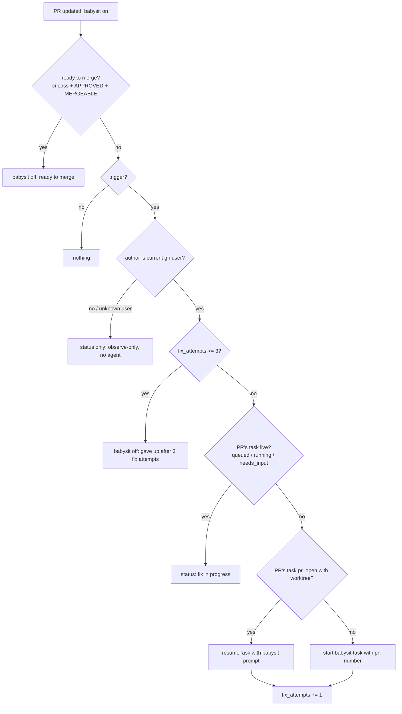

# techtree — design

A pi package that shows a repository as an RPG-style tech tree: every directory is a node, scored for quality, with live agent work and PRs overlaid. From the tree you can start improvement tasks and babysit PRs.

Open source, with no dependency on any specific pi host. It works in plain pi, in the pi TUI, and in any host that can open a URL.

## Decisions

| Topic | Decision |
|---|---|
| Surface | A pi extension serves a localhost web app; `/techtree` starts it and prints the URL. |
| Agents | Headless pi child processes (`pi --mode rpc`), one per task, each in its own git worktree. |
| PRs | `gh` CLI polling. No GitHub App, no webhooks. |
| Tree | The directory tree is the core. Plugins can name and annotate nodes; for example, a Cargo crate root becomes a "crate" node. |
| Scores | Each metric is turned into a percentile against the repo's other nodes of the same kind, and a weighted composite of those gives a 0–100 quality score. Weights live in config. |
| Progress | Planned delta = the sum of the estimated impacts of the task's findings. Fill comes from checklist completion and the current phase. |
| Autonomy | Each task has a "manual review before PR" checkbox, pre-ticked when the complexity heuristic says so. Nothing ever auto-merges. |
| LLM scans | On demand per subtree, cached by file content hash. |
| State | User cache: `~/.cache/techtree/<repo-id>/` (SQLite via `node:sqlite`, plus per-task logs). Optional repo config at `.techtree.yaml`. |
| Concurrency | 3 workers by default (configurable); further tasks queue. |
| Stack | TypeScript. Node server: `node:http`, `node:sqlite`, no framework. Front end: Preact with hand-rolled SVG, built with esbuild. |

## Architecture

```
pi extension (techtree)
 ├─ /techtree command → start server, notify URL
 ├─ tools: techtree_status, techtree_findings, techtree_report (worker progress)
 └─ server (node:http, localhost, random port, token in URL)
     ├─ REST + SSE API  ←→  web UI (Preact/SVG)
     ├─ scorer pipeline  → metric plugins → sqlite
     ├─ task runner      → pi --mode rpc children in worktrees
     └─ PR poller        → gh pr list/view/checks
```

There is one server per repo, shared by every pi session in that repo through a lockfile (`server.json`: pid, port, token) in the cache dir. The server runs as a detached Node process (`techtree serve <repo>`) so tasks outlive the pi session that started it; `/techtree` starts it when the lockfile is missing or stale and reuses it otherwise.

## Data model (contract for all subtasks)

`src/types.ts` is the authoritative copy of these contracts. Beyond the summary below it adds: `TreeNode.parent`; `Tree` (`repoRoot` + `nodes` by id); `CollectCtx` (repo root, tree, config, a `Cache` keyed by kind and key, logger, abort signal); `Finding.tags` (used by the complexity heuristic); `Task.prompt`, `question`, `error`, `pid`, `logPath`, timestamps; `PrState.title`, `author`, `taskId`, and the optional poller fields `mergeable`, `branch`, `head`, `reviewCount`, `babysitStatus` (see "PRs"); the scoring output (`MetricScore`, `NodeScore`, `Impact`, `ScoreResult`, `Suggestion`); `Config`; and the HTTP API payloads below.

```ts
type NodeId = string;              // repo-relative dir path, "" = root
interface TreeNode { id: NodeId; name: string; kind: string /* "dir" | "crate" | ... */; children: NodeId[]; files: string[] }

interface MetricDef {
  key: string;                     // "loc", "test_count", "lint_warnings", ...
  label: string;
  unit?: string;
  direction: "higher_better" | "lower_better" | "neutral";   // neutral = weight-only (e.g. loc)
  aggregate: "sum" | "max" | "mean_by_loc";                   // how parents combine children
  normalizeBy?: string;            // e.g. lint_warnings per "loc" before percentile
}
interface MetricPlugin {
  id: string;
  metrics: MetricDef[];
  annotate?(tree: Tree): void;     // rename/kind nodes (cargo: crate names)
  collect(ctx: CollectCtx): Promise<Record<NodeId, Record<string, number>>>;  // leaf/own values
  findings?(ctx: CollectCtx): Promise<Finding[]>;
}
interface Finding {
  id: string;                      // stable hash of (source, file, rule, snippet)
  node: NodeId; file?: string; line?: number;
  source: string;                  // "clippy", "llm-scan", "test-gap", ...
  title: string; detail: string;
  severity: "low" | "medium" | "high";
  effort: "trivial" | "small" | "medium" | "large";
  metricEffects: Record<string, number>;   // e.g. { lint_warnings: -1 } if fixed
}
interface Task {
  id: string; node: NodeId; title: string; findingIds: string[];
  state: "queued" | "running" | "needs_input" | "review" | "pr_open" | "done" | "failed";
  manualReview: boolean; worktree?: string; branch?: string; pr?: number;
  plannedFrom: number; plannedTo: number;   // composite scores
  checklist: { text: string; done: boolean }[]; phase: "plan" | "explore" | "edit" | "test" | "pr";
}
interface PrState { number: number; url: string; node: NodeId; files: string[]; ci: "pass" | "fail" | "pending";
  review: string; updatedAt: string; babysit: boolean; stale: boolean; stuck: boolean }
```

## Scoring

1. **Collect.** Each plugin returns its own values per node. The core aggregates them up the tree using each metric's `aggregate`.
2. **Normalize.** Metrics with `normalizeBy` are divided first, so lint warnings are counted per kLOC. Each node then gets a percentile among peers of the same `kind` with at least `minLoc` lines; tiny nodes inherit their parent's percentile. `lower_better` metrics are flipped.
3. **Composite.** quality = Σ wᵢ·pctᵢ / Σ wᵢ over the metrics present. The weights come from `.techtree.yaml`, with defaults provided.
4. **History.** Every scoring run writes a snapshot (commit sha, timestamp), giving sparklines and before/after comparisons for merged tasks.

The v1 plugins are listed below.

| Plugin | Metrics | Findings |
|---|---|---|
| `generic` | `loc`, `files`, `max_file_loc`, `todo_density` | very large files, TODO/FIXME clusters |
| `git` | `churn_90d`, `authors_90d`, `last_touched_days`, `open_pr_overlap` | — |
| `rust` | crate annotation, `fn_count`, `complexity` (approx.), `unwrap_density`, `test_count`, `test_ratio`, `ignored_tests`, `lint_warnings` (clippy JSON), `test_time` (nextest JUnit, if present) | clippy diagnostics, untested public fns, unwrap/expect in non-test code |
| `llm-scan` (on demand) | `review_debt` (severity-weighted, per kLOC of scanned code), `scanned_loc` | each scanned issue, with severity, effort and a suggested fix |

### v1 plugin metrics

Own values are per node: a directory's own files only; the core aggregates up. Density and ratio metrics hold a raw count and name their denominator in `normalizeBy`, so findings can state their effect as a count and parents aggregate correctly by summing.

| Metric | Own value | Direction | Aggregate | normalizeBy |
|---|---|---|---|---|
| `loc` | non-blank lines | neutral | sum | |
| `files` | counted files | neutral | sum | |
| `max_file_loc` | largest file's `loc` | lower_better | max | |
| `todo_density` | lines with `TODO`/`FIXME`/`XXX`/`HACK` | lower_better | sum | `loc` |
| `churn_90d` | lines added + deleted in the last 90 days | neutral | sum | |
| `authors_90d` | distinct author emails in the last 90 days | neutral | max | |
| `last_touched_days` | days since the newest commit touching an own file | neutral | max (stalest part) | |
| `open_pr_overlap` | open PRs changing an own file | neutral | max | |
| `fn_count` | `fn` items in non-test Rust code | neutral | sum | |
| `pub_fn_count` | `pub fn` items in non-test Rust code | neutral | sum | |
| `complexity` | branch points (`if`, `match`, `while`, `for … in`, `loop`, `&&`, `\|\|`) in non-test code | lower_better | sum | `fn_count` |
| `unwrap_density` | `.unwrap()` / `.expect(` in non-test code | lower_better | sum | `loc` |
| `test_count` | test fns (`#[test]`, `#[<path>::test]`, `#[rstest]`) | neutral | sum | |
| `test_ratio` | test fns (same count as `test_count`) | higher_better | sum | `pub_fn_count` |
| `ignored_tests` | `#[ignore]` attributes | lower_better | sum | |
| `fan_in` | workspace crates depending on this crate (crate nodes only) | neutral | max | |
| `lint_warnings` | clippy/rustc lint diagnostics in own files (linted crates only) | lower_better | sum | `loc` |
| `test_time` | seconds from nextest JUnit XML (crate nodes only) | neutral | sum | |

Git metrics are neutral: churn, authorship and recency describe how hot a node is (used by the complexity heuristic and as weights), not its quality. `open_pr_overlap` feeds conflict, not quality. Only history of files in the tree counts: excluded paths and files that no longer exist (deleted or moved away) are ignored, because they are not any node's own files.

Rules shared by the plugins:

- **Skipped files** (`generic`): binary files (NUL byte in the first 8 KB), files over 2 MB, lockfiles, minified `*.min.*` files, files under `vendor/` or `third_party/`, and files whose first lines say `@generated` or `DO NOT EDIT`.
- **Non-test Rust code** excludes files under a `tests/`, `benches/` or `examples/` directory and the bodies of `#[cfg(test)]` modules and test fns. Comments and string literals are ignored. The detection is lexical and approximate.
- **Crates** (`rust.annotate`): a directory whose `Cargo.toml` has a `[package]` section becomes kind `crate`, named after the package. `fan_in` counts dependents across all workspace `Cargo.toml` dependency tables. Renames via `package = "…"` are honoured, including aliases a member inherits with `workspace = true` from the root `[workspace.dependencies]`.
- **Clippy** runs only when `plugins.rust.clippy` is true or `TECHTREE_CLIPPY=1`. One `cargo clippy --message-format=json -p … <clippyArgs>` covers every crate whose key (hash of its files, the root `Cargo.toml`, `Cargo.lock`, `rust-toolchain[.toml]` and `clippyArgs`) is not cached. The child inherits the parent environment (e.g. `CARGO_TARGET_DIR`). A crate counts as linted when one of its targets other than the build script was checked (or reported lints) and it had no non-lint compile error. A crate that fails to build, including through a failing build script, gets no `lint_warnings`, is not cached, and is logged. Each diagnostic is counted once per primary source span, so repeated emissions (e.g. lib and test targets under `--all-targets`) collapse while separate occurrences on one line stay separate. `plugins.rust.exclude` lists crate names to skip.
- **test_time** sums `testsuite` times per package from `<target>/nextest/*/*.xml`, where `<target>` is `CARGO_TARGET_DIR` or `<repo>/target`.
- **open_pr_overlap** uses `gh pr list --state open --json number,files` when a remote points at GitHub, cached for 10 minutes; any failure yields 0.

Findings (ids hash source, file, rule and a snippet, never a line number):

| Source | Rule | Granularity | metricEffects |
|---|---|---|---|
| `large-file` | `large-file` | file with ≥ 1000 loc; ≥ 2000 medium/large, ≥ 4000 high/large | `max_file_loc` down to max(1000, next largest file) |
| `todo` | `todo-cluster` | file with ≥ 3 TODO lines | `todo_density: -n` |
| `clippy` | lint code | one per diagnostic; trivial when machine-applicable, else small | `lint_warnings: -1` |
| `test-gap` | `untested-pub-fn` | file whose `pub fn` names never appear in the crate's test code | `test_count: +n`, `test_ratio: +n` |
| `unwrap` | `unwrap-expect` | file with unwrap/expect in non-test code | `unwrap_density: -n` |

Clippy findings are tagged `concurrency` (lock, mutex, atomic, `Arc`, `Send`/`Sync`, await), `security` (unsafe, transmute, raw pointers, uninit) or `api` (`must_use`, docs, `new_without_default`, self conventions); untested public fns are tagged `api`.

**Impact estimation (what-if).** Fixing finding *f* applies `metricEffects` to its node's raw values, then recomputes aggregation, percentiles and composite for that node and its ancestors, holding everyone else fixed. impact(f) = Δquality at the node, and the root delta is shown alongside. A task's planned delta applies all its findings together.

### LLM scan

`scanNode(node, ctx, opts)` in `src/plugins/llm-scan.ts` reviews the files of a subtree (the node and all descendants) with the `techtree-scan` skill.

1. **Select.** Subtree files sorted by path, skipping binary files (containing a NUL byte) and files larger than `batchBytes`; at most `maxFiles` are kept.
2. **Batch.** Files are chunked in order into batches of at most `batchFiles` files and `batchBytes` UTF-8 bytes. Batch key = sha256 of (SKILL.md contents, each path and its contents).
3. **Run.** A cached batch costs nothing. Otherwise pi runs once per batch, at most `concurrency` at a time, with cwd = repo root: `<piCommand> -p --no-session --tools read,grep,find,ls --skill <package>/skills/techtree-scan "/skill:techtree-scan <files with numbered lines>"`. A run that exits nonzero, times out (`timeoutMs`, whatever its exit code), or prints no JSON array fails that batch; failures are reported and not cached, and never throw. A timed-out or aborted child gets SIGTERM, then SIGKILL after 1 s; the batch settles only once the child has exited. Aborting the signal stops running children, skips pending batches, and rejects with the abort reason.
4. **Parse.** The final text must contain a JSON array (bare, in a ```json fence, or between the first `[` and last `]`). Items need a non-empty `title`, a `detail` string, a `file` from the batch, a valid `severity` and `effort`; optional `line` (positive integer), `tags` (strings), `suggestedFix` (string, appended to the detail) and `metricEffects` (finite numbers). Malformed items, and items repeating an earlier item's `file` and `title` (the finding identity), are dropped and the rest kept.
5. **Store** in `ctx.cache` kind `llm-scan`: `batch:<key>` → the batch's findings, and `file:<path>` → `{ sha, loc, findings }` for every file in the batch (an empty list means scanned and clean).
6. **Progress.** `opts.onProgress` receives `{ done, total, cached, failed, findings }` after each batch.

Options come from `config.plugins["llm-scan"]`, overridable per call: `concurrency` (2), `maxFiles` (200), `batchFiles` (20), `batchBytes` (60000), `timeoutMs` (600000).

**Scoring reads only the cache, never pi.** A file counts as scanned when its `file:<path>` entry's `sha` matches the file's current contents. For each node with scanned own files: `review_debt` = Σ severity weight of their findings (low 1, medium 3, high 9; `aggregate: sum`, `normalizeBy: scanned_loc`, `lower_better`), and `scanned_loc` = their summed line count (`neutral`, `sum`). Nodes with no scanned files get neither metric. Each cached finding becomes a `Finding` with `source: "llm-scan"`, `node` = the file's directory, id = hash of (source, file, title), and `metricEffects.review_debt` = −weight (overriding any model-supplied value). `scanCoverage(ctx)` returns the overview `coverage`: nodes with any scanned own file, total nodes, scanned and total lines.

**Priority** of a suggested task = impact ÷ effort cost × (1 − conflict), where conflict ∈ [0,1] is the overlap of its files and directories with running tasks' worktree diffs and open-PR file lists.

### Scoring rules (`src/core/`)

The precise rules the scorer implements:

- **Tree.** Files come from `git ls-files -co --exclude-standard` (tracked plus untracked, not ignored). A `config.ignore` entry is a path glob (`*` matches within a segment, `**` across segments). An entry without `/` matches any path segment (`target` drops `target/…` and `crates/a/target/…`); an entry with `/` matches a leading part of the path. Every directory with a file somewhere below it is a node: id = its repo-relative path, root id `""`, name = basename (repo dir name for the root), kind `dir` until a plugin's `annotate` changes it.
- **Aggregation.** A node has a metric if it or a descendant has an own value for it. `sum` adds own and children's values; `max` takes the largest; `mean_by_loc` is Σ value·loc ÷ Σ loc over the own value (weighted by own `loc`) and the children's aggregated values (weighted by their aggregated `loc`), falling back to the plain mean when Σ loc = 0. When several plugins define the same key, the first definition wins.
- **Normalize.** `normalizeBy: "loc"` gives a value per 1000 lines (per kLOC); any other `normalizeBy` metric is a plain ratio. A zero or missing divisor gives 0.
- **Peers.** A node is ranked when its aggregated `loc` ≥ `minLoc` (every node is ranked if no plugin defines `loc`). Its peers for a metric are the other ranked nodes of the same `kind` that have the metric.
- **Percentile** (interpolated mid-rank). For value *v* and peers *P* (*m* = |P|, the node itself excluded): if *m* = 0, 50; if some peers equal *v*, 100·(#{p < v} + #{p = v}/2) ÷ *m*; below every peer 0; above every peer 100; otherwise linear interpolation between the percentiles of the nearest peer values below and above. Ties get identical scores, and a small change in value gives a small change in percentile, which keeps what-if impacts non-zero. `lower_better` metrics use 100 − pct; `neutral` metrics get `pct: null`. A node that is not ranked takes its parent's pct for each metric (`inherited: true`), or null at the root.
- **Composite.** quality = Σ wᵢ·pctᵢ ÷ Σ wᵢ over the node's metrics with a non-null pct and weight > 0; null if there are none.
- **What-if.** Effects are added to the node's own values (clamped at 0). Only the changed nodes and their ancestors are re-aggregated and re-scored, against the unchanged peer distributions. A node ranked before and after moves its pct by percentile(*S*, new) − percentile(*S*, old), clamped to 0..100, where *S* is the unchanged distribution including its own old value; otherwise it is ranked (or inherits) as above. Including the old value keeps a fix visible for the worst node of a kind, whose plain percentile stays 0 until it passes the next-worst peer. A Δ involving a null quality is 0. A multi-finding impact sums the effects per node and reports the Δ at the deepest common ancestor of the findings' nodes (or a given node).
- **Effort cost.** trivial 1, small 2, medium 5, large 13; priority uses the node impact.
- **Conflict.** A suggestion's paths are its findings' files (its node's dir when none have a file). Two paths overlap when one equals or contains the other (the root contains everything). conflict = fraction of the suggestion's paths overlapping any busy path.
- **Suggestions.** One per finding, except that `trivial` findings from the same source in the same file form one suggestion, anchored at the deepest common ancestor of their nodes (its impact is measured there). Suggestions are sorted by priority, highest first.
- **Hot node.** A node is hot when its aggregated `churn_90d` or `fan_in` is > 0 and fewer than ⌈n/10⌉ of the n nodes of its kind with that metric have a strictly larger value.
- **Pipeline.** `score()` builds the tree, runs every plugin's `annotate` in order, then every `collect` and `findings` in parallel. A failing hook is logged and skipped: a failed `collect` drops that plugin's metrics, a failed `findings` drops its findings. Findings on unknown nodes are dropped, duplicate ids keep the first.
- **Persistence.** Each run inserts a snapshot with its node scores. Findings are upserted by id (`first_seen` kept, `last_seen` updated, `resolved_at` cleared); after a full run, unresolved findings not in it get `resolved_at` (by membership, not timestamp).
- **Report.** `formatReport` lists, per non-neutral metric, the 10 best and 10 worst ranked (non-inherited) nodes independently (they overlap when fewer than 20 nodes are ranked), then the top 20 findings by priority. Control characters in repository text (paths, names, titles, labels) are printed as `\xNN`.

## UI

- **Tree:** left to right, root to deepest directory, as a tidy tree with collapse/expand and zoom/pan. It should look and feel like a game tech tree and feel alive, not like a plain graph:
  - Each node is a pixel-art square tile (crisp edges, no anti-aliasing) sized by √weight; the weight metric is selectable (loc, test_count, test_time, …). Edge width also scales with √weight.
  - Tile fill comes from the selected score on a diverging ramp so the worst nodes stand out: bad scores are hot and saturated (red/orange), good scores cool (teal/green), and the bottom decile visibly pulses. The ramp is normalized to the repo's range.
  - The tile surfaces more at a glance through filled segments: one pixel segment per weighted metric coloured by its percentile, plus badges for open PRs, tasks needing input and finding count.
  - A progress bar along the tile's bottom shows quality, or the research bar while a task runs.
  - Ambient motion: running tasks animate, attention items pulse, score changes flash. Motion respects `prefers-reduced-motion`.
  - Siblings are sorted by a selectable key (default: alphabetical).
- **Overlays:** running tasks appear as a research bar under the node. The bar is solid up to `plannedFrom`, then shows a loading stripe up to `plannedTo` filled to checklist completion, then empty. Its color follows the score ramp. Open PRs appear as a count bubble on the top-right corner of their anchor node. The anchor is the deepest node that contains at least 60% of the PR's changed lines.
- **Node panel** (on click): first the node's own calls to action, then the top calls to action from its children (each labelled with and linking to its child node); then composite score and per-metric breakdown with percentiles and sparklines, findings ranked by impact, open PRs with a babysit toggle, running tasks with live log tail, and suggested next tasks. Starting a task asks for the manual-review checkbox (pre-ticked by the heuristic) and lets you edit the prompt.
- **Overview** (no selection): calls to action:
  1. tasks in `needs_input` or `review`
  2. PRs that are failing, stuck (no progress in 24h), or stale (no update in 3 days)
  3. the top suggested tasks by priority, favouring low conflict
  4. a scan-coverage summary

**Calls to action** (`Cta`, used by the node panel and overview), ranked highest first:
1. tasks in `needs_input`, then `review`;
2. PRs that are failing, then stuck, then stale;
3. suggestions by priority.
A node's `ownCtas` are those anchored at the node; `childCtas` are the top 10 anchored strictly below it.

**Complexity heuristic** for pre-ticking manual review: tick it if any of these hold:
- the effort is `medium` or larger,
- there is more than one finding,
- the node is "hot" (top-decile churn or fan-in among nodes of its kind),
- a finding is tagged `concurrency`, `security` or `api`.

## Agents

- **Start:** the runner creates a worktree at `~/code/worktrees/<repo>/techtree-<task>` (`worktreeTemplate`: `{home}`, `{repo}` = repo dir name, `{task}` = task id) on a new branch `techtree/<task>` from `baseRef`, with `git worktree add`; the main checkout's working tree is never touched. It spawns `piCommand --mode rpc --session-dir <cache>/sessions/<task> --session-id <task> -e <package>/extensions --skill <package>/skills/techtree-worker --skill <package>/skills/techtree-babysit` there, with `TECHTREE_URL`, `TECHTREE_TOKEN` and `TECHTREE_TASK` in the environment, and sends the task prompt as `/skill:techtree-worker <prompt>` plus the finish rule for the task's `manualReview` setting.
- **Queue:** at most `workers` tasks have a live child (`running` or `needs_input`); further tasks stay `queued` and start in creation order as slots free up. Resuming a task that has a worktree but no child ("Open PR", an answer after restart, recovery) also goes through the queue: the task becomes `queued` and respawns on its pi session with the resume prompt when a slot frees.
- **Worker protocol:** the skill requires a checklist up front through the `techtree_report` tool (`{plan}`), then `{phase}` and `{done:i}` updates. When stuck, the worker calls `{needs_input: question}`, which pauses the task. `techtree_report` POSTs the payload to `$TECHTREE_URL/api/tasks/$TECHTREE_TASK/report?token=$TECHTREE_TOKEN`; one payload may carry several fields. Reports for tasks without a live worker, unknown phases, or out-of-range `done` indexes are rejected.
- **RPC events:** every event worth reading (assistant messages, tool calls, retries, dialogs, errors, stderr, state changes) becomes a timestamped line in `<cache>/tasks/<task>.log` and a `log` server event; every task change is persisted to SQLite and emitted as a `task` event.
  - An extension dialog (`select`, `confirm`, `input`, `editor`) moves the task to `needs_input` with the dialog text as the question. The answer is sent back as the dialog response: `confirm` is true when the answer starts with y/yes/ok/true/allow, other dialogs get the text as their value. If pi resolves the dialog itself (its `timeout` elapses, or the agent settles while the dialog is open), the dialog is dropped and the task returns to `running`.
  - An answer to a reported `needs_input` question is sent as a follow-up prompt. Either way the task returns to `running`.
  - When the agent settles (`agent_settled`) while `running` and the task is not finished, the runner nudges once; if it settles unfinished again, the task moves to `needs_input`. Any report or answer re-arms the nudge.
  - If pi rejects a prompt (`response` with `success: false`), the task becomes `failed` with pi's error, because no run will follow.
  - Records from a child that is no longer the task's current worker (after cancel, replacement or shutdown) are ignored.
  - If the child exits while the task is `queued`, `running` or `needs_input`, the task becomes `failed` with the exit code and log path.
- **Finish:** a task is finished when its checklist is non-empty and fully ticked and, in the PR stage, `gh pr view <branch> --json number` finds the PR (run asynchronously, with a 60 s timeout). The PR stage is every task without `manualReview`, and a `manualReview` task after "Open PR".
  - With `manualReview`, the worker commits and stops; the runner moves the task to `review` and ends the child. The diff is `git diff <baseRef>...HEAD` in the worktree, where `baseRef` is resolved in the main checkout. The UI shows it with an "Open PR" button.
  - "Open PR" (`review` → `queued` → `running`, phase `pr`) resumes the same pi session with an instruction to push to the upstream remote and open the PR with `gh`, following the repo's PR template.
  - Otherwise the worker opens the PR itself in one go. Once the PR number is found the task records it, moves to `pr_open` and the child is ended. Nothing ever merges.
- **Cancel:** stops the child (if any) and marks the task `failed` with error `cancelled`. The worktree is kept.
- **Babysit tasks:** a task started with `pr: <number>` (runner-only `StartTask` field) adopts that existing PR instead of opening one: its worktree is created detached at `baseRef` and then switched with `gh pr checkout <number> --branch techtree/<task>`, its prompt is sent as given (the caller includes `/skill:techtree-babysit`), and its PR lookup uses the PR number. `resumeTask(task, prompt)` queues a `pr_open` task that has a worktree to respawn on its session with `prompt`. Babysit itself is described under "PRs".
- **Recovery:** task state lives in SQLite. RPC runs over the child's stdio, so a new server cannot reattach to an old child; and when the server dies, the child's stdin closes and pi shuts down. On start, for each task persisted as `running`, `needs_input`, or `queued` with a worktree, the runner stops any process still alive at the recorded pid.
  - If the task's pi session file exists, `running` tasks are queued to respawn on that session (`--session-id`) with a short "continue" prompt. `needs_input` tasks keep their question and are queued to respawn on that session when answered; an answer to a lost dialog is sent as a prompt. An answer or "Open PR" still waiting in the queue during a restart is lost: the task resumes with the "continue" prompt, or the PR instruction if it is in the PR stage.
  - Without a session file the task is marked `failed`, with the log path in `error`.
  - Queue pumping waits until the recovery sweep has finished; then `queued` tasks start as slots allow. `review`, `pr_open`, `done` and `failed` tasks are left untouched.

## PRs

`src/prs/` polls `gh`, anchors PRs on the tree, flags them, and babysits them. Nothing here ever merges.

**Poller** (`PrPoller`). One poll runs, in the repo root, through the `gh` argv prefix (default `["gh"]`):
1. `gh api user --jq .login` until it has succeeded once (the current user);
2. `gh pr list --author @me --state open --limit 100 --json <fields>`;
3. `gh pr view <n> --json <fields>` for each PR recorded on a `pr_open` task that step 2 did not return (usually none); a PR whose `state` is not `OPEN` is dropped.

`<fields>` = `number,url,title,author,files,statusCheckRollup,reviewDecision,reviews,updatedAt,mergeable,headRefName,headRefOid,state`. Polls never overlap (`poll()` while one is running returns the running one); the next poll is scheduled `intervalMs` (default 60 s) after the previous one ends, doubling after each consecutive failure up to `maxBackoffMs` (default 15 min). A failed step (missing `gh`, no auth, bad JSON) never throws: the poll keeps the previous PRs and `status` becomes `gh failed: <first stderr line>`; a successful poll sets `status` to `ok`.

Each open PR becomes a `PrState`, persisted in the `prs` table (keeping `babysit`, `fix_attempts`, `last_progress_at` across polls) and emitted as a `pr` event when anything in it changed. Open PRs no longer returned (merged or closed) are deleted from the table.
- `ci` from `statusCheckRollup`: `fail` if any check run concluded `FAILURE`, `CANCELLED`, `TIMED_OUT`, `ACTION_REQUIRED` or `STARTUP_FAILURE`, or any status context is `FAILURE`/`ERROR`; else `pending` if any check run is not `COMPLETED` or any status context is `PENDING`/`EXPECTED`; else `pass` (also with no checks).
- `review` = `reviewDecision` (`""` when null); `reviewCount` = submitted reviews by others that are not approvals; `mergeable` = gh's `MERGEABLE` / `CONFLICTING` / `UNKNOWN`; `branch` = head ref, `head` = head commit sha.
- `taskId` = the newest task whose `pr` is the PR's number or whose `branch` is its head ref.
- `node` = `anchorPr(files, tree)` on the latest tree (root when no tree is loaded).

**Anchoring** (`anchorPr`). Input: the PR's files with changed lines (additions + deletions). Each file's lines count toward the node of its directory, or the deepest existing ancestor when that directory is not a node (so files outside the tree count only toward the root). A node contains the lines of its subtree. The anchor is the deepest node containing at least 60% of all changed lines (the root always qualifies). When the PR changes no lines (renames, binaries), every file counts as one line; with no files the anchor is the root. Example: 70 lines in `crates/a/src`, 30 in `crates/b` → `crates/a/src`; 50 / 50 → `crates`.

**Flags** (injectable clock). *Progress* is a new head commit, a `ci` change, a `review` change or a `reviewCount` change; it sets `last_progress_at` to now. A PR first seen starts with `last_progress_at` = its `updatedAt`. `stale` = now − `updatedAt` ≥ 3 days; `stuck` = now − `last_progress_at` ≥ 24 h.

**Babysit** (`Babysitter`). `setBabysit(number, on)` toggles it per PR (unknown PR → error); switching on resets `fix_attempts` to 0 and immediately evaluates the PR's current state. On each poll update of a babysat PR:



- **Triggers** compare with the previous state (on switch-on: CI failing, changes requested or conflict as they are now): `ci` turns `fail`; `review` turns `CHANGES_REQUESTED`; `reviewCount` grows; `mergeable` turns `CONFLICTING`.
- **Observe-only** is enforced in code: for a PR whose author is not the current gh user (or while the user is unknown), babysit never starts or resumes an agent, so it can neither push nor reply; it only sets `babysitStatus` and emits the `pr` event.
- Every outcome is written to `babysitStatus` (`ready to merge`, `observe-only: <triggers>`, `gave up after 3 fix attempts`, `fix in progress: <triggers>`, `fix attempt <k>/3: <triggers>`). A merged or closed PR leaves the poll results, which ends its babysitting.
- The babysit prompt is `/skill:techtree-babysit` with the PR number, URL, title, head branch and triggers. Babysit tasks are titled `Babysit PR #<n>`, anchored at the PR's node, without manual review.

## Configuration

`.techtree.yaml` at the repo root, merged over defaults. Supported YAML subset: nested block mappings, block lists of scalars, flow lists (`[a, b]`), scalars and `#` comments.

```yaml
weights: { }          # metric key → composite weight (defaults in src/config.ts)
minLoc: 200           # smaller nodes inherit their parent's percentile
workers: 3
worktreeTemplate: "{home}/code/worktrees/{repo}/techtree-{task}"
baseRef: HEAD         # ref task worktrees branch from
piCommand: [pi]       # argv prefix for pi children; env TECHTREE_PI overrides the default
ignore: [target, node_modules, .git]
plugins:              # per-plugin options, e.g.
  rust: { }
```

## HTTP API

All routes are under `/api`, require the token, and return JSON (log and diff return `text/plain`). Payload types are in `src/types.ts`. The server (`src/server/server.ts`) only parses, authenticates and routes; every route delegates to one method of the `Backend` interface in `src/server/backend.ts`, which the integration layer implements with the real scorer, runner and poller (`src/server/mock.ts` is a synthetic implementation for UI development: `node src/server/dev.ts`).

| Route | Result |
|---|---|
| `GET /api/state` | `ApiState`: repo, latest snapshot, tree, metric defs, weights, scores, tasks, PRs, finding counts |
| `GET /api/node?id=<node>` | `ApiNode`: score, history, findings with impact, PRs, tasks, suggestions |
| `GET /api/overview` | `ApiOverview`: attention tasks, flagged PRs, suggestions, scan coverage |
| `GET /api/events` | SSE stream of `ServerEvent` |
| `GET /api/tasks/:id/log?tail=N` | last N log lines (text) |
| `GET /api/tasks/:id/diff` | worktree diff against the base (text) |
| `POST /api/tasks` | body `StartTaskRequest` → `Task` |
| `POST /api/tasks/:id/answer` | body `{ text }`: answer a `needs_input` question → `Task` |
| `POST /api/tasks/:id/open-pr` | `review` → `pr_open` → `Task` |
| `POST /api/tasks/:id/cancel` | stop the child, mark `failed` → `Task` |
| `POST /api/prs/:number/babysit` | body `{ on: boolean }` → `PrState` |
| `POST /api/score` | rescore the repo → `{ ok: true }`; completion arrives as a `scores` event |
| `POST /api/scan` | body `{ node }`: run the LLM scan on a subtree → `{ ok: true }`; progress arrives as `scan` events |
| `POST /api/tasks/:id/report` | worker progress from `techtree_report` (`WorkerReport`: at least one of `plan: string[]`, `phase: TaskPhase`, `done: index`, `needs_input: string`) → `Task` |

Errors are JSON `{ error: string }`: 400 malformed body or parameters, 401 missing or wrong token, 403 foreign `Host`/`Origin` or a non-JSON mutating request, 404 unknown route, node, task or PR, 409 the task is in the wrong state, 413 body over 1 MB, 500 anything else. Backends signal 404/409 by throwing `HttpError`.

The SSE stream sends one `data: <ServerEvent JSON>` message per event and a `: ping` comment every 15 s. It has no replay, so clients refetch `/api/state` (and any open details) whenever the stream reconnects.

## Security

The server binds 127.0.0.1 only and requires a random token on every request, including the static UI. The token is accepted as `?token=` (the server then sets it as an `HttpOnly; SameSite=Strict` cookie `techtree_token_<port>` (named per port because cookies are not port-scoped and each repo has its own server) and redirects page loads to the bare URL), as that cookie, or as `Authorization: Bearer <token>` (used by workers). Requests whose `Host` is not `127.0.0.1:<port>` or `localhost:<port>` are rejected (DNS rebinding). Mutating endpoints are `POST` only, must send `Content-Type: application/json`, and are rejected when an `Origin` header names another origin, so cross-site forms cannot reach them. Workers inherit the user's pi configuration and sandbox, and techtree adds no privileges.

## Out of scope for v1

Multi-repo views, team-shared history, auto-merge, scheduled scans, non-Rust language plugins beyond `generic`.

## Work breakdown

| # | Subtask | Depends on | Output |
|---|---|---|---|
| 0 | Repo scaffold, contracts (`src/types.ts`), config loader, sqlite schema | — | buildable package skeleton |
| 1 | Tree builder + aggregation + percentile/composite + what-if impact | 0 | `core/` with unit tests on a fixture repo |
| 2 | Plugins: `generic`, `git`, `rust` | 0 | `plugins/`, tested on fixtures and base/base |
| 3 | `llm-scan` plugin + `techtree-scan` skill (finding schema, impact fields) | 0 | skill + plugin, cached by content hash |
| 4 | Task runner (worktrees, pi RPC children, progress protocol, recovery) + `techtree-worker` skill | 0 | `runner/` |
| 5 | PR poller + anchoring + babysit loop + `techtree-babysit` skill | 0, 4 | `prs/` |
| 6 | HTTP/SSE API + web UI (tree, overlays, panel, overview) | 0, with a mock API until 1/2/4/5 land | `server/`, `web/` |
| 7 | pi extension glue (`/techtree`, tools, lockfile, setWidget status) + end-to-end smoke test on base/base | all | release-ready package |
