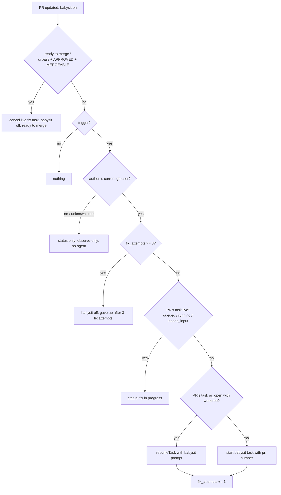

# techtree — design

A pi package that shows a repository as an RPG-style tech tree: every directory is a node, scored for quality, with live agent work and PRs overlaid. From the tree you can start improvement tasks and babysit PRs.

Open source, with no dependency on any specific pi host. It works in plain pi, in the pi TUI, and in any host that can open a URL.

## Decisions

| Topic | Decision |
|---|---|
| Surface | A pi extension serves a localhost web app; `/techtree` starts it and prints the URL. |
| Agents | Headless pi child processes (`pi --mode rpc`), one per task, each in its own git worktree. |
| PRs | `gh` CLI polling. No GitHub App, no webhooks. |
| Tree | The directory tree is the core. Plugins can name and annotate nodes; for example, a Cargo crate root becomes a "crate" node. |
| Scores | Each metric is turned into a percentile against the repo's other nodes of the same kind, and a weighted composite of those gives a 0–100 quality score. Weights live in config. |
| Progress | Planned delta = the sum of the estimated impacts of the task's findings. Fill comes from checklist completion and the current phase. |
| Autonomy | Each task has a "manual review before PR" checkbox, pre-ticked when the complexity heuristic says so. Nothing ever auto-merges. |
| LLM scans | On demand per subtree, cached by file content hash. |
| State | User cache: `~/.cache/techtree/<repo-id>/` (SQLite via `node:sqlite`, plus per-task logs). Optional repo config at `.techtree.yaml`. |
| Concurrency | 3 workers by default (configurable); further tasks queue. |
| Stack | TypeScript. Node server: `node:http`, `node:sqlite`, no framework. Front end: Preact with hand-rolled SVG, built with esbuild. |

## Architecture

```
pi extension (techtree)
 ├─ /techtree command → start server, notify URL
 ├─ tools: techtree_status, techtree_findings, techtree_report (worker progress)
 └─ server (node:http, localhost, random port, token in URL)
     ├─ REST + SSE API  ←→  web UI (Preact/SVG)
     ├─ scorer pipeline  → metric plugins → sqlite
     ├─ task runner      → pi --mode rpc children in worktrees
     └─ PR poller        → gh pr list/view/checks
```

There is one server per repo, shared by every pi session in that repo through a lockfile (`server.json`: pid, port, token, url, version) in the cache dir. The server runs as a detached Node process (`techtree serve <repo>`) so tasks outlive the pi session that started it; `/techtree` starts it when the lockfile is missing or stale and reuses it otherwise.

### Server lifecycle

- **`techtree serve [repo] [--port N]`** (default `.`, random port) starts the server for the repo with the real backend and serves the built UI from `dist/web`, read from disk on every request, so `npm run build` and a page reload is the UI dev loop. When a live server already exists (see below) it prints that server's URL and exits instead. Otherwise it claims the repo with an exclusive SQLite lock on `<cacheDir>/server.lock` (released by the OS when the process dies, so a crash leaves no stale claim); a process that loses the claim waits up to 30 s for the winner to become live, prints its URL and exits, so concurrent launches yield one server. The owner listens, writes `<cacheDir>/server.json` atomically (temp file + rename), prints the URL, and stays in the foreground. On SIGINT/SIGTERM or idle exit it removes `server.json` (only if it still names its own pid), detaches from task workers, aborts running scans and waits for their pi children to exit, then releases the claim and exits.
- **Idle exit:** the server exits after 2 hours (`TECHTREE_IDLE_MS` overrides) with no API request, no SSE client, no task with a live worker or waiting in the queue (`queued`, `running`, `needs_input`) and no scoring or scan in progress.
- **`techtree stop [repo]`** sends SIGTERM to the pid in `server.json` when that server is live, and removes a stale `server.json`.
- **Live server:** `server.json` exists, its pid is alive, and `GET /api/health` on its port answers 200 within 2 s. Anything else is stale.
- **Launch** (`/techtree` and the extension tools): reuse a live server; otherwise spawn `node <package>/dist/cli.js serve <repo>` detached, with stdout and stderr appended to `<cacheDir>/server.log` (mode 0600, also enforced on an existing log, because it holds the token-bearing URL), and wait up to 30 s for a live server. If `dist/cli.js` or `dist/web` is missing, the launcher builds the package first (`node build.mjs`) and fails with an error naming the missing `esbuild` dev dependency when it is not installed.

### Backend (`src/backend/`)

`RepoBackend` implements `Backend` with the real pieces:

- **Scores:** the latest `ScoreResult` is kept in memory and in the `cache` table (kind `backend`, key `result`), so a restarted server serves it at once. On start, and on `POST /api/score`, it rescores with `score()` (default plugins plus `llm-scan`) when there is no stored result or HEAD moved (start) or always (`POST /api/score`); one run at a time, with a request arriving during a run queuing one more run. Each run saves a snapshot, records findings (full run) and emits `scores`. `getState` and the other score-based reads wait for the first result when none exists yet, and fail with 503 when no run is in progress (e.g. the first run failed).
- **Node ids** are checked as own keys of the tree, so a restored result never accepts ids like `toString`, and per-node accumulators have no prototype.
- **Node:** history from the snapshots; the node's own findings with their impacts, ranked by node impact; PRs and tasks anchored at the node; suggestions anchored at the node; `ownCtas`/`childCtas` from all tasks, PRs and suggestions.
- **Busy paths** for suggestion conflict: files changed in the worktree of every task with a live or queued worker (`git diff --name-only -z <baseRef>` there, committed and uncommitted; NUL-delimited so non-ASCII names stay exact) plus the files of every open PR.
- **Overview:** attention tasks, flagged PRs, the first 8 suggestions (in their diversified order), and `scanCoverage`.
- **Tasks** go through the `TaskRunner`. A started task's `plannedFrom` is the node's quality (0 when null) and `plannedTo` = `plannedFrom` + the what-if impact of all its findings at the node. Without a `title`, a single-finding task takes the finding's title. Without a `prompt`, the prompt lists each finding's location, title and detail. Unknown finding ids are a 400; runner errors map to 404 (unknown task), 400 (invalid report) or 409 (wrong state).
- **Scan:** `POST /api/scan` runs `scanNode` in the background (409 while that node is already scanning), emitting `scan` events with status `running` (message `<done>/<total> batches`), then `done` (or `failed` with the error), then rescores.
- **PRs** come from a `PrSource` (`list()`, `setBabysit(number, on)`, `onChange(listener)`); the default source has no PRs and `setBabysit` is a 404.

### pi extension (`extensions/index.ts`)

It is `index.ts` so that both `-e <package>/extensions` (a directory loads its `index.ts`) and the package manifest's `./extensions` discovery find it. pi loads the TypeScript directly through jiti; it imports modules from `src/`, and only the server it launches runs from `dist/`. Its factory starts nothing.

- **In worker children** (`TECHTREE_TASK` set) it registers only `techtree_report` and never starts a server.
- **`/techtree`** launches or reuses the server and shows the URL: a `warning` notify (delivered by every UI host, including RPC hosts that drop background `info` notifies), and on stdout in print mode, where notifies have no channel. It then starts the status widget.
- **Status widget** (`setWidget` key `techtree`): one line, `techtree: <n> running · <m> need attention · <url>`, fed by one `GET /api/state` and then the `/api/events` stream (refetching state on reconnect). It stops on `session_shutdown`.
- **Tools:** `techtree_status` (`{ project? }`: root quality, running tasks, attention tasks and flagged PRs, URL) and `techtree_findings` (`{ path?, limit?, project? }`: top findings by impact for the deepest node containing `path`, a repo-relative or absolute file or directory defaulting to the working directory; limit 10). `project` defaults to `quality`. Both launch the server when needed.

## Projects

A *project* is one use of the tech tree on a repo: quality, performance, a feature. Every repo has the built-in **Quality** project (id `quality`), which scores and scans the repo as described under "Scoring"; users add custom projects (e.g. "Faster startup", goal: "cut cold start below 1 s") and switch between them.

```ts
interface ScorerSpec {
  plugins?: string[];   // metric plugin ids; only Quality uses them (the backend's plugin set)
  rubric?: string;      // LLM-judged rubric: what the scan looks for
  command?: string[];   // argv of an external scoring command, run in the repo root
  plan?: boolean;       // work items reported by Plan tasks
}
interface Project { id: string; name: string; goal?: string; scorer: ScorerSpec; createdAt: string; builtin?: boolean }
```

- **Shared vs per project.** The tree (paths, `loc`, kinds, structure) is shared. Scores, findings, suggestions, calls to action, snapshots and tasks belong to one project (`Task.project`, a `project` column on `snapshots`, `findings` and `tasks`).
- **Scorers.** A project *has a scorer* when its `scorer.plugins` is non-empty, its `rubric` is non-blank, its `command` is non-empty or `plan` is true (`isScored`). Quality is scored with the backend's plugin set (default plugins plus `llm-scan`) and its `scorer.plugins` lists their ids. Custom projects are created with an empty scorer and get one from the settings dialog or a scorer task (see "Project scorers"). A project without a scorer has no scores and no findings: its state carries the shared tree with only neutral metrics (`loc`, …) so tiles keep their size and render neutral, while tasks, PRs and attention CTAs work as usual. Rescoring refreshes the shared tree and every scorer; scanning needs a rubric (Quality: its plugins) (400 otherwise).
- **Storage.** The per-repo SQLite db has a `projects` table (`id`, `data` JSON `Project`). Opening the db creates Quality if missing and adds the `project` column (default `quality`) to old databases, so existing snapshots, findings and tasks become Quality's; task JSON without `project` loads as `quality`.
- **Ids.** A new project's id is its name lowercased, with runs of other characters than `a-z0-9` turned into `-` and trimmed (`project` when empty), suffixed `-2`, `-3`, … when taken; `all` is reserved for the cross-project overview.
- **PRs** belong to the project of their task (`taskId`), else to Quality; `pr` events and listed PRs carry that as `project`.
- **Worker prompts** of a project with a goal start with `Project: <name>` and `Goal: <goal>` lines before the task prompt.
- **Delete** removes a custom project with its tasks (discarded like "Discard": worktree, branch, log, session), findings and snapshots. Built-in projects cannot be deleted (409), nor a project with a task that is `queued`, `running`, `needs_input`, or `pr_open` with a PR not yet seen merged or closed (409: cancel it or close its PR first); `pr_open` tasks whose PR is retired (see "PRs") are discarded with the rest.
- **CLI.** `techtree score [repo] [--project <id>]` scores the project (default `quality`) with the plugin scorer and saves its snapshot; for a project without plugins it says so and saves nothing; an unknown project is an error. (Rubric, command and plan scorers run only in the server.)
- **Cross-project overview** (`GET /api/overview?project=all`): `attentionTasks` and `flaggedPrs` of every project first (each labelled by its `project`), then `suggestions` (each project's own) interleaved round-robin by project (the first of each project in project order, then the second of each, …), each with its `project`, cut to 8; `coverage` is Quality's; `scorerErrors` are omitted.

### Project scorers

A custom project's scores come from any combination of its scorer's parts. Each part is a metric plugin run over the shared tree, together with a plugin that carries the Quality result's neutral metrics (`loc`, …) so tiles keep their size and `minLoc` applies. Every non-neutral metric of a custom project weighs 1 in its composite unless `config.weights` names it. Each project result is kept in memory and in the `cache` table (kind `backend`, key `result:<project>`), saved as a snapshot of the project and its findings recorded (full run) after every rescore. Finding ids hash the project id, so equal findings of two projects never share a row.

- **Rubric.** The LLM scan (see "LLM scan") with the rubric added to the prompt: `/skill:techtree-scan Rubric: <rubric>`, a line asking to report only what the rubric describes instead of the skill's focus areas (same output format), then the files. Its cache kind is `rubric:<project>:<sha256(rubric) first 12 hex>`, so editing the rubric starts coverage over. Metrics: `issues` = Σ severity weight of the scanned own files' findings (`lower_better`, `sum`, `normalizeBy: rubric_loc`), `rubric_loc` = their lines (`neutral`, `sum`). Findings have `source: "rubric"` and `metricEffects.issues` = −weight. `POST /api/scan?project=<id>` scans a subtree with the rubric; the overview's coverage is the rubric scan's.
- **Command.** `command` runs with cwd = repo root (never read from the repo: the project lives in techtree's cache, so it is the user's own config), with a timeout of `plugins.command.timeoutMs` (default 600000, SIGTERM then SIGKILL after 1 s), on every rescore. Its stdout is JSON:

  ```json
  { "metrics": [{ "key": "p99_ms", "label": "p99 latency", "direction": "lower_better", "unit": "ms", "aggregate": "max" }],
    "values": { "crates/rpc/src/server.rs": { "p99_ms": 42 }, "crates/db": { "p99_ms": 7 } },
    "findings": [{ "file": "crates/rpc/src/server.rs", "line": 88, "title": "Allocates per request", "detail": "…", "severity": "medium", "effort": "small" }] }
  ```

  A metric needs a non-empty `key` and `label` and a valid `direction`; `aggregate` is `sum` (default), `max` or `mean_by_loc`; `normalizeBy` is not supported. A `values` path is a node id (directory) or a file; a file's values count for its directory (or the deepest existing ancestor). Several values for the same node and metric are combined with the metric's aggregate (`mean_by_loc`: plain mean). Unknown paths, keys and non-finite numbers are skipped. A finding names a `node` or a `file` (whose directory is its node), and needs `title` and a valid `severity`; `detail` defaults to `""`, `effort` to `small`; `source: "command"`, no metric effects. A run that cannot start, exits nonzero, times out or prints invalid JSON gives no metrics and no findings and its error (with the last stderr line) is shown in the project overview (`ApiOverview.scorerErrors`).
- **Plan.** Work items reported by Plan tasks (below), stored in cache kind `plan`, key `<project>`, as `{ id, node, title, detail, effort, severity }` (id = hash of project, node and title; a re-reported item replaces the old one). An item is *resolved* once a `change` task of the project that carries its id reaches `pr_open` or `done`. Metrics: `plan_items` (own items, `neutral`, `sum`) and `progress` = resolved items (`higher_better`, `sum`, `normalizeBy: plan_items`); nodes without items in their subtree are unscored. Unresolved items are findings with `source: "plan"` and `metricEffects.progress = +1`, so they become suggestions and calls to action on their nodes, and starting a task from them works like any finding. A `change` task of a plan project reaching `pr_open` or `done` triggers a rescore.

**Task kinds.** `Task.kind` is `change` (default; everything under "Agents"), `scorer` or `plan`. Only `change` tasks make branches and PRs: scorer and plan tasks run in a throwaway worktree detached at `baseRef` (no branch; discarding removes it), never open PRs, and finish when their checklist is done (`scorer` → `review`, `plan` → `done`). They are anchored at the root, need no findings and get their prompt from the backend (a given `prompt` is added as the user's instruction); `manualReview` is ignored. Plan tasks run with `--tools read,grep,find,ls,techtree_report`.

- **Plan** ("Plan the work"; starting one turns the project's `plan` on): the prompt gives the goal and asks the agent to read the repo and report work items with `techtree_report({ items: [{ node, title, detail, effort, severity? }] })`, `node` a directory of the tree (`""` = root), `severity` default `medium`. A report whose items are malformed or name unknown nodes is rejected with 400 naming them. Accepted items are stored (see Plan above) and the project is rescored.
- **Scorer** ("Draft scorer" when the project has none, "Refine scorer" otherwise): the prompt gives the goal, the current `ScorerSpec` as JSON, a summary of the current scores (root composite, metric labels) and findings (count per source and the top 10 titles), and the scripts directory `<cache>/projects/<project>/` (created before the task starts), where the agent may write scripts for a `command` scorer. The agent proposes a scorer with `techtree_report({ scorer: { rubric?, command?, plan? } })` (validated: `rubric` a string, `command` a non-empty string list, `plan` a boolean; at least one; other keys rejected), stored as `Task.proposal`. The task card shows the proposal as a line diff against the current scorer with **Accept scorer** (`POST /api/tasks/:id/accept-scorer`: only for a `review` scorer task with a proposal, else 409) which saves the proposal as the project's scorer (Quality's `plugins` kept), marks the task `done` and rescores. Replying in the chat pane resumes the agent to iterate; it returns to `review`.

## Data model (contract for all subtasks)

`src/types.ts` is the authoritative copy of these contracts. Beyond the summary below it adds: `TreeNode.parent`; `Tree` (`repoRoot` + `nodes` by id); `CollectCtx` (repo root, tree, config, a `Cache` keyed by kind and key, logger, abort signal); `Finding.tags` (used by the complexity heuristic); `Task.project` (see "Projects"), `Task.prompt`, `question`, `error`, `pid`, `logPath`, timestamps; `PrState.title`, `author`, `taskId`, and the optional poller fields `mergeable`, `branch`, `head`, `reviewCount`, `babysitStatus` (see "PRs"); the scoring output (`MetricScore`, `NodeScore`, `Impact`, `ScoreResult`, `Suggestion`); `Config` (including the optional `terminal` template); `ChatEntry` (a chat transcript turn); and the HTTP API payloads below.

```ts
type NodeId = string;              // repo-relative dir path, "" = root
interface TreeNode { id: NodeId; name: string; kind: string /* "dir" | "crate" | ... */; children: NodeId[]; files: string[] }

interface MetricDef {
  key: string;                     // "loc", "test_count", "lint_warnings", ...
  label: string;
  unit?: string;
  direction: "higher_better" | "lower_better" | "neutral";   // neutral = weight-only (e.g. loc)
  aggregate: "sum" | "max" | "mean_by_loc";                   // how parents combine children
  normalizeBy?: string;            // e.g. lint_warnings per "loc" before percentile
}
interface MetricPlugin {
  id: string;
  metrics: MetricDef[];
  annotate?(tree: Tree): void;     // rename/kind nodes (cargo: crate names)
  collect(ctx: CollectCtx): Promise<Record<NodeId, Record<string, number>>>;  // leaf/own values
  findings?(ctx: CollectCtx): Promise<Finding[]>;
}
interface Finding {
  id: string;                      // stable hash of (source, file, rule, snippet)
  node: NodeId; file?: string; line?: number;
  source: string;                  // "clippy", "llm-scan", "test-gap", ...
  title: string; detail: string;
  severity: "low" | "medium" | "high";
  effort: "trivial" | "small" | "medium" | "large";
  metricEffects: Record<string, number>;   // e.g. { lint_warnings: -1 } if fixed
  confidence?: number;             // 0..1, default 1: how likely the finding is a real problem
}
interface Task {
  id: string; node: NodeId; title: string; findingIds: string[];
  state: "queued" | "running" | "needs_input" | "review" | "pr_open" | "done" | "failed";
  manualReview: boolean; worktree?: string; branch?: string; pr?: number;
  plannedFrom: number; plannedTo: number;   // composite scores
  checklist: { text: string; done: boolean }[]; phase: "plan" | "explore" | "edit" | "test" | "pr";
}
interface PrState { number: number; url: string; node: NodeId; files: string[]; ci: "pass" | "fail" | "pending";
  review: string; updatedAt: string; babysit: boolean; stale: boolean; stuck: boolean }
```

## Scoring

1. **Collect.** Each plugin returns its own values per node. The core aggregates them up the tree using each metric's `aggregate`.
2. **Normalize.** Metrics with `normalizeBy` are divided first, so lint warnings are counted per kLOC. Each node then gets a percentile among peers of the same `kind` with at least `minLoc` lines; smaller nodes are unscored (null percentiles and quality) and render neutral, because a parent's score says nothing about a small folder. `lower_better` metrics are flipped.
3. **Composite.** quality = Σ wᵢ·pctᵢ / Σ wᵢ over the metrics present. The weights come from `.techtree.yaml`, with defaults provided.
4. **History.** Every scoring run writes a snapshot (commit sha, timestamp), giving sparklines and before/after comparisons for merged tasks.

The v1 plugins are listed below.

| Plugin | Metrics | Findings |
|---|---|---|
| `generic` | `loc`, `files`, `max_file_loc`, `todo_density` | very large files, TODO/FIXME clusters |
| `git` | `churn_90d`, `authors_90d`, `last_touched_days`, `open_pr_overlap` | — |
| `rust` | crate annotation, `fn_count`, `complexity` (approx.), `unwrap_density`, `test_count`, `test_ratio`, `ignored_tests`, `lint_warnings` (clippy JSON), `test_time` (nextest JUnit, if present) | clippy diagnostics, untested public fns, unwrap/expect in non-test code |
| `slop` | `dup_lines`, `comment_noise`, `test_smells` | duplicated blocks, noise comments, test smells (see "Slop detectors") |
| `llm-scan` (on demand) | `review_debt` (severity-weighted, per kLOC of scanned code), `scanned_loc` | each scanned issue, with severity, effort and a suggested fix |

### v1 plugin metrics

Own values are per node: a directory's own files only; the core aggregates up. Density and ratio metrics hold a raw count and name their denominator in `normalizeBy`, so findings can state their effect as a count and parents aggregate correctly by summing.

| Metric | Own value | Direction | Aggregate | normalizeBy |
|---|---|---|---|---|
| `loc` | non-blank lines | neutral | sum | |
| `files` | counted files | neutral | sum | |
| `max_file_loc` | largest file's `loc` | lower_better | max | |
| `todo_density` | lines with `TODO`/`FIXME`/`XXX`/`HACK` | lower_better | sum | `loc` |
| `churn_90d` | lines added + deleted in the last 90 days | neutral | sum | |
| `authors_90d` | distinct author emails in the last 90 days | neutral | max | |
| `last_touched_days` | days since the newest commit touching an own file | neutral | max (stalest part) | |
| `open_pr_overlap` | open PRs changing an own file | neutral | max | |
| `fn_count` | `fn` items in non-test Rust code | neutral | sum | |
| `pub_fn_count` | `pub fn` items in non-test Rust code | neutral | sum | |
| `complexity` | branch points (`if`, `match`, `while`, `for … in`, `loop`, `&&`, `\|\|`) in non-test code | lower_better | sum | `fn_count` |
| `unwrap_density` | `.unwrap()` / `.expect(` in non-test code, excluding binary entry points (`main.rs`, files under `src/bin/`) and build scripts (`build.rs`), and calls in `const`/`static` item initializers (evaluated at compile time, so they cannot panic at runtime) | lower_better | sum | `loc` |
| `test_count` | test fns (`#[test]`, `#[<path>::test]`, `#[rstest]`) | neutral | sum | |
| `test_ratio` | test fns (same count as `test_count`) | higher_better | sum | `pub_fn_count` |
| `ignored_tests` | `#[ignore]` attributes | lower_better | sum | |
| `fan_in` | workspace crates depending on this crate (crate nodes only) | neutral | max | |
| `lint_warnings` | clippy/rustc lint diagnostics in own files (linted crates only) | lower_better | sum | `loc` |
| `test_time` | seconds from nextest JUnit XML (crate nodes only) | neutral | sum | |
| `dup_lines` | significant lines of own code files inside a duplicated block (every copy counts) | lower_better | sum | `loc` |
| `comment_noise` | noise comment lines in own code files | lower_better | sum | `loc` |
| `test_smells` | test smells in own Rust files (one per assertion-free, near-duplicate or overlong test, one per trivial assert) | lower_better | sum | `test_count` |

Git metrics are neutral: churn, authorship and recency describe how hot a node is (used by the complexity heuristic and as weights), not its quality. `open_pr_overlap` feeds conflict, not quality. Only history of files in the tree counts: excluded paths and files that no longer exist (deleted or moved away) are ignored, because they are not any node's own files.

Rules shared by the plugins:

- **Skipped files** (`generic`): binary files (NUL byte in the first 8 KB), files over 2 MB, lockfiles, minified `*.min.*` files, files under `vendor/` or `third_party/`, and files whose first lines say `@generated` or `DO NOT EDIT`.
- **Test code** (Rust; shared by every Rust metric and finding, including the slop detectors) is detected lexically:
  - *test files*: files with a `tests`, `test_utils`, `testing`, `test_helpers`, `fixtures`, `mock` or `mocks` directory in their path; files named `tests.rs`, `test_utils.rs`, `testing.rs`, `test_helpers.rs`, `fixtures.rs`, `mock.rs`, `mocks.rs`, `test_*.rs`, `*_test.rs` or `*_tests.rs`; files an out-of-line test-only module (`#[cfg(test)] mod name;`, see below) points at; files with a file-level inner `#![cfg(test)]`; and every file of a *test-support crate*, whose package name or directory path has a segment (split at `/`, `-`, `_`) `test`, `tests`, `testing`, `testsuite`, `harness`, `e2e`, `fixtures`, `mock`, `mocks`, the pair `test utils`/`test helpers`, or starts with `load test…` (e.g. `base-test-utils`, `actions/harness`, `crates/infra/challenger-e2e`, `base-load-tester`);
  - *test regions* in other files: the item or statement (module, fn, impl, struct, use, `let` …) after a `#[cfg(P)]` whose predicate is test-only, up to its `;` or the `}` closing its first block, continuing past that block while the code goes on with `.`, `?`, `;`, `else` or `as` (so `let x = Fixture { … }.build().unwrap();` is covered whole); the block enclosing a nested inner `#![cfg(P)]`; and the bodies of test fns (`#[test]`, `#[<path>::test]`, `#[rstest]`). A predicate is test-only when it is `test`; `feature = "test-utils"` (also `test_utils`, `testing`, `test-helpers`, `test-support`); `all(…)` with a test-only member (e.g. `all(test, unix)`); or `any(…)` whose members are all test-only (e.g. `any(test, feature = "test-utils")`). `not(…)` and anything else are not. Comments inside a predicate are ignored.
- **Non-test Rust code** is everything else outside `benches/` and `examples/` directories. Comments and string literals are ignored. The detection is lexical and approximate.
- **Crates** (`rust.annotate`): a directory whose `Cargo.toml` has a `[package]` section becomes kind `crate`, named after the package. `fan_in` counts dependents across all workspace `Cargo.toml` dependency tables. Renames via `package = "…"` are honoured, including aliases a member inherits with `workspace = true` from the root `[workspace.dependencies]`.
- **Clippy** runs only when `plugins.rust.clippy` is true or `TECHTREE_CLIPPY=1`. One `cargo clippy --message-format=json -p … <clippyArgs>` covers every crate whose key (hash of its files, the root `Cargo.toml`, `Cargo.lock`, `rust-toolchain[.toml]` and `clippyArgs`) is not cached. The child inherits the parent environment (e.g. `CARGO_TARGET_DIR`). A crate counts as linted when one of its targets other than the build script was checked (or reported lints) and it had no non-lint compile error. A crate that fails to build, including through a failing build script, gets no `lint_warnings`, is not cached, and is logged. Each diagnostic is counted once per primary source span, so repeated emissions (e.g. lib and test targets under `--all-targets`) collapse while separate occurrences on one line stay separate. `plugins.rust.exclude` lists crate names to skip.
- **test_time** sums `testsuite` times per package from `<target>/nextest/*/*.xml`, where `<target>` is `CARGO_TARGET_DIR` or `<repo>/target`.
- **open_pr_overlap** uses `gh pr list --state open --json number,files` when a remote points at GitHub, cached for 10 minutes; any failure yields 0.

Findings (ids hash source, file, rule and a snippet, never a line number):

| Source | Rule | Granularity | metricEffects |
|---|---|---|---|
| `large-file` | `large-file` | file with ≥ 1000 loc; ≥ 2000 medium/large, ≥ 4000 high/large | `max_file_loc` down to max(1000, next largest file) |
| `todo` | `todo-cluster` | file with ≥ 3 TODO lines | `todo_density: -n` |
| `clippy` | lint code | one per diagnostic; trivial when machine-applicable, else small | `lint_warnings: -1` |
| `test-gap` | `untested-pub-fn` | file whose `pub fn` names never appear in the crate's test code, only in crates with `fan_in` > 0; confidence 0.3 | `test_count: +n`, `test_ratio: +n` |
| `unwrap` | `unwrap-expect` | file with unwrap/expect counted by `unwrap_density`; confidence = mean weight of its calls | `unwrap_density: -n` |
| `duplication` | `duplicate-block` | one per duplicated block; confidence 0.9 | `dup_lines: -n` (the anchored copy) |
| `comment-noise` | `noise-comments` | file with noise comment lines; confidence = mean weight of its lines | `comment_noise: -n` |
| `test-smell` | `assert-free`, `duplicate-tests`, `trivial-assert`, `long-test` | one per file and rule (one per group for duplicates) | `test_smells: -n` |

Clippy findings are tagged `concurrency` (lock, mutex, atomic, `Arc`, `Send`/`Sync`, await), `security` (unsafe, transmute, raw pointers, uninit) or `api` (`must_use`, docs, `new_without_default`, self conventions); untested public fns are tagged `api`.

**Confidence.** `test-gap` is a name-matching heuristic, so it is low-confidence and only reported for crates other crates depend on; uncovered fns of leaf crates still lower `test_ratio` but produce no finding. An `unwrap` finding's confidence is the mean weight of its calls: bare `.unwrap()` 1; `.expect(` 0.6 (the message documents an invariant); `.lock()`, `.read()` or `.write()` followed by `.unwrap()`/`.expect(` 0.2 (lock poisoning is idiomatically fatal); `.unwrap()`/`.expect(` directly on a string literal's `.parse()` (`"…".parse().unwrap()`, with or without a turbofish) 0.2 (a constant that cannot fail).

**Impact estimation (what-if).** Fixing finding *f* applies `metricEffects` to its node's raw values, then recomputes aggregation, percentiles and composite for that node and its ancestors, holding everyone else fixed. impact(f) = Δquality at the node, and the root delta is shown alongside. A task's planned delta applies all its findings together.

### Slop detectors

The `slop` plugin finds duplicated code, comment noise and weak tests. It is lexical, deterministic and reads each file once (under 2 s on a 500 kLOC Rust workspace); its work is linear in the number of lines, even for highly repetitive input. *Code files* are files with the extensions `rs`, `ts`, `tsx`, `js`, `jsx`, `mjs`, `cjs`, `go`, `java`, `kt`, `swift`, `c`, `h`, `cc`, `cpp`, `hpp`, `cs`, `scala` and `sol` that `readSource` accepts. Every code file is lexed like Rust (`//` and nested `/* */` comments, `"…"` and raw strings, char literals), which is approximate for the other C-family languages. *Doc comments* (`///`, `//!`, `/** */`, `/*! */`) are never noise. *Test code* in Rust files is the Rust test code defined under "Rules shared by the plugins"; in other files it is a whole file whose path has a `tests`, `test`, `__tests__`, `test_utils`, `testing`, `fixtures`, `mock` or `mocks` directory, or whose name ends in `.test.*`, `_test.*`, `.spec.*` (also plural). Test-support crates keep their duplication and test-smell findings, under the test-code thresholds.

**Duplication.** Each line is normalized: comments removed (literals kept, so blocks of different data never match), all whitespace removed. *Significant* lines are the normalized lines that contain a letter or digit and are not imports (`[pub] use …`, `[pub] mod x;`, `import …`, `extern crate …`, `package …`) or attributes (`#[…]`, `#![…]`). A *window* is 10 consecutive significant lines of one file; it can match only when it has at least 5 distinct lines and 250 normalized characters, so repetitive code and runs of short lines (getters, literal lists, closing brackets) never count. Two windows match when their normalized text is equal, except windows of the same file that start fewer than 10 significant lines apart. A *block* is a maximal run of consecutive windows in one file, each matching the window at the same offset in one other location, the *partner*. Files are processed in path order and windows in order; every occurrence of a block's windows is marked, and marked windows start no new block, so each duplicated region is reported once. A block gives one finding anchored at its first line, listing every other location of its first window (at most 5 shown): title `Deduplicate N-line block in F (also in G[, +k more])`, N = significant lines in the block, effort `small` below 30 lines, `medium` below 100, else `large`; severity `medium` with ≥ 30 lines or ≥ 3 copies, else `low`; id snippet = the block's normalized text. Blocks starting in test code are reported only with ≥ 20 lines, because repeated test setup is common and cheap. `dup_lines` counts the significant lines covered by any matching window, test code included.

**Comment noise.** Only comments on a line of their own count. Consecutive comment lines form a *run*. Each line is classified, first match wins:

- *kept*: a run before the first code line that mentions a license, copyright or SPDX; a line containing `SAFETY:`, `TODO`, `FIXME`, `XXX` or `HACK` (counted by `todo_density`), or a tool directive (`eslint`, `@ts-`, `prettier`, `rustfmt`, `clippy::`, `noqa`, `nolint`).
- *divider* (weight 0.9): four or more of the same character from `-=*#~_/+` with at most 40 other characters, e.g. `// ---- Scoring output ----`, plus a label line between two divider lines; never in a run with a `|` (an ASCII table).
- *commented-out code* (weight 0.8): a code-like line in a run that has a code-like line ending in `;`, `{` or `}`. A line is code-like when it ends with `;`, `{`, `}`, `)` or `,`, contains an identifier directly followed by `(`, an assignment `=`, `::`, `->` or `=>` (or is only brackets and separators), and is not prose: no backtick and no three plain words in a row other than Rust keywords. E.g. `// let x = foo(1);` but not `// rejects the high-s form (EIP-2);`.
- *stale note* (weight 0.7): a run of one line, of at most 3 words, starting with `removed`, `old`, `unused`, `deprecated`, `dead code` or `no longer used` (case-insensitive), e.g. `// removed`.
- *restating* (weight 0.6): a run of one line directly above a code line, with 2–6 words, without `?` or an intent word (`because`, `why`, `note`, `so`, `otherwise`, `ensure`, `since`, `unless`, `must`, `never`, `always`, `only`, `not`, `until`, `workaround`), whose content words (lowercase, stopwords removed, a trailing `s` dropped from words over 3 letters) number at least 2 and all occur among the next line's identifier parts (identifiers split at `_` and case changes), allowing `new` for create/construct/build/init/initialize, `get` for fetch/read/retrieve, `set` for update/assign, `len` for length/count, `err` for error, `iter` for iterate/loop/each. E.g. `// create the client` above `let client = Client::new(cfg);`.

One finding per file with noise: `Remove N noise comment lines in F`, listing each line and its kind (at most 20); effort `trivial` up to 5 lines, `small` up to 30, else `medium`; severity `low`.

**Test smells** (Rust files; tests are the fns marked by the `test_count` attributes):

- `assert-free` (weight 0.7): the test has no expectation: its body contains none of `assert` or `expect` (any case, anywhere: macros, helpers, builders such as `with_expected_err`), `panic!`, `unreachable!`, `todo!`, `.unwrap…(` (including `unwrap_err`), `.times(`, or a call of a fn whose name starts with `check`, `verify`, `ensure` or `validate`; it does not return `Result` while using `?`; it is not `#[should_panic]` (in any position of its attribute group); it does not mention a fn or macro of the same file that has an expectation (directly or through another one it mentions, e.g. `cases.for_each(run_case)`); and it invokes no macro other than `println!`, `print!`, `eprintln!`, `eprint!`, `dbg!`, `format!`, `vec!`, `matches!`, `write!`, `writeln!` (other macros may assert).
- `duplicate-tests` (weight 0.8): two or more tests in a file, not parameterized with `#[case…]`, whose bodies are equal after normalization (comments and literal contents blanked, numbers replaced by `0`, whitespace removed) and at least 40 characters long; they could be one table-driven test.
- `trivial-assert` (weight 0.9): `assert!(true)`, `assert!(!false)`, or `assert_eq!`/`assert_ne!` whose two operands are both literals, or identical, literal contents included, and free of calls (`assert_eq!(x, x)`, not the determinism check `assert_eq!(f(), f())` nor `assert_eq!(m["a"], m["b"])`).
- `long-test` (weight 0.5): a test body over 120 non-blank lines and 40 statements (`;`), so long data tables of a table-driven test do not count.

Each rule gives one finding per file (per group for duplicates) with n = affected tests (trivial asserts: occurrences): titles `N tests in F assert nothing`, `Merge N near-duplicate tests in F`, `Remove N trivial asserts in F`, `Split N overlong tests in F`; effort `trivial` for trivial asserts, `small` for up to 3 tests, else `medium`; severity `low`; id snippet = the rule (the first test's name for duplicates). `test_smells` sums n over a file's findings.

### LLM scan

`scanNode(node, ctx, opts)` in `src/plugins/llm-scan.ts` reviews the files of a subtree (the node and all descendants) with the `techtree-scan` skill.

1. **Select.** Subtree files sorted by path, skipping binary files (containing a NUL byte) and files larger than `batchBytes`; at most `maxFiles` are kept.
2. **Batch.** Files are chunked in order into batches of at most `batchFiles` files and `batchBytes` UTF-8 bytes. Batch key = sha256 of (SKILL.md contents, each path and its contents).
3. **Run.** A cached batch costs nothing. Otherwise pi runs once per batch, at most `concurrency` at a time, with cwd = repo root: `<piCommand> -p --no-session --tools read,grep,find,ls --skill <package>/skills/techtree-scan "/skill:techtree-scan <files with numbered lines>"`. A run that exits nonzero, times out (`timeoutMs`, whatever its exit code), or prints no JSON array fails that batch; failures are reported and not cached, and never throw. A timed-out or aborted child gets SIGTERM, then SIGKILL after 1 s; the batch settles only once the child has exited. Aborting the signal stops running children, skips pending batches, and rejects with the abort reason.
4. **Parse.** The final text must contain a JSON array (bare, in a ```json fence, or between the first `[` and last `]`). Items need a non-empty `title`, a `detail` string, a `file` from the batch, a valid `severity` and `effort`; optional `line` (positive integer), `tags` (strings), `suggestedFix` (string, appended to the detail) and `metricEffects` (finite numbers). Malformed items, and items repeating an earlier item's `file` and `title` (the finding identity), are dropped and the rest kept.
5. **Store** in `ctx.cache` kind `llm-scan`: `batch:<key>` → the batch's findings, and `file:<path>` → `{ sha, loc, findings }` for every file in the batch (an empty list means scanned and clean).
6. **Progress.** `opts.onProgress` receives `{ done, total, cached, failed, findings }` after each batch.

Options come from `config.plugins["llm-scan"]`, overridable per call: `concurrency` (2), `maxFiles` (200), `batchFiles` (20), `batchBytes` (60000), `timeoutMs` (600000).

**Scoring reads only the cache, never pi.** A file counts as scanned when its `file:<path>` entry's `sha` matches the file's current contents. For each node with scanned own files: `review_debt` = Σ severity weight of their findings (low 1, medium 3, high 9; `aggregate: sum`, `normalizeBy: scanned_loc`, `lower_better`), and `scanned_loc` = their summed line count (`neutral`, `sum`). Nodes with no scanned files get neither metric. Each cached finding becomes a `Finding` with `source: "llm-scan"`, `node` = the file's directory, id = hash of (source, file, title), and `metricEffects.review_debt` = −weight (overriding any model-supplied value). `scanCoverage(ctx)` returns the overview `coverage`: nodes with any scanned own file, total nodes, scanned and total lines.

**Priority** of a suggested task = impact.node × confidence × size ÷ effort cost × (1 − conflict), where confidence is the mean of its findings' confidence (1 when unset), size = √(loc of the node where the impact is measured ÷ root loc) (1 without `loc`), and conflict ∈ [0,1] is the overlap of its files and directories with running tasks' worktree diffs and open-PR file lists. The size factor damps the bias toward tiny nodes, where one fix moves a percentile a lot but the repo barely changes.

### Scoring rules (`src/core/`)

The precise rules the scorer implements:

- **Tree.** Files come from `git ls-files -co --exclude-standard` (tracked plus untracked, not ignored). A `config.ignore` entry is a path glob (`*` matches within a segment, `**` across segments). An entry without `/` matches any path segment (`target` drops `target/…` and `crates/a/target/…`); an entry with `/` matches a leading part of the path. Every directory with a file somewhere below it is a node: id = its repo-relative path, root id `""`, name = basename (repo dir name for the root), kind `dir` until a plugin's `annotate` changes it.
- **Aggregation.** A node has a metric if it or a descendant has an own value for it. `sum` adds own and children's values; `max` takes the largest; `mean_by_loc` is Σ value·loc ÷ Σ loc over the own value (weighted by own `loc`) and the children's aggregated values (weighted by their aggregated `loc`), falling back to the plain mean when Σ loc = 0. When several plugins define the same key, the first definition wins.
- **Normalize.** `normalizeBy: "loc"` gives a value per 1000 lines (per kLOC); any other `normalizeBy` metric is a plain ratio. A zero or missing divisor gives 0.
- **Peers.** A node is ranked when its aggregated `loc` ≥ `minLoc` (every node is ranked if no plugin defines `loc`). Its peers for a metric are the other ranked nodes of the same `kind` that have the metric.
- **Percentile** (interpolated mid-rank). For value *v* and peers *P* (*m* = |P|, the node itself excluded): if *m* = 0, 50; if some peers equal *v*, 100·(#{p < v} + #{p = v}/2) ÷ *m*; below every peer 0; above every peer 100; otherwise linear interpolation between the percentiles of the nearest peer values below and above. Ties get identical scores, and a small change in value gives a small change in percentile, which keeps what-if impacts non-zero. `lower_better` metrics use 100 − pct; `neutral` metrics get `pct: null`. A node that is not ranked gets `pct: null` for every metric and a null quality.
- **Composite.** quality = Σ wᵢ·pctᵢ ÷ Σ wᵢ over the node's metrics with a non-null pct and weight > 0; null if there are none.
- **What-if.** Effects are added to the node's own values (clamped at 0). Only the changed nodes and their ancestors are re-aggregated and re-scored, against the unchanged peer distributions. A node ranked before and after moves its pct by percentile(*S*, new) − percentile(*S*, old), clamped to 0..100, where *S* is the unchanged distribution including its own old value; otherwise it is ranked (or inherits) as above. Including the old value keeps a fix visible for the worst node of a kind, whose plain percentile stays 0 until it passes the next-worst peer. A Δ involving a null quality is 0, and the node Δ for an unscored focus is reported at its nearest scored ancestor, so fixes in small folders still rank. A multi-finding impact sums the effects per node and reports the Δ at the deepest common ancestor of the findings' nodes (or a given node).
- **Effort cost.** trivial 1, small 2, medium 5, large 13; priority uses the node impact (see **Priority** above for the full formula).
- **Conflict.** A suggestion's paths are its findings' files (its node's dir when none have a file). Two paths overlap when one equals or contains the other (the root contains everything). conflict = fraction of the suggestion's paths overlapping any busy path.
- **Suggestions.** One per finding, except that `trivial` findings from the same source in the same file form one suggestion, anchored at the deepest common ancestor of their nodes (its impact is measured there). A suggestion carries its findings' `source`. Suggestions are sorted by priority, highest first, then *diversified*: taken in blocks of 8 positions, each block admits at most 2 suggestions per source, filling the block greedily with the highest-priority admissible suggestion and only then with any remaining one when no admissible one is left.
- **Hot node.** A node is hot when its aggregated `churn_90d` or `fan_in` is > 0 and fewer than ⌈n/10⌉ of the n nodes of its kind with that metric have a strictly larger value.
- **Pipeline.** `score()` builds the tree, runs every plugin's `annotate` in order, then every `collect` and `findings` in parallel. A failing hook is logged and skipped: a failed `collect` drops that plugin's metrics, a failed `findings` drops its findings. Findings on unknown nodes are dropped, duplicate ids keep the first.
- **Persistence.** Each run inserts a snapshot with its node scores. Findings are upserted by id (`first_seen` kept, `last_seen` updated, `resolved_at` cleared); after a full run, unresolved findings not in it get `resolved_at` (by membership, not timestamp).
- **Report.** `formatReport` lists, per non-neutral metric, the 10 best and 10 worst ranked (non-inherited) nodes independently (they overlap when fewer than 20 nodes are ranked), then the top 20 findings by priority (conflict 0), diversified by source like suggestions. Control characters in repository text (paths, names, titles, labels) are printed as `\xNN`.

## UI

- **Tree:** top to bottom, root to deepest directory, as a tidy tree with collapse/expand and zoom/pan. It should look and feel like a game tech tree and feel alive, not like a plain graph:
  - **Layout.** Depth picks the row: a node's children sit one row below it, side by side in sort order, and the parent is centred over them. Each node occupies a slot as wide as its tile with its badges or its label, whichever is wider; a subtree gets a contiguous horizontal band at least as wide as its children's bands and its own slot, so nothing overlaps. The label sits centred under the tile: the expand handle (on nodes with children), the name cut to 14 characters with an ellipsis (the full path shows on hover), and the number of hidden children. Edges leave the parent below its label, run down to a horizontal bus shared by its children, and drop into each child's top edge.
  - **Focus.** The tree renders around a focus node within a visible-node budget (default 70), so it stays narrow and deep. Initially the focus is the root. Selecting a node makes it the focus. The context around it is kept small — the ancestor path to the root, plus at most a few siblings of the focus and of each ancestor (uncles), nearest first, with the rest folded into a "+N more" stub that selects the parent when clicked. Sibling context is picked from the current sort order, nearest to the path node first, preferring siblings whose subtree holds an attention item (see motion below); folding a single sibling is pointless, so it is shown instead.
  - **Descendants** of the focus are chosen best-first by *subtree value* (below): every immediate child of the focus is always shown (when it has more than 40, the 40 of highest subtree value, plus a "+N more" stub); then, repeatedly, the visible unopened descendant of highest subtree value opens to show its 2 children of highest subtree value, plus a "+N more" stub when it has others. Opening stops at the first node whose reveal (children plus stub) would exceed the budget; the ancestor path with its context and the focus's children are always shown, so only openings are limited by it. Folding a single child is pointless, so a node with 3 children (or a focus with 41) shows them all. The result is the full child row plus a few long chains drilling into the most valuable spots. Ties in subtree value fall back to the current sort order, and shown children are always drawn in sort order. A "+N more" stub inside the focus subtree expands its node (like the expand handle) instead of selecting it.
  - **Subtree value** = the largest node value in the subtree, where node value = 1,000,000 if the node needs attention (see motion below) + 100,000 if it has a running task + (100 − quality) × √own loc (0 when unscored) + 10 × own findings. Own loc is the node's `loc` minus its children's (its own files' lines). Attention and running work always win, then the worst concentration of code: using own rather than aggregated loc makes the chain drill down to the directory that holds the bad code instead of stopping at its biggest ancestor. Example: a review task in `crates/a/src/deep` puts a chain from the root through `crates`, `crates/a`, `crates/a/src` to `crates/a/src/deep`.
  - Manual expand/collapse still works within the focused view: expanding a node shows all its children (on an ancestor, it unfolds the "+N more" stub; collapsing it folds them again), collapsing a node hides its children (except on the ancestor path), and manual choices are reset when the focus changes. Manual expansions come first within the budget: the path to a manually expanded node stays open whatever the subtree values (its children are shown besides the most valuable ones, even past the budget), and to make room, automatic openings are undone, most recent first, except those leading to a manually expanded node (only manual expansions and the focus's children alone can exceed the budget). Closing the panel keeps the focus. Fit frames every tile with its badges and label. Changing focus re-fits the view to the focus subtree (with its context) and animates nodes to their new places. The page URL carries the focus as `?focus=<node>`, so a focused view can be shared or reloaded.
  - Each node is a pixel-art square tile on a dark board: a 16×16-pixel sprite (crisp edges, no anti-aliasing, chunky frame; crates get a gold frame and tab) whose side scales with √weight between 24 and 64 world units, snapped to multiples of 8. The weight metric is selectable (loc, test_count, test_time, …). Edges are orthogonal elbows whose width scales with √weight.
  - Tile fill comes from the selected score on a diverging ramp so the worst nodes stand out. The ramp is normalized to the repo's range: t = (score − min) ÷ (max − min) over every node's score for the selected key (0.5 when all are equal). Hue runs red (t = 0) → orange → amber → green → teal (t = 1), with saturation highest at the bad end; unscored nodes are gray. Bad scores stand out through colour alone (saturation and hue), not motion.
  - The tile surfaces more at a glance: a 4×2 grid of stat pips, one per weighted metric (non-neutral, weight > 0, heaviest first, at most 8), each coloured by the node's percentile on the same ramp over a fixed 0..100 range and left dark when the node lacks the metric; plus corner badges for open PRs (top right, red when CI fails), tasks needing input (top left) and own finding count (bottom right).
  - A bar along the tile's bottom shows quality as an XP bar, or the research bar of the node's first running task.
  - Motion means work or attention, never score: research bars animate on nodes with running tasks, and nodes that need you (a task in `needs_input` or `review`, a failing/stuck/stale PR) glow and pulse. Nodes slide when the layout changes, and after a rescore every node whose selected score changed by at least 0.5 flashes and floats its signed delta. Motion respects `prefers-reduced-motion`.
  - Siblings are sorted by a selectable key (default: alphabetical).
- **Overlays:** running tasks appear as a research bar under the node. The bar is solid up to `plannedFrom`, then shows a loading stripe up to `plannedTo` filled to checklist completion, then empty. Its color follows the score ramp. Open PRs appear as a count bubble on the top-right corner of their anchor node. The anchor is the deepest node that contains at least 60% of the PR's changed lines.
- **Node panel** (on click): first "This node": the node's own calls to action with their actions (answer a question, review the diff and Open PR, babysit toggle, Start a suggested task); then "From children": the top calls to action from its descendants, each labelled with its path relative to the node and selecting that node on click; then composite score and per-metric breakdown with percentiles and sparklines, findings ranked by impact, open PRs with a babysit toggle, and tasks with their checklist and action bar (see "Task actions"). Suggested tasks appear only as calls to action. Starting a task asks for the manual-review checkbox (pre-ticked by the heuristic), lets you edit the prompt, and lets you pick the model from the models pi reports (`GET /api/models`), prepopulated with `config.defaultModel` or, when unset, the last model used in this repo, else pi's own default. Start stays disabled until that list has loaded, so a task never silently skips the default; if loading fails, the dialog says so and starts with pi's default.
- **Projects.** The header has a project switcher: every project, "All projects" and "New project…" (a dialog asking for a name and a goal). A gear next to it opens the selected project's settings: rename, edit the goal, delete (not for Quality). The selection is kept in the URL as `?project=<id>` (`all` for all projects; absent = Quality). "All projects" closes the node panel and shows the cross-project overview, each item labelled with its project; selecting an item switches to its project and node. Meanwhile the tree shows the last selected project (Quality at first). The settings dialog also edits the scorer of a custom project: rubric text, command argv (one argument per line) and a "Plan" checkbox. A project without a scorer shows its goal and two calls to action, "Draft scorer" and "Plan the work", instead of suggestions and scan coverage; a scored custom project shows "Refine scorer" and, with `plan`, "Plan the work"; each opens a small dialog with an optional instruction and starts the task (see "Task kinds"). The overview lists scorer errors. Scan coverage shows for Quality and rubric projects. Node details are refetched when the project changes and the previous project's are never shown meanwhile; saving project settings refetches the state, and a reconnect refetches the project list too. The UI ignores `task` and `pr` events of other projects, except that the cross-project overview refetches on every task event.
- **Panel width.** The right panel (node panel or overview) is 440 px wide by default. Dragging the handle on its left edge resizes it between 320 px and 75% of the window; the tree takes the remaining width and re-fits when the drag ends. The width is kept in `localStorage` (`techtree.panelWidth`); double-clicking the handle resets it to the default.
- **New task here** in the node panel opens the start dialog without findings, for a free-form prompt (Start stays disabled while the prompt is empty); it works in every project.
- **Overview** (no selection): calls to action:
  1. tasks in `needs_input` or `review`
  2. PRs that are failing, stuck (no progress in 24h), or stale (no update in 3 days)
  3. the top suggested tasks by priority, favouring low conflict and diversified by source
  4. a scan-coverage summary

**Task actions.** Every task row (in "This node" and under "Tasks") has one action bar; each action shows only in the states listed:

| Action | Shown when | Does |
|---|---|---|
| Open PR | `review`, `change` tasks | `POST /api/tasks/:id/open-pr` |
| Accept scorer | `review`, `scorer` tasks with a proposal | `POST /api/tasks/:id/accept-scorer`; the proposal diff shows above the bar |
| Cancel | `queued`, `running`, `needs_input`, `review` | `POST /api/tasks/:id/cancel` (a babysit or fix run returns to `pr_open`, see "Agents") |
| Discard | every state except `pr_open` | asks for confirmation, then `POST /api/tasks/:id/discard` |
| Log | always | toggles the log pane: the last 200 lines of `GET /api/tasks/:id/log`, followed live through `log` events |
| Diff | the task has a worktree | toggles the diff pane (`GET /api/tasks/:id/diff`); open by default in `review` |
| Chat | the task has a worktree | toggles the chat pane (below) |
| Open in terminal: shell / agent | the task has a worktree | `POST /api/tasks/:id/open-terminal`; agent is disabled, with the reason as its tooltip, while the task is `queued`, `running` or `needs_input` |

The task's PR shows as a `PR #N` link to the PR's URL when the poller knows the PR, else as plain text.

**Chat pane.** The task's transcript (`GET /api/tasks/:id/chat`, then live `chat` events): user messages, assistant messages and one-line tool calls, each with its time, in order. Below it a textarea and Send post `POST /api/tasks/:id/message`. Send is disabled with the reason shown when the server would refuse the message: the task is `queued` ("waiting for a worker slot"), `running` without a worker yet ("starting"), or `done`. Assistant markdown is shown as plain text.

**Links.** URLs (`http://`, `https://`) in task questions and errors, log and chat lines, finding titles and details, call-to-action reasons and suggestion titles are clickable links opening in a new tab (`rel="noreferrer"`). Trailing punctuation (`.,;:!?'"`, and a closing `)`/`]` without its opener in the URL) stays outside the link; trimming is linear in the URL's length. Text is rendered as text nodes, never as HTML.

**Calls to action** (`Cta`, used by the node panel and overview), ranked highest first:
1. tasks in `needs_input`, then `review`;
2. PRs that are failing, then stuck, then stale;
3. suggestions in their diversified order (see "Suggestions").
A node's `ownCtas` are those anchored at the node; `childCtas` are the top 10 anchored strictly below it, with their suggestions diversified again among themselves.

**Complexity heuristic** for pre-ticking manual review: tick it if any of these hold:
- the effort is `medium` or larger,
- there is more than one finding,
- the node is "hot" (top-decile churn or fan-in among nodes of its kind),
- a finding is tagged `concurrency`, `security` or `api`.

## Agents

- **Start** (`change` tasks; see "Task kinds" for `scorer` and `plan`): the runner creates a worktree at `~/code/worktrees/<repo>/techtree-<task>` (`worktreeTemplate`: `{home}`, `{repo}` = repo dir name, `{task}` = task id) on a new branch `techtree/<task>` from `baseRef`, with `git worktree add` run asynchronously while the task holds a worker slot (so `POST /api/tasks` returns the queued task at once and the server never blocks on a large checkout); the main checkout's working tree is never touched. It spawns `piCommand --mode rpc --session-dir <cache>/sessions/<task> --session-id <task> -e <package>/extensions --skill <package>/skills/techtree-worker --skill <package>/skills/techtree-babysit` there, with `TECHTREE_URL`, `TECHTREE_TOKEN` and `TECHTREE_TASK` in the environment, and adds `--model <model>` when the task has one (on every spawn, including resumes, recovery and Open PR), and sends the task prompt as `/skill:techtree-worker <prompt>` plus the finish rule for the task's `manualReview` setting.
- **Queue:** at most `workers` tasks have a live child (`running` or `needs_input`); further tasks stay `queued` and start in creation order as slots free up. Resuming a task that has a worktree but no child ("Open PR", an answer after restart, recovery) also goes through the queue: the task becomes `queued` and respawns on its pi session with the resume prompt when a slot frees.
- **Worker protocol:** the skill requires a checklist up front through the `techtree_report` tool (`{plan}`), then `{phase}` and `{done:i}` updates. When stuck, the worker calls `{needs_input: question}`, which pauses the task. `techtree_report` POSTs the payload to `$TECHTREE_URL/api/tasks/$TECHTREE_TASK/report?token=$TECHTREE_TOKEN`; one payload may carry several fields. Reports for tasks without a live worker, unknown phases, or out-of-range `done` indexes are rejected.
- **RPC events:** every event worth reading (assistant messages, tool calls, retries, dialogs, errors, stderr, state changes) becomes a timestamped line in `<cache>/tasks/<task>.log` and a `log` server event; every task change is persisted to SQLite and emitted as a `task` event.
  - An extension dialog (`select`, `confirm`, `input`, `editor`) moves the task to `needs_input` with the dialog text as the question. The answer is sent back as the dialog response: `confirm` is true when the answer starts with y/yes/ok/true/allow, other dialogs get the text as their value. If pi resolves the dialog itself (its `timeout` elapses, or the agent settles while the dialog is open), the dialog is dropped and the task returns to `running`.
  - An answer to a reported `needs_input` question is sent as a follow-up prompt. Either way the task returns to `running`.
  - When the agent settles (`agent_settled`) while `running` and the task is not finished, the runner nudges once; if it settles unfinished again, the task moves to `needs_input`. Any report or answer re-arms the nudge.
  - If pi rejects a prompt (`response` with `success: false`), the task becomes `failed` with pi's error, because no run will follow.
  - Records from a child that is no longer the task's current worker (after cancel, replacement or shutdown) are ignored.
  - If the child exits while the task is `queued`, `running` or `needs_input`, the task becomes `failed` with the exit code and log path.
- **Finish:** a task is finished when its checklist is non-empty and fully ticked and, in the PR stage, `gh pr view <branch> --json number` finds the PR (run asynchronously, with a 60 s timeout); when that lookup fails (e.g. GitHub rate limits), the last `…/pull/<n>` URL in the worker's final message is used instead. The PR stage is every task without `manualReview`, a `manualReview` task after "Open PR", and every task that already has a PR. A PR lookup still in flight is ignored when another prompt has been sent to the worker meanwhile (a chat message, an answer) or the checklist is no longer complete; the next settle decides.
  - With `manualReview`, the worker commits and stops; the runner moves the task to `review` and ends the child. The diff is `git diff <baseRef>...HEAD` in the worktree, where `baseRef` is resolved in the main checkout. The UI shows it with an "Open PR" button.
  - "Open PR" (`review` → `queued` → `running`, phase `pr`) resumes the same pi session with an instruction to push to the upstream remote and open the PR with `gh`, following the repo's PR template.
  - Otherwise the worker opens the PR itself in one go. Once the PR number is found the task records it, moves to `pr_open` and the child is ended. Nothing ever merges.
- **Stopping a worker** (cancel, discard, failure, finish): the child gets SIGTERM (on finish, its stdin is closed instead) and SIGKILL if it is still alive 1 s later (5 s on finish). Until it has exited, its session counts as busy: a queued resume of the task waits, and agent mode in "Open in terminal" is refused with 409.
- **Cancel:** stops the child (if any) and marks the task `failed` with error `cancelled`. The worktree is kept. A task that already has a PR (a babysit or fix run, `pr` set) returns to `pr_open` instead, so the PR stays tracked and babysit can resume it later; nothing happens to the PR itself.
- **Message** (`POST /api/tasks/:id/message`, the chat pane) routes by state:
  - `running` with a live worker: sent as a `prompt` with `streamingBehavior: "steer"`, delivered to pi after the current tool calls (or starting a run when pi is idle); it re-arms the nudge.
  - `needs_input`: an answer (see above).
  - `review`, `failed` or `pr_open` with a worktree and a pi session: resumed through the queue on its session with the message as the prompt (like "Open PR"); a `failed` task's error is cleared. The finish rules apply as usual, so a `review` task returns to `review` and a `pr_open` task to `pr_open` (its PR number is kept) once its checklist is done again.
  - anything else (`queued`, `running` before its worker has spawned, `done`, no worktree or no session): rejected with 409.
- **Chat transcript:** besides the log, the runner appends one JSON line `{ role, text, at }` (`ChatEntry`) per conversation turn to `<cache>/tasks/<task>.chat.jsonl` and emits it as a `chat` event (`{ type: "chat", taskId, entry }`): `user` for every prompt it sends (the initial prompt, answers, messages, nudges and resume prompts, as sent) and every dialog answer, `assistant` for each assistant message with text, `tool` for each tool call (`<tool> <args>`, args truncated to 200 characters). `GET /api/tasks/:id/chat` returns the file's entries in order (empty for tasks started before this existed; 404 for unknown tasks). The chat pane merges the snapshot with `chat` events that arrived while it loaded, so none is lost. Discard deletes the file.
- **Open in terminal** (`POST /api/tasks/:id/open-terminal`, body `{ mode: "shell" | "agent" }`): opens a real terminal window in the task's worktree, detached from the server. `shell` opens a shell there; `agent` runs interactive pi on the task's session: `piCommand --session-dir <cache>/sessions/<task> --session-id <task>` plus `--model <model>` when the task has one, refused with 409 while the task is `queued`, `running` or `needs_input` (cancel first, because two pi processes would write the same session). Both need an existing worktree (409 otherwise). The window comes from `config.terminal`, an argv template in which `{cwd}` is replaced by the worktree path and `{command}` by the command as one shell-quoted string (literally, in one pass, so `$` sequences and placeholder text inside the values stay as they are) (empty in shell mode; argv elements left empty are dropped). Without `terminal`: on macOS `osascript` tells Terminal.app to `do script "cd '<cwd>' && <command>"` and activates it; on Linux `x-terminal-emulator -e sh -c "cd '<cwd>' && <command>; exec \"${SHELL:-/bin/sh}\""`; elsewhere 501. Every path and argv word is single-quoted for the shell (and the macOS script escaped for AppleScript), so no text reaches a shell unquoted. A terminal program that cannot be started is a 501 naming it.
- **Discard:** for junk work that should never become a PR. Allowed in every state except `pr_open` (close the PR on GitHub first). Stops the child (if any), force-removes the worktree, deletes the local `techtree/<task>` branch (never a remote branch), deletes the task row, its log and its session, and emits `task_removed`. Its findings become suggestions again.
- **Babysit tasks:** a task started with `pr: <number>` (runner-only `StartTask` field) adopts that existing PR instead of opening one: its worktree is created detached at `baseRef` and then switched with `gh pr checkout <number> --branch techtree/<task>`, run asynchronously with a 5-minute timeout while the task holds a worker slot (a task cancelled meanwhile never spawns a worker), its prompt is sent as given (the caller includes `/skill:techtree-babysit`), and its PR lookup uses the PR number. `resumeTask(task, prompt)` queues a `pr_open` task that has a worktree to respawn on its session with `prompt`. Babysit itself is described under "PRs".
- **Recovery:** task state lives in SQLite. RPC runs over the child's stdio, so a new server cannot reattach to an old child; and when the server dies, the child's stdin closes and pi shuts down. On start, for each task persisted as `running`, `needs_input`, or `queued` with a worktree, the runner stops any process still alive at the recorded pid.
  - If the task's pi session file exists, `running` tasks are queued to respawn on that session (`--session-id`) with a short "continue" prompt. `needs_input` tasks keep their question and are queued to respawn on that session when answered; an answer to a lost dialog is sent as a prompt. An answer or "Open PR" still waiting in the queue during a restart is lost: the task resumes with the "continue" prompt, or the PR instruction if it is in the PR stage.
  - Without a session file the task is marked `failed`, with the log path in `error`.
  - Queue pumping waits until the recovery sweep has finished; then `queued` tasks start as slots allow. `review`, `pr_open`, `done` and `failed` tasks are left untouched.

## PRs

`src/prs/` polls `gh`, anchors PRs on the tree, flags them, and babysits them. Nothing here ever merges.

**Poller** (`PrPoller`). One poll runs, in the repo root, through the `gh` argv prefix (default `["gh"]`):
1. `gh api user --jq .login`: the current user, re-checked every poll so an account switch takes effect at once;
2. `gh pr list --author @me --state open --limit 100 --json <fields>`;
3. `gh pr view <n> --json <fields>` for each PR recorded on a `pr_open` task that step 2 did not return and that is not retired (usually none). A PR whose `state` is not `OPEN` is dropped and retired.

A PR number is *retired* (cache kind `pr-retired`) once it is seen merged or closed, either in step 3 or by leaving the open list, so historical task PRs cost no gh calls.

`<fields>` = `number,url,title,author,files,statusCheckRollup,reviewDecision,reviews,updatedAt,mergeable,headRefName,headRefOid,state`. Polls never overlap (`poll()` while one is running returns the running one); the next poll is scheduled `intervalMs` (default 60 s) after the previous one ends, doubling after each consecutive failure up to `maxBackoffMs` (default 15 min). A failed step (missing `gh`, no auth, no user login, bad JSON, an entry without a numeric `number`, or anything failing while converting the entries) never throws: the poll keeps the previous PRs unchanged and `status` becomes `gh failed: <first stderr line or error>`; a failed user lookup also clears the user. A successful poll sets `status` to `ok`.

Each open PR becomes a `PrState`, persisted in the `prs` table (keeping `babysit`, `fix_attempts`, `last_progress_at` across polls) and emitted as a `pr` event when anything in it changed. Open PRs no longer returned (merged or closed) are deleted from the table, retired, and announced with a `pr_removed` event (`{ type: "pr_removed", number }`) so clients drop them.
- `ci` from `statusCheckRollup`: `fail` if any check run concluded `FAILURE`, `CANCELLED`, `TIMED_OUT`, `ACTION_REQUIRED` or `STARTUP_FAILURE`, or any status context is `FAILURE`/`ERROR`; else `pending` if any check run is not `COMPLETED` or any status context is `PENDING`/`EXPECTED`; else `pass` (also with no checks).
- `review` = `reviewDecision` (`""` when null); `reviewCount` = submitted reviews by others that are not approvals; `mergeable` = gh's `MERGEABLE` / `CONFLICTING` / `UNKNOWN`; `branch` = head ref, `head` = head commit sha.
- `taskId` = the newest task whose `pr` is the PR's number or whose `branch` is its head ref.
- `node` = `anchorPr(files, tree)` on the latest tree (root when no tree is loaded).

**Anchoring** (`anchorPr`). Input: the PR's files with changed lines (additions + deletions). Each file's lines count toward the node of its directory, or the deepest existing ancestor when that directory is not a node (so files outside the tree count only toward the root). A node contains the lines of its subtree. The anchor is the deepest node containing at least 60% of all changed lines (the root always qualifies). When the PR changes no lines (renames, binaries), every file counts as one line; with no files the anchor is the root. Example: 70 lines in `crates/a/src`, 30 in `crates/b` → `crates/a/src`; 50 / 50 → `crates`.

**Flags** (injectable clock). *Progress* is a new head commit, a `ci` change, a `review` change or a `reviewCount` change; it sets `last_progress_at` to now. A PR first seen starts with `last_progress_at` = its `updatedAt`. `stale` = now − `updatedAt` ≥ 3 days; `stuck` = now − `last_progress_at` ≥ 24 h.

**Babysit** (`Babysitter`). `setBabysit(number, on)` toggles it per PR (async; unknown PR → error); switching on resets `fix_attempts` to 0, looks the current gh user up again, and immediately evaluates the PR's current state. On each poll update of a babysat PR:



- **Triggers** compare with the previous state (on switch-on: CI failing, changes requested or conflict as they are now): `ci` turns `fail`; `review` turns `CHANGES_REQUESTED`; `reviewCount` grows; `mergeable` turns `CONFLICTING`.
- **Failed attempts.** `fix_attempts` counts launches since the PR was last healthy (`ci` pass, no conflict, no changes requested); a healthy update resets it to 0, so only consecutive unsuccessful fixes use up the budget of 3.
- **Stopping.** At ready-to-merge, and when a babysat PR is merged or closed (it leaves the open list), the PR's task is cancelled if it is still `queued`, `running` or `needs_input`; a queued fix therefore never starts after closure. PRs that are not babysat leave their tasks alone.
- **Observe-only** is enforced in code: for a PR whose author is not the current gh user (or while the user is unknown), babysit never starts or resumes an agent, so it can neither push nor reply; it only sets `babysitStatus` and emits the `pr` event.
- Every outcome is written to `babysitStatus` (`ready to merge`, `observe-only: <triggers>`, `gave up after 3 fix attempts`, `fix in progress: <triggers>`, `fix attempt <k>/3: <triggers>`). A merged or closed PR leaves the poll results, which ends its babysitting.
- The babysit prompt is `/skill:techtree-babysit` with the PR number, URL, title, head branch and triggers. Babysit tasks are titled `Babysit PR #<n>`, anchored at the PR's node, without manual review.

## Configuration

Layers, later winning: defaults, the user config (`$TECHTREE_CONFIG`, else `$XDG_CONFIG_HOME/techtree/config.yaml`, else `~/.config/techtree/config.yaml`), then `.techtree.yaml` at the repo root. `weights` and `plugins` merge per key. `piCommand`, `piLoadsExtension`, `terminal` and `worktreeTemplate` choose what techtree executes and where it writes, so they are read from the user config only; a repo file setting them is ignored with a warning. Supported YAML subset: nested block mappings, block lists of scalars, flow lists (`[a, b]`), scalars and `#` comments.

```yaml
weights: { }          # metric key → composite weight (defaults in src/config.ts)
minLoc: 200           # smaller nodes are unscored
workers: 3
worktreeTemplate: "{home}/code/worktrees/{repo}/techtree-{task}"
baseRef: HEAD         # ref task worktrees branch from
piCommand: [pi]       # user config only. argv prefix for pi children; env TECHTREE_PI (one executable path, may contain spaces) overrides the default
piLoadsExtension: false # user config only. true when pi already loads techtree's extension (installed in pi's extensions dir); workers then get no `-e` flag, for hosts that reject it
terminal: []          # user config only. argv template for "Open in terminal", e.g. [open, -a, iTerm, "{cwd}"]; {cwd}, {command}; empty = platform default
defaultModel: ""      # provider/model prefilled in the start dialog; empty = last used, else pi's default
ignore: [target, node_modules, .git]
plugins:              # per-plugin options, e.g.
  rust: { }
```

## HTTP API

All routes are under `/api`, require the token (except `/api/health`), and return JSON (log and diff return `text/plain`). Payload types are in `src/types.ts`. The server (`src/server/server.ts`) only parses, authenticates and routes; every route delegates to one method of the `Backend` interface in `src/server/backend.ts`, which the integration layer implements with the real scorer, runner and poller (`src/backend/`; for UI development run `techtree serve` on a repo, see "Server lifecycle").

| Route | Result |
|---|---|
| `GET /api/health` | `{ version }`; the only route that needs no token |
| `GET /api/projects` | `Project[]`, Quality first, then by creation |
| `POST /api/projects` | body `{ name, goal? }` → the new custom `Project` (empty scorer); 400 for an empty name |
| `PATCH /api/projects/:id` | body `{ name?, goal?, scorer? }` → `Project` (an empty goal removes it; `scorer` `{ rubric?, command?, plan? }` replaces those parts, blank rubric / empty command / false plan removing them; 400 for other shapes) |
| `DELETE /api/projects/:id` | delete a custom project and its rows → `{ ok: true }`; 409 built-in or with live/PR tasks (see "Projects") |
| `GET /api/state?project=<id>` | `ApiState`: repo, the project, latest snapshot, tree, metric defs, weights, scores, the project's tasks and PRs, finding counts |
| `GET /api/node?id=<node>&project=<id>` | `ApiNode`: score, history, findings with impact, PRs, tasks, suggestions |
| `GET /api/overview?project=<id>` | `ApiOverview`: attention tasks, flagged PRs, suggestions, scan coverage, scorer errors (`scorerErrors?`); `project=all` gives the cross-project overview |
| `GET /api/events` | SSE stream of `ServerEvent` (including `pr_removed` for merged or closed PRs) |
| `GET /api/tasks/:id/log?tail=N` | last N log lines (text) |
| `GET /api/tasks/:id/diff` | worktree diff against the base (text) |
| `GET /api/models` | `ApiModels`: `{ default, models }`, used by the start dialog. `models` comes from `<piCommand> --list-models` (a table whose header row starts with `provider` and `model`; its rows' first two columns are provider and model) as `provider/model`, cached in memory for 10 minutes. Output without that header (e.g. pi's "No models available" help), a nonzero exit, or a run past 30 s (SIGTERM, then SIGKILL after 1 s) yields `[]`, which is not cached. `default` = `config.defaultModel`, else the model of the newest task that has one, else null |
| `GET /api/source?path=P&line=N` | `ApiSource`: lines of repo file `P` at the scored commit (`git show <sha>:P`), 10 lines before to 20 after `N` (first 30 lines without `N`); 404 for paths not in that commit. The start dialog previews each finding with it. |
| `POST /api/tasks` | body `StartTaskRequest` → `Task` (optional `model`, passed to the child as `--model`; optional `project`, default `quality`; optional `kind`, see "Task kinds") |
| `POST /api/tasks/:id/accept-scorer` | save a `review` scorer task's proposal as its project's scorer, mark it `done`, rescore → `Task`; 409 otherwise |
| `POST /api/tasks/:id/answer` | body `{ text }`: answer a `needs_input` question → `Task` |
| `POST /api/tasks/:id/open-pr` | `review` → `pr_open` → `Task` |
| `POST /api/tasks/:id/cancel` | stop the child, mark `failed` → `Task` |
| `POST /api/tasks/:id/message` | body `{ text }`: message the task's agent, routed by state (see "Agents") → `Task` |
| `GET /api/tasks/:id/chat` | `ChatEntry[]`: the task's transcript |
| `POST /api/tasks/:id/open-terminal` | body `{ mode: "shell" \| "agent" }`: open a terminal window in the worktree → `{ ok: true }`; 409 agent mode while a worker is live or without a worktree, 501 no terminal for this platform |
| `POST /api/tasks/:id/discard` | stop the child, delete worktree, local branch and task (not for `pr_open`) → `{ ok: true }` |
| `POST /api/prs/:number/babysit` | body `{ on: boolean }` → `PrState` |
| `POST /api/score?project=<id>` | rescore the repo → `{ ok: true }`; completion arrives as a `scores` event |
| `POST /api/scan?project=<id>` | body `{ node }`: run the LLM scan on a subtree → `{ ok: true }`; progress arrives as `scan` events; 400 for a project without a scorer |
| `POST /api/tasks/:id/report` | worker progress from `techtree_report` (`WorkerReport`: at least one of `plan: string[]`, `phase: TaskPhase`, `done: index`, `needs_input: string`, `items` (plan tasks), `scorer` (scorer tasks); see "Task kinds") → `Task` |

Every project-scoped route takes `?project=<id>`, default `quality`; an unknown project is a 404.

Errors are JSON `{ error: string }`: 400 malformed body or parameters, 401 missing or wrong token, 403 foreign `Host`/`Origin` or a non-JSON mutating request, 404 unknown route, node, task or PR, 409 the task is in the wrong state, 413 body over 1 MB, 500 anything else, 501 a platform feature that is unavailable (no terminal program). Backends signal 404/409 by throwing `HttpError`.

The SSE stream sends one `data: <ServerEvent JSON>` message per event and a `: ping` comment every 15 s. It has no replay, so clients refetch `/api/state` (and any open details) whenever the stream reconnects.

## Security

The server binds 127.0.0.1 only and requires a random token on every request, including the static UI; only `GET /api/health`, which returns the package version and nothing else, is open so launchers can probe a server. The token is accepted as `?token=` (the server then sets it as an `HttpOnly; SameSite=Strict` cookie `techtree_token_<port>` (named per port because cookies are not port-scoped and each repo has its own server) and redirects page loads to the bare URL), as that cookie, or as `Authorization: Bearer <token>` (used by workers). Requests whose `Host` is not `127.0.0.1:<port>` or `localhost:<port>` are rejected (DNS rebinding). Mutating endpoints are `POST`, `PATCH` or `DELETE`, must send `Content-Type: application/json`, and are rejected when an `Origin` header names another origin, so cross-site forms cannot reach them. Workers inherit the user's pi configuration and sandbox, and techtree adds no privileges.

## Out of scope for v1

Multi-repo views, team-shared history, auto-merge, scheduled scans, non-Rust language plugins beyond `generic`.

## Work breakdown

| # | Subtask | Depends on | Output |
|---|---|---|---|
| 0 | Repo scaffold, contracts (`src/types.ts`), config loader, sqlite schema | — | buildable package skeleton |
| 1 | Tree builder + aggregation + percentile/composite + what-if impact | 0 | `core/` with unit tests on a fixture repo |
| 2 | Plugins: `generic`, `git`, `rust` | 0 | `plugins/`, tested on fixtures and base/base |
| 3 | `llm-scan` plugin + `techtree-scan` skill (finding schema, impact fields) | 0 | skill + plugin, cached by content hash |
| 4 | Task runner (worktrees, pi RPC children, progress protocol, recovery) + `techtree-worker` skill | 0 | `runner/` |
| 5 | PR poller + anchoring + babysit loop + `techtree-babysit` skill | 0, 4 | `prs/` |
| 6 | HTTP/SSE API + web UI (tree, overlays, panel, overview) | 0 | `server/`, `web/` |
| 7 | pi extension glue (`/techtree`, tools, lockfile, setWidget status) + end-to-end smoke test on base/base | all | release-ready package |
